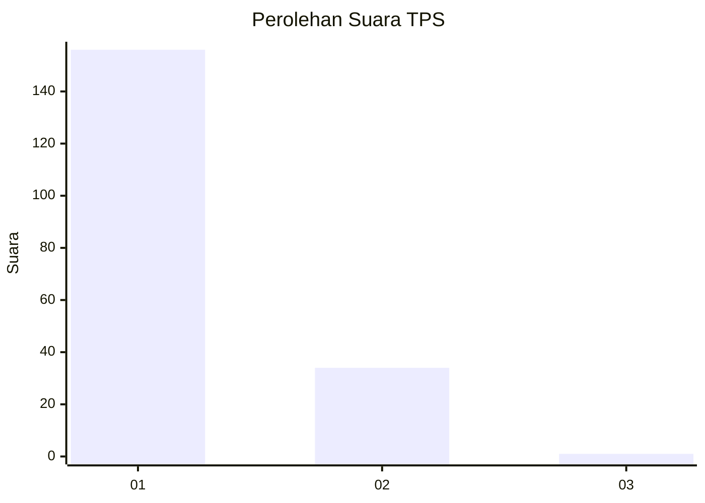
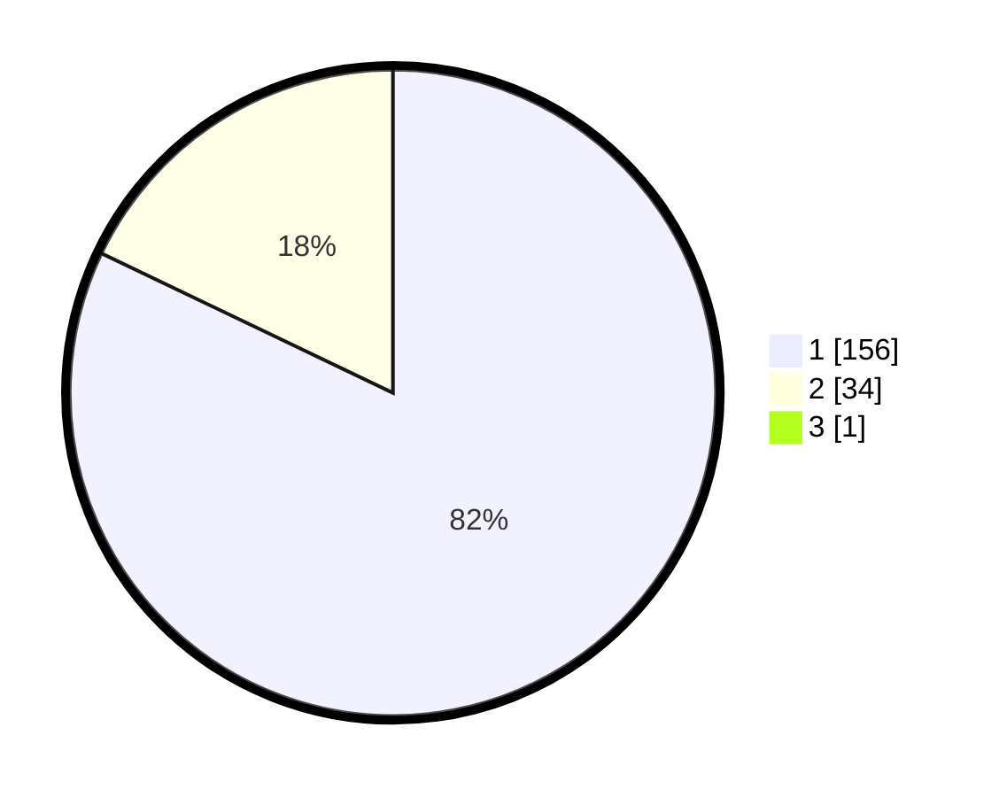

# Hasil

## Grafik

## Tabel

| No. | Nama Paslon    | Suara | Suara (raw) | Persentase |
|:--- |:-------------- | -----:| -----------:| ----------:|
| 1   | ANIES MUHAIMIN | 156   | [156][p-1]  | 81,68      |
| 2   | PRABOWO GIBRAN | 34    | [34][p-2]   | 17,80      |
| 3   | GANJAR MAHFUD  | 1     | [1][p-3]    | 0,52       |

[p-1]: https://github.com/gigit-pemilu/pemilu-2024-11-aceh/blob/main/pilpres/hitung-suara/sub/11-aceh/sub/01-aceh-selatan/sub/18-trumon-tengah/sub/2004-krueng-batee/sub/001-tps/sub/paslon-1.txt
[p-2]: https://github.com/gigit-pemilu/pemilu-2024-11-aceh/blob/main/pilpres/hitung-suara/sub/11-aceh/sub/01-aceh-selatan/sub/18-trumon-tengah/sub/2004-krueng-batee/sub/001-tps/sub/paslon-2.txt
[p-3]: https://github.com/gigit-pemilu/pemilu-2024-11-aceh/blob/main/pilpres/hitung-suara/sub/11-aceh/sub/01-aceh-selatan/sub/18-trumon-tengah/sub/2004-krueng-batee/sub/001-tps/sub/paslon-3.txt

## Foto C Plano

https://sirekap-obj-formc.kpu.go.id/bf88/pemilu/ppwp/11/01/18/20/04/1101182004001-20240217-061426--b8b25910-7043-4f76-86b9-67295cd6059a.jpg

https://sirekap-obj-formc.kpu.go.id/bf88/pemilu/ppwp/11/01/18/20/04/1101182004001-20240217-061428--475951e7-7177-45e9-bc4e-4db3c1e848b6.jpg

https://sirekap-obj-formc.kpu.go.id/bf88/pemilu/ppwp/11/01/18/20/04/1101182004001-20240217-061427--38a50e78-6c0c-477b-80ec-26fa11900736.jpg

## Metadata

| Key        | Value               |
| ---------- | ------------------- |
| Time Stamp | 2024-02-17 16:00:02 |

## DATA PEMILIH TETAP

Jumlah pemilih dalam DPT: **213**.
 * L: **108**.
 * P: **105**.

## DATA PENGGUNA HAK PILIH

Jumlah pengguna hak pilih dalam DPT: **191**.
 * L: **93**.
 * P: **98**.

Jumlah pengguna hak pilih dalam DPTb: **1**.
 * L: **1**.
 * P: **0**.

Jumlah pengguna hak pilih dalam DPK: **0**.
 * L: **0**.
 * P: **0**.

Jumlah pengguna hak pilih: **192**.
 * L: **94**.
 * P: **98**.

## JUMLAH SUARA SAH DAN TIDAK SAH

JUMLAH SELURUH SUARA SAH: **191**.

JUMLAH SUARA TIDAK SAH: **1**.

JUMLAH SELURUH SUARA SAH DAN SUARA TIDAK SAH: **192**.

