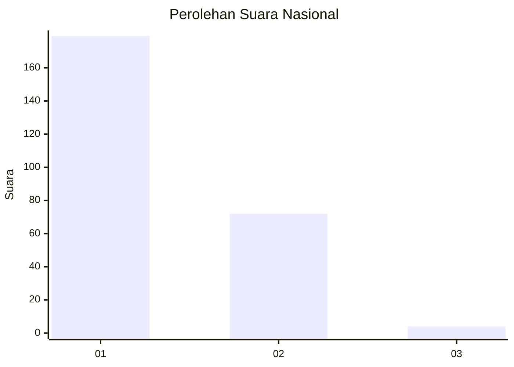
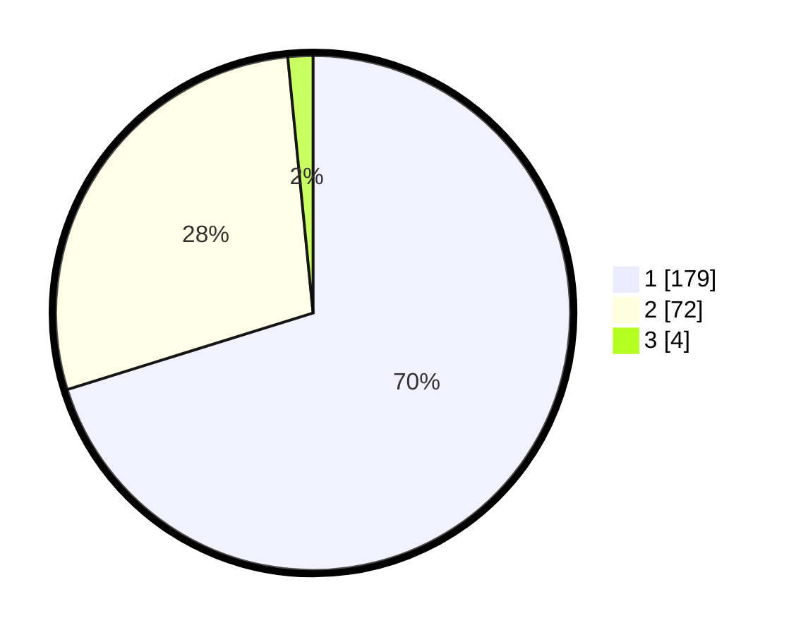

# Hasil

## Grafik

## Tabel

| No. | Nama Paslon    | Suara | Suara (raw) | Persentase |
|:--- |:-------------- | -----:| -----------:| ----------:|
| 1   | ANIES MUHAIMIN | 179   | [179][p-1]  | 70,20      |
| 2   | PRABOWO GIBRAN | 72    | [72][p-2]   | 28,24      |
| 3   | GANJAR MAHFUD  | 4     | [4][p-3]    | 1,57       |

[p-1]: https://github.com/gigit-pemilu/pemilu-2024/blob/main/pilpres/hitung-suara/sub/11-aceh/sub/01-aceh-selatan/sub/18-trumon-tengah/sub/2006-jambo-papeun/sub/001-tps/sub/paslon-1.txt
[p-2]: https://github.com/gigit-pemilu/pemilu-2024/blob/main/pilpres/hitung-suara/sub/11-aceh/sub/01-aceh-selatan/sub/18-trumon-tengah/sub/2006-jambo-papeun/sub/001-tps/sub/paslon-2.txt
[p-3]: https://github.com/gigit-pemilu/pemilu-2024/blob/main/pilpres/hitung-suara/sub/11-aceh/sub/01-aceh-selatan/sub/18-trumon-tengah/sub/2006-jambo-papeun/sub/001-tps/sub/paslon-3.txt

## Foto C Plano

https://sirekap-obj-formc.kpu.go.id/6c0a/pemilu/ppwp/11/01/18/20/06/1101182006001-20240216-143611--e430ca07-7f92-4de0-8af7-6111e9492078.jpg

https://sirekap-obj-formc.kpu.go.id/6c0a/pemilu/ppwp/11/01/18/20/06/1101182006001-20240216-143613--bff7d1d8-5bb2-4c34-9b54-8bd5d0b2aece.jpg

https://sirekap-obj-formc.kpu.go.id/6c0a/pemilu/ppwp/11/01/18/20/06/1101182006001-20240216-143612--26e5c440-4645-4be6-a6f5-b3e4cd0d5409.jpg

## Metadata

| Key        | Value               |
| ---------- | ------------------- |
| Time Stamp | 2024-02-16 21:01:00 |

## DATA PEMILIH TETAP

Jumlah pemilih dalam DPT: **271**.
 * L: **136**.
 * P: **135**.

## DATA PENGGUNA HAK PILIH

Jumlah pengguna hak pilih dalam DPT: **249**.
 * L: **123**.
 * P: **126**.

Jumlah pengguna hak pilih dalam DPTb: **1**.
 * L: **0**.
 * P: **1**.

Jumlah pengguna hak pilih dalam DPK: **7**.
 * L: **2**.
 * P: **5**.

Jumlah pengguna hak pilih: **257**.
 * L: **125**.
 * P: **132**.

## JUMLAH SUARA SAH DAN TIDAK SAH

JUMLAH SELURUH SUARA SAH: **255**.

JUMLAH SUARA TIDAK SAH: **2**.

JUMLAH SELURUH SUARA SAH DAN SUARA TIDAK SAH: **257**.

