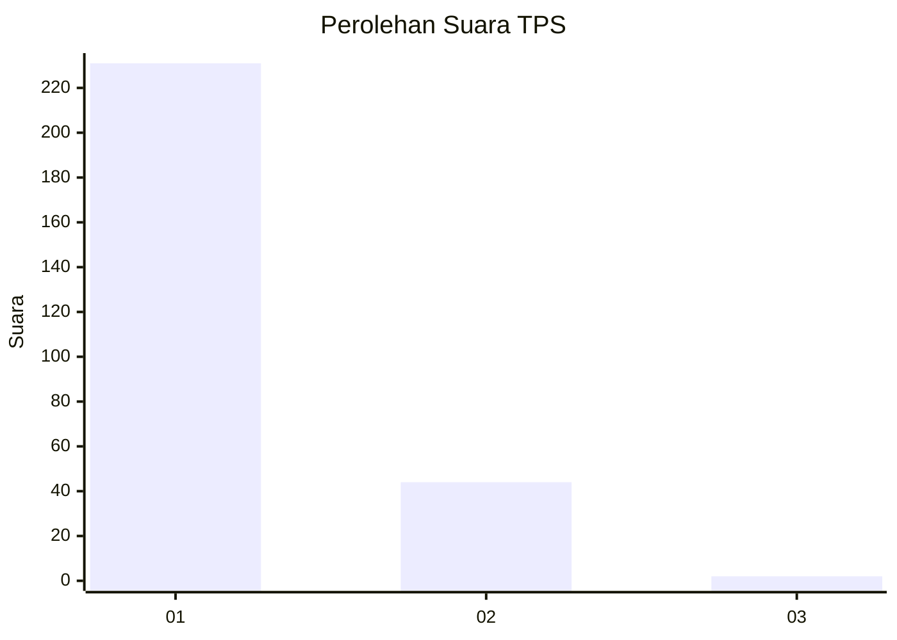
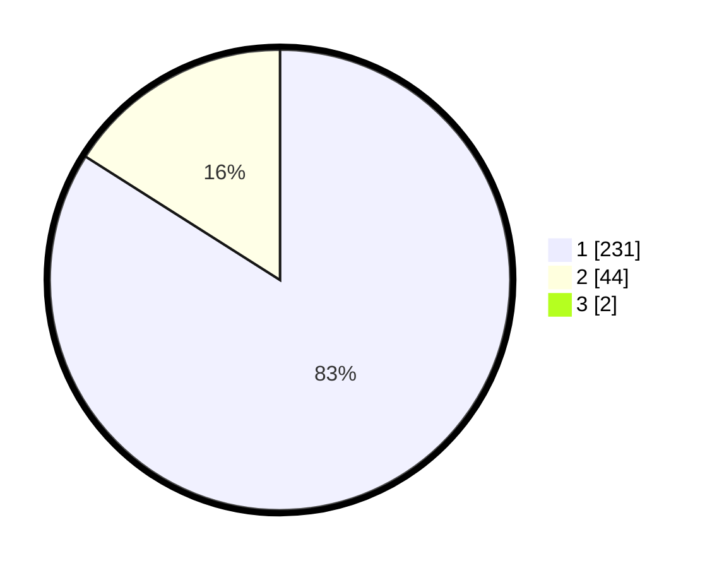

# Hasil

## Grafik

## Tabel

| No. | Nama Paslon    | Suara | Suara (raw) | Persentase |
|:--- |:-------------- | -----:| -----------:| ----------:|
| 1   | ANIES MUHAIMIN | 231   | [231][p-1]  | 83,39      |
| 2   | PRABOWO GIBRAN | 44    | [44][p-2]   | 15,88      |
| 3   | GANJAR MAHFUD  | 2     | [2][p-3]    | 0,72       |

[p-1]: https://github.com/gigit-pemilu/pemilu-2024-11-aceh/blob/main/pilpres/hitung-suara/sub/11-aceh/sub/01-aceh-selatan/sub/18-trumon-tengah/sub/2009-ie-jeureuneh/sub/001-tps/sub/paslon-1.txt
[p-2]: https://github.com/gigit-pemilu/pemilu-2024-11-aceh/blob/main/pilpres/hitung-suara/sub/11-aceh/sub/01-aceh-selatan/sub/18-trumon-tengah/sub/2009-ie-jeureuneh/sub/001-tps/sub/paslon-2.txt
[p-3]: https://github.com/gigit-pemilu/pemilu-2024-11-aceh/blob/main/pilpres/hitung-suara/sub/11-aceh/sub/01-aceh-selatan/sub/18-trumon-tengah/sub/2009-ie-jeureuneh/sub/001-tps/sub/paslon-3.txt

## Foto C Plano

https://sirekap-obj-formc.kpu.go.id/fe50/pemilu/ppwp/11/01/18/20/09/1101182009001-20240216-135831--a823a566-1008-477c-a36e-cbc4b411705e.jpg

https://sirekap-obj-formc.kpu.go.id/fe50/pemilu/ppwp/11/01/18/20/09/1101182009001-20240216-135832--06e8b75f-089e-4602-8326-e3a0b4257e43.jpg

https://sirekap-obj-formc.kpu.go.id/fe50/pemilu/ppwp/11/01/18/20/09/1101182009001-20240216-135832--009a65e3-518a-428a-b3f4-140940b1b135.jpg

## Metadata

| Key        | Value               |
| ---------- | ------------------- |
| Time Stamp | 2024-02-16 21:01:00 |

## DATA PEMILIH TETAP

Jumlah pemilih dalam DPT: **290**.
 * L: **145**.
 * P: **145**.

## DATA PENGGUNA HAK PILIH

Jumlah pengguna hak pilih dalam DPT: **272**.
 * L: **132**.
 * P: **140**.

Jumlah pengguna hak pilih dalam DPTb: **1**.
 * L: **1**.
 * P: **0**.

Jumlah pengguna hak pilih dalam DPK: **6**.
 * L: **2**.
 * P: **4**.

Jumlah pengguna hak pilih: **279**.
 * L: **135**.
 * P: **144**.

## JUMLAH SUARA SAH DAN TIDAK SAH

JUMLAH SELURUH SUARA SAH: **277**.

JUMLAH SUARA TIDAK SAH: **2**.

JUMLAH SELURUH SUARA SAH DAN SUARA TIDAK SAH: **279**.

