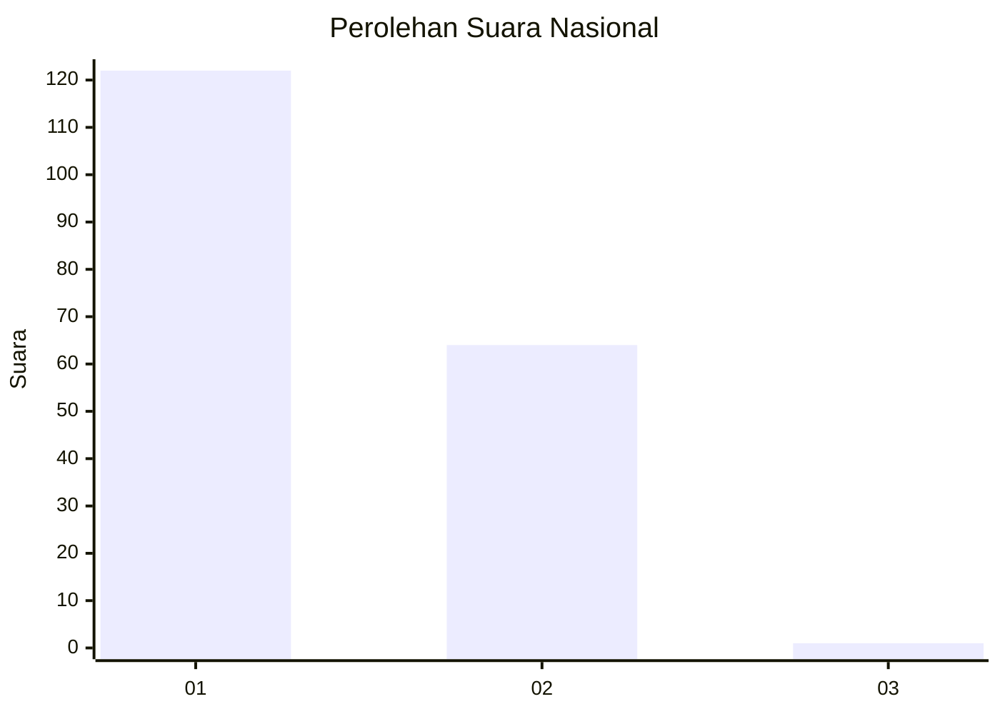
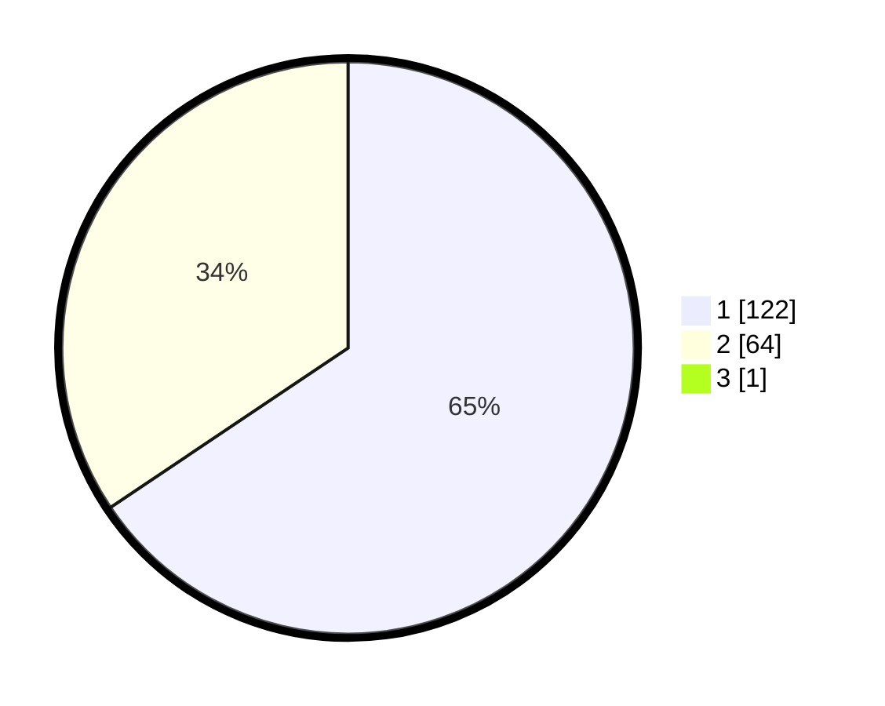

# Hasil

## Grafik

## Tabel

| No. | Nama Paslon    | Suara | Suara (raw) | Persentase |
|:--- |:-------------- | -----:| -----------:| ----------:|
| 1   | ANIES MUHAIMIN | 122   | [122][p-1]  | 65,24      |
| 2   | PRABOWO GIBRAN | 64    | [64][p-2]   | 34,22      |
| 3   | GANJAR MAHFUD  | 1     | [1][p-3]    | 0,53       |

[p-1]: https://github.com/gigit-pemilu/pemilu-2024/blob/main/pilpres/hitung-suara/sub/11-aceh/sub/02-aceh-tenggara/sub/01-lawe-alas/sub/2001-engkeran/sub/001-tps/sub/paslon-1.txt
[p-2]: https://github.com/gigit-pemilu/pemilu-2024/blob/main/pilpres/hitung-suara/sub/11-aceh/sub/02-aceh-tenggara/sub/01-lawe-alas/sub/2001-engkeran/sub/001-tps/sub/paslon-2.txt
[p-3]: https://github.com/gigit-pemilu/pemilu-2024/blob/main/pilpres/hitung-suara/sub/11-aceh/sub/02-aceh-tenggara/sub/01-lawe-alas/sub/2001-engkeran/sub/001-tps/sub/paslon-3.txt

## Foto C Plano

https://sirekap-obj-formc.kpu.go.id/ee13/pemilu/ppwp/11/02/01/20/01/1102012001001-20240222-115631--810923dd-393d-4a17-883a-b994e614a6e8.jpg

https://sirekap-obj-formc.kpu.go.id/ee13/pemilu/ppwp/11/02/01/20/01/1102012001001-20240222-115825--4b6b3f5e-7571-4d69-aed0-92db626ce64f.jpg

https://sirekap-obj-formc.kpu.go.id/ee13/pemilu/ppwp/11/02/01/20/01/1102012001001-20240222-091735--180480d6-0cc7-45f3-9ee1-5463e0831e2e.jpg

## Metadata

| Key        | Value               |
| ---------- | ------------------- |
| Time Stamp | 2024-02-24 22:31:28 |

