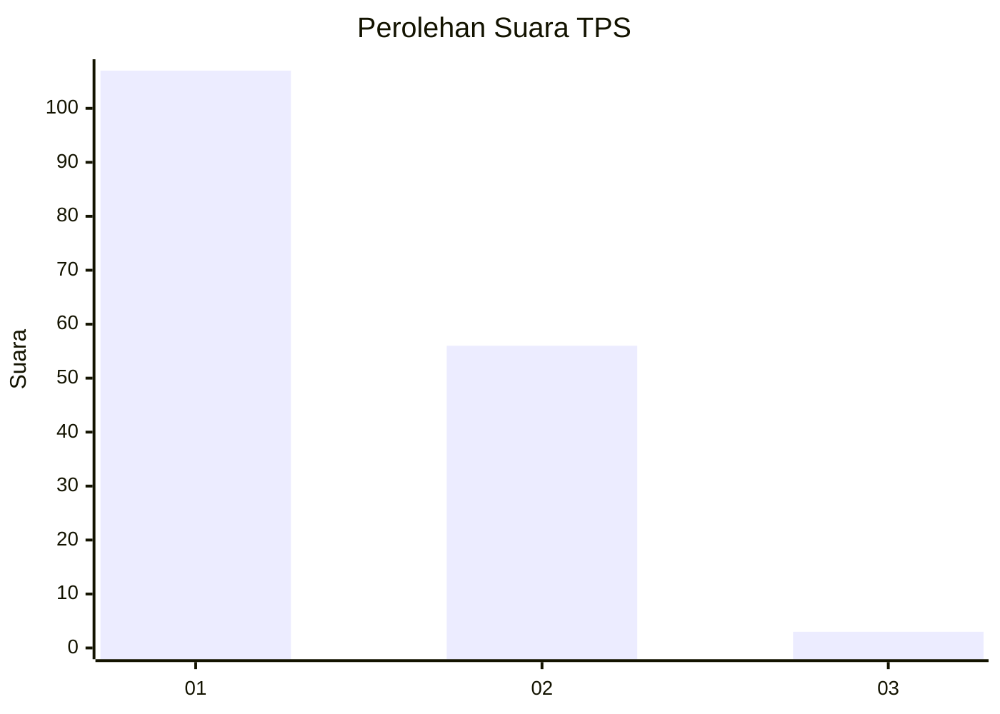
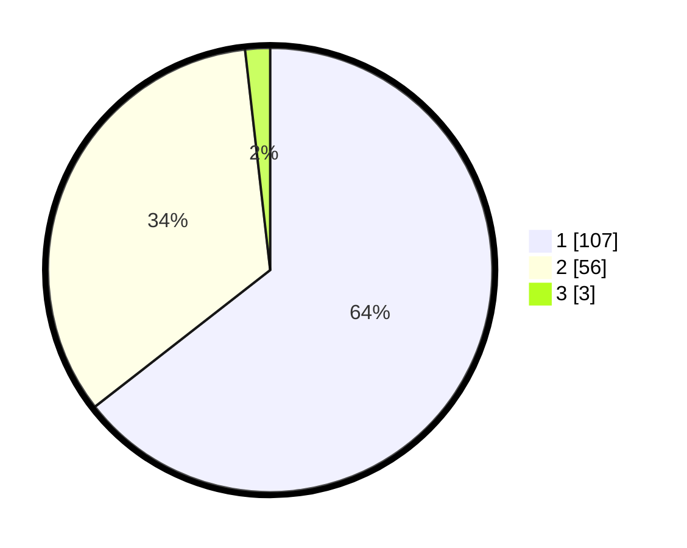

# Hasil

## Grafik

## Tabel

| No. | Nama Paslon    | Suara | Suara (raw) | Persentase |
|:--- |:-------------- | -----:| -----------:| ----------:|
| 1   | ANIES MUHAIMIN | 107   | [107][p-1]  | 64,46      |
| 2   | PRABOWO GIBRAN | 56    | [56][p-2]   | 33,73      |
| 3   | GANJAR MAHFUD  | 3     | [3][p-3]    | 1,81       |

[p-1]: https://github.com/gigit-pemilu/pemilu-2024-11-aceh/blob/main/pilpres/hitung-suara/sub/11-aceh/sub/02-aceh-tenggara/sub/01-lawe-alas/sub/2002-rumah-kampung/sub/001-tps/sub/paslon-1.txt
[p-2]: https://github.com/gigit-pemilu/pemilu-2024-11-aceh/blob/main/pilpres/hitung-suara/sub/11-aceh/sub/02-aceh-tenggara/sub/01-lawe-alas/sub/2002-rumah-kampung/sub/001-tps/sub/paslon-2.txt
[p-3]: https://github.com/gigit-pemilu/pemilu-2024-11-aceh/blob/main/pilpres/hitung-suara/sub/11-aceh/sub/02-aceh-tenggara/sub/01-lawe-alas/sub/2002-rumah-kampung/sub/001-tps/sub/paslon-3.txt

## Foto C Plano

https://sirekap-obj-formc.kpu.go.id/edc3/pemilu/ppwp/11/02/01/20/02/1102012002001-20240223-001916--f9bd1e6b-3411-4352-8bfb-c90602faacc2.jpg

https://sirekap-obj-formc.kpu.go.id/edc3/pemilu/ppwp/11/02/01/20/02/1102012002001-20240223-002046--d7a762e1-b3ad-48a0-8960-a04b3148ad34.jpg

https://sirekap-obj-formc.kpu.go.id/edc3/pemilu/ppwp/11/02/01/20/02/1102012002001-20240223-002847--eff62931-48fe-49ba-a013-d9e8b670ad46.jpg

## Metadata

| Key        | Value               |
| ---------- | ------------------- |
| Time Stamp | 2024-02-24 22:31:28 |

## DATA PEMILIH TETAP

Jumlah pemilih dalam DPT: **168**.
 * L: **85**.
 * P: **57**.

## DATA PENGGUNA HAK PILIH

Jumlah pengguna hak pilih dalam DPT: **165**.
 * L: **79**.
 * P: **86**.

Jumlah pengguna hak pilih dalam DPTb: **7**.
 * L: **3**.
 * P: **4**.

Jumlah pengguna hak pilih dalam DPK: **10**.
 * L: **0**.
 * P: **0**.

Jumlah pengguna hak pilih: **772**.
 * L: **83**.
 * P: **89**.

## JUMLAH SUARA SAH DAN TIDAK SAH

JUMLAH SELURUH SUARA SAH: **171**.

JUMLAH SUARA TIDAK SAH: **1**.

JUMLAH SELURUH SUARA SAH DAN SUARA TIDAK SAH: **172**.

