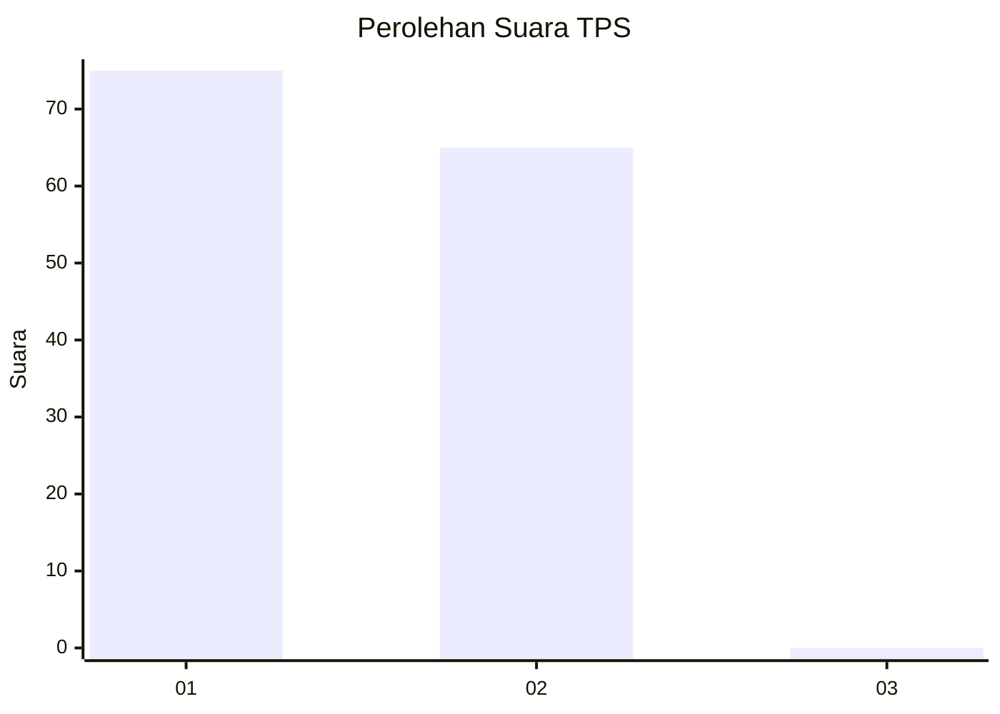
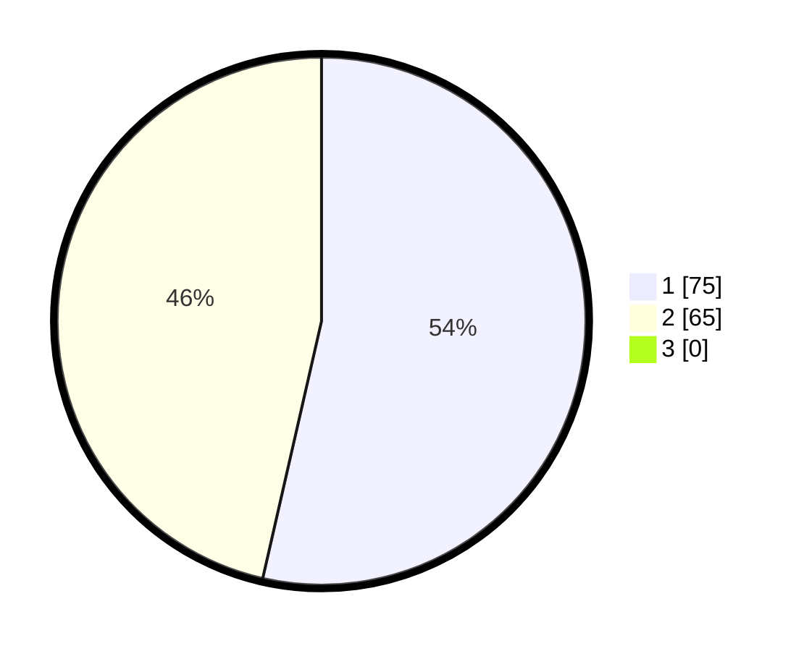

# Hasil

## Grafik

## Tabel

| No. | Nama Paslon    | Suara | Suara (raw) | Persentase |
|:--- |:-------------- | -----:| -----------:| ----------:|
| 1   | ANIES MUHAIMIN | 75    | [75][p-1]   | 53,57      |
| 2   | PRABOWO GIBRAN | 65    | [65][p-2]   | 46,43      |
| 3   | GANJAR MAHFUD  | 0     | [0][p-3]    | 0,00       |

[p-1]: https://github.com/gigit-pemilu/pemilu-2024-11-aceh/blob/main/pilpres/hitung-suara/sub/11-aceh/sub/02-aceh-tenggara/sub/01-lawe-alas/sub/2002-rumah-kampung/sub/002-tps/sub/paslon-1.txt
[p-2]: https://github.com/gigit-pemilu/pemilu-2024-11-aceh/blob/main/pilpres/hitung-suara/sub/11-aceh/sub/02-aceh-tenggara/sub/01-lawe-alas/sub/2002-rumah-kampung/sub/002-tps/sub/paslon-2.txt
[p-3]: https://github.com/gigit-pemilu/pemilu-2024-11-aceh/blob/main/pilpres/hitung-suara/sub/11-aceh/sub/02-aceh-tenggara/sub/01-lawe-alas/sub/2002-rumah-kampung/sub/002-tps/sub/paslon-3.txt

## Foto C Plano

https://sirekap-obj-formc.kpu.go.id/7701/pemilu/ppwp/11/02/01/20/02/1102012002002-20240223-000506--e4f63759-1c1b-4f6c-a44e-59c05c104bea.jpg

https://sirekap-obj-formc.kpu.go.id/7701/pemilu/ppwp/11/02/01/20/02/1102012002002-20240223-222313--e89b31c7-3c29-4a29-8bb9-29e1f0a2ef33.jpg

https://sirekap-obj-formc.kpu.go.id/7701/pemilu/ppwp/11/02/01/20/02/1102012002002-20240223-000200--fc893f83-3789-4f03-ae0e-d18ad2e98954.jpg

## Metadata

| Key        | Value               |
| ---------- | ------------------- |
| Time Stamp | 2024-02-24 22:31:28 |

