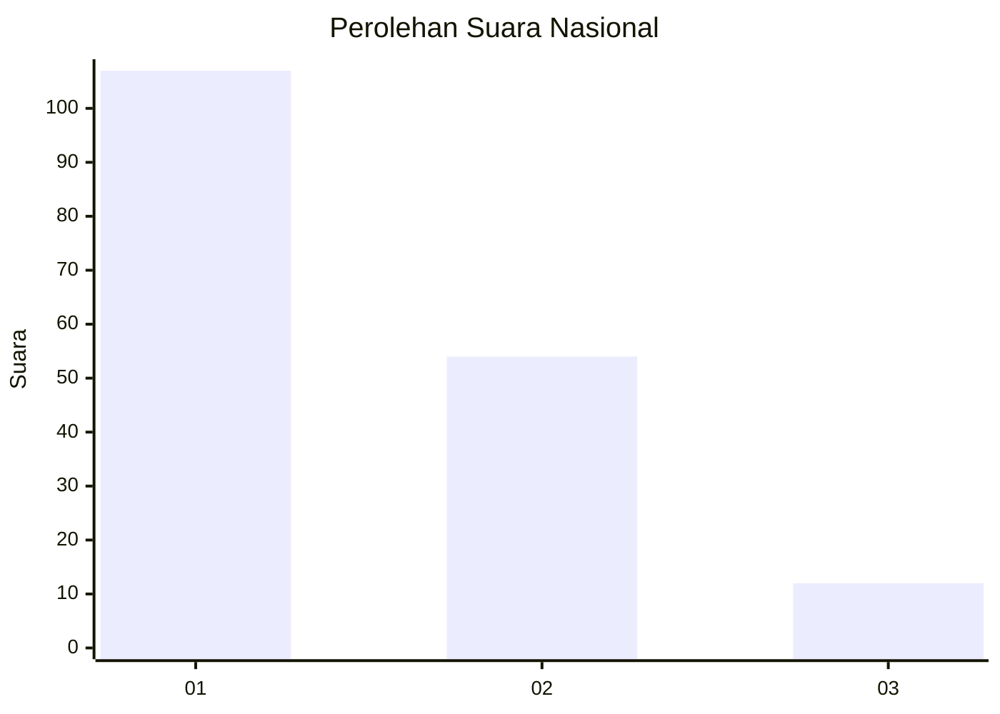
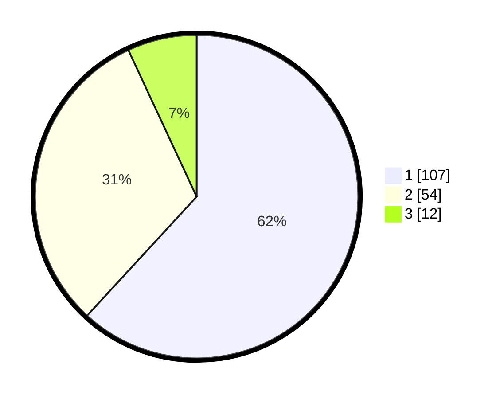

# Hasil

## Grafik

## Tabel

| No. | Nama Paslon    | Suara | Suara (raw) | Persentase |
|:--- |:-------------- | -----:| -----------:| ----------:|
| 1   | ANIES MUHAIMIN | 107   | [107][p-1]  | 61,85      |
| 2   | PRABOWO GIBRAN | 54    | [54][p-2]   | 31,21      |
| 3   | GANJAR MAHFUD  | 12    | [12][p-3]   | 6,94       |

[p-1]: https://github.com/gigit-pemilu/pemilu-2024/blob/main/pilpres/hitung-suara/sub/11-aceh/sub/02-aceh-tenggara/sub/01-lawe-alas/sub/2004-pasir-bangun/sub/001-tps/sub/paslon-1.txt
[p-2]: https://github.com/gigit-pemilu/pemilu-2024/blob/main/pilpres/hitung-suara/sub/11-aceh/sub/02-aceh-tenggara/sub/01-lawe-alas/sub/2004-pasir-bangun/sub/001-tps/sub/paslon-2.txt
[p-3]: https://github.com/gigit-pemilu/pemilu-2024/blob/main/pilpres/hitung-suara/sub/11-aceh/sub/02-aceh-tenggara/sub/01-lawe-alas/sub/2004-pasir-bangun/sub/001-tps/sub/paslon-3.txt

## Foto C Plano

https://sirekap-obj-formc.kpu.go.id/74ea/pemilu/ppwp/11/02/01/20/04/1102012004001-20240215-041259--17a665a2-7006-40dd-b4c3-92e269d2c3c8.jpg

https://sirekap-obj-formc.kpu.go.id/74ea/pemilu/ppwp/11/02/01/20/04/1102012004001-20240215-041221--ef1e6c82-0d2c-42d1-bae5-6a51ba6b4751.jpg

https://sirekap-obj-formc.kpu.go.id/74ea/pemilu/ppwp/11/02/01/20/04/1102012004001-20240215-041332--0d038dfa-b1b7-40cc-8717-031f0906c644.jpg

## Metadata

| Key        | Value               |
| ---------- | ------------------- |
| Time Stamp | 2024-02-15 15:00:29 |

