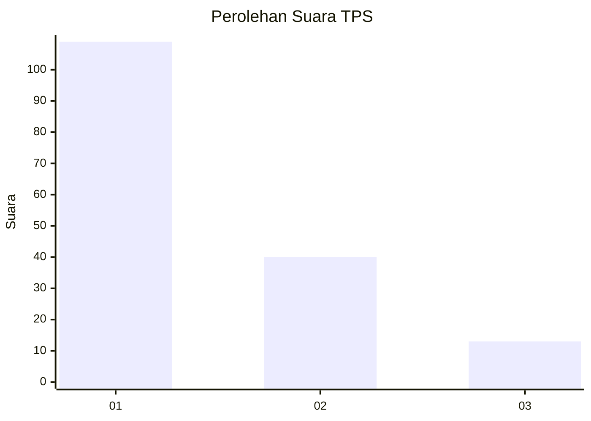
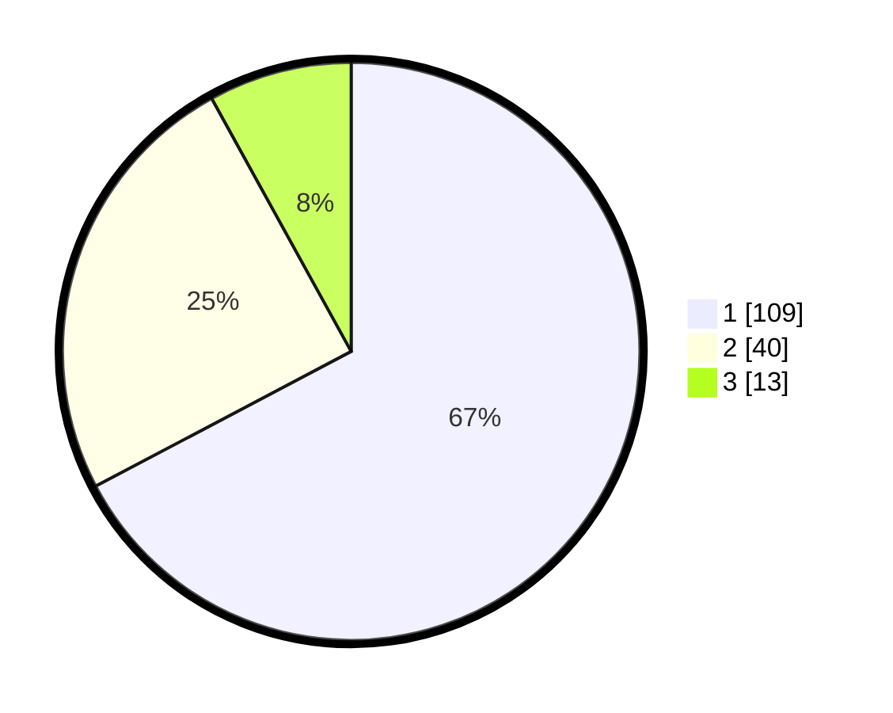

# Hasil

## Grafik

## Tabel

| No. | Nama Paslon    | Suara | Suara (raw) | Persentase |
|:--- |:-------------- | -----:| -----------:| ----------:|
| 1   | ANIES MUHAIMIN | 109   | [109][p-1]  | 67,28      |
| 2   | PRABOWO GIBRAN | 40    | [40][p-2]   | 24,69      |
| 3   | GANJAR MAHFUD  | 13    | [13][p-3]   | 8,02       |

[p-1]: https://github.com/gigit-pemilu/pemilu-2024-11-aceh/blob/main/pilpres/hitung-suara/sub/11-aceh/sub/02-aceh-tenggara/sub/01-lawe-alas/sub/2004-pasir-bangun/sub/002-tps/sub/paslon-1.txt
[p-2]: https://github.com/gigit-pemilu/pemilu-2024-11-aceh/blob/main/pilpres/hitung-suara/sub/11-aceh/sub/02-aceh-tenggara/sub/01-lawe-alas/sub/2004-pasir-bangun/sub/002-tps/sub/paslon-2.txt
[p-3]: https://github.com/gigit-pemilu/pemilu-2024-11-aceh/blob/main/pilpres/hitung-suara/sub/11-aceh/sub/02-aceh-tenggara/sub/01-lawe-alas/sub/2004-pasir-bangun/sub/002-tps/sub/paslon-3.txt

## Foto C Plano

https://sirekap-obj-formc.kpu.go.id/3828/pemilu/ppwp/11/02/01/20/04/1102012004002-20240215-001452--155315de-dc5d-4ffe-abef-54b781f748ca.jpg

https://sirekap-obj-formc.kpu.go.id/3828/pemilu/ppwp/11/02/01/20/04/1102012004002-20240215-022546--268f1613-5592-4ed1-8edc-536460cfa88c.jpg

https://sirekap-obj-formc.kpu.go.id/3828/pemilu/ppwp/11/02/01/20/04/1102012004002-20240215-022555--450b268b-727b-44ce-bd7f-cb932c65c1a4.jpg

## Metadata

| Key        | Value               |
| ---------- | ------------------- |
| Time Stamp | 2024-02-15 15:00:29 |

