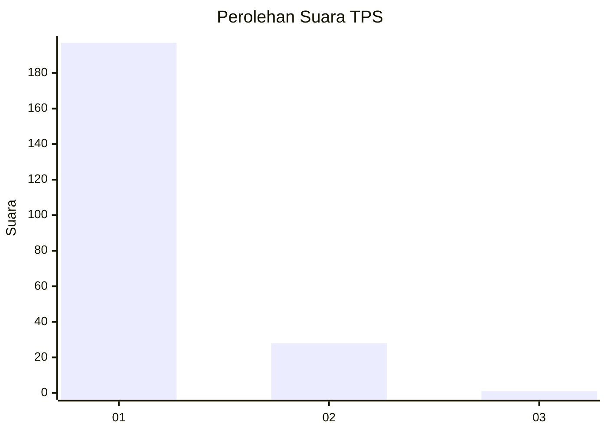
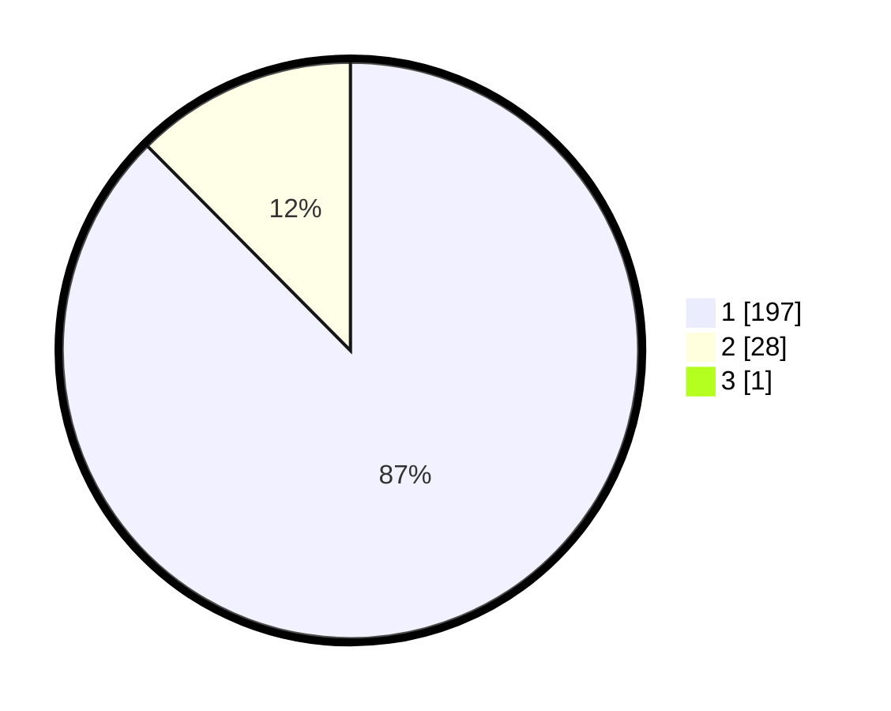

# Hasil

## Grafik

## Tabel

| No. | Nama Paslon    | Suara | Suara (raw) | Persentase |
|:--- |:-------------- | -----:| -----------:| ----------:|
| 1   | ANIES MUHAIMIN | 197   | [197][p-1]  | 87,17      |
| 2   | PRABOWO GIBRAN | 28    | [28][p-2]   | 12,39      |
| 3   | GANJAR MAHFUD  | 1     | [1][p-3]    | 0,44       |

[p-1]: https://github.com/gigit-pemilu/pemilu-2024-11-aceh/blob/main/pilpres/hitung-suara/sub/11-aceh/sub/02-aceh-tenggara/sub/01-lawe-alas/sub/2008-kuta-cingkam-ii/sub/002-tps/sub/paslon-1.txt
[p-2]: https://github.com/gigit-pemilu/pemilu-2024-11-aceh/blob/main/pilpres/hitung-suara/sub/11-aceh/sub/02-aceh-tenggara/sub/01-lawe-alas/sub/2008-kuta-cingkam-ii/sub/002-tps/sub/paslon-2.txt
[p-3]: https://github.com/gigit-pemilu/pemilu-2024-11-aceh/blob/main/pilpres/hitung-suara/sub/11-aceh/sub/02-aceh-tenggara/sub/01-lawe-alas/sub/2008-kuta-cingkam-ii/sub/002-tps/sub/paslon-3.txt

## Foto C Plano

https://sirekap-obj-formc.kpu.go.id/826e/pemilu/ppwp/11/02/01/20/08/1102012008002-20240214-232600--6f72378e-87e3-4741-9a4d-8b61bd516a5e.jpg

https://sirekap-obj-formc.kpu.go.id/826e/pemilu/ppwp/11/02/01/20/08/1102012008002-20240214-232646--1424572a-cdfe-40dc-83de-c4333f8cf889.jpg

https://sirekap-obj-formc.kpu.go.id/826e/pemilu/ppwp/11/02/01/20/08/1102012008002-20240216-135912--a390b1c5-e248-45af-8248-e98cbdd6a658.jpg

## Metadata

| Key        | Value               |
| ---------- | ------------------- |
| Time Stamp | 2024-02-16 14:00:34 |

