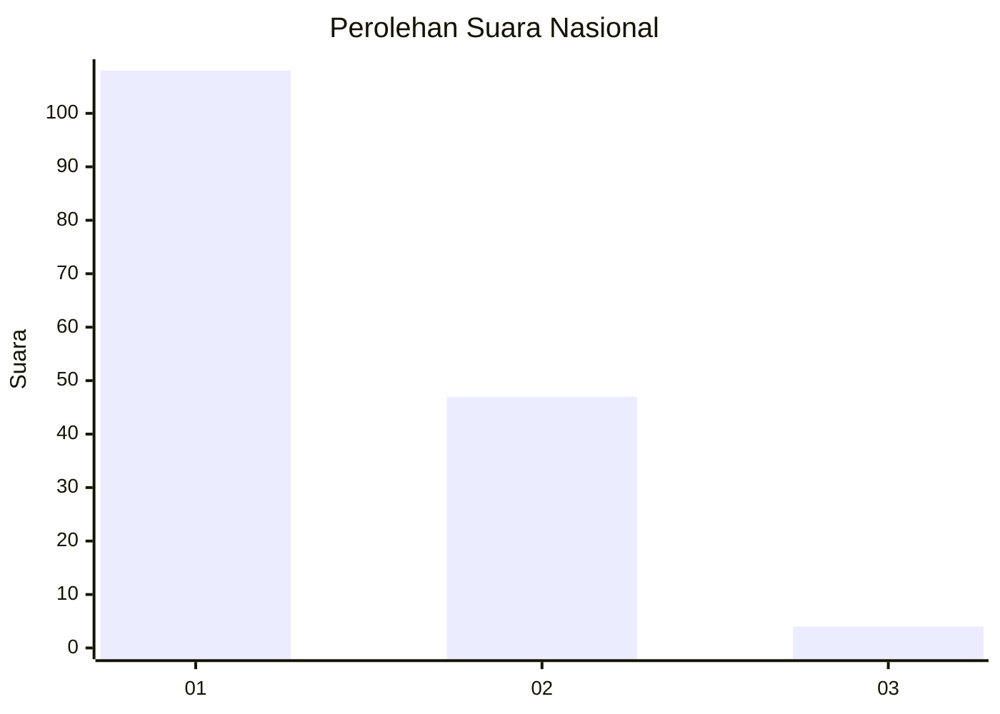
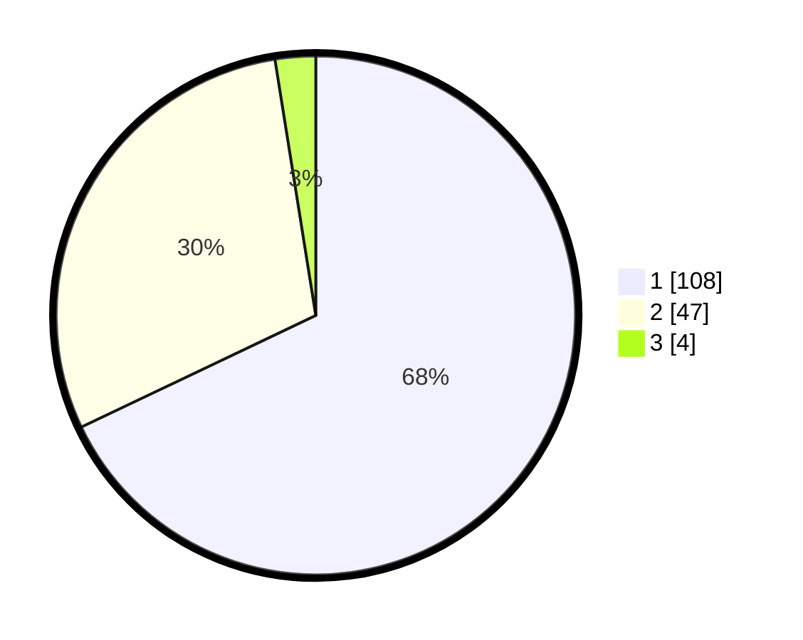

# Hasil

## Grafik

## Tabel

| No. | Nama Paslon    | Suara | Suara (raw) | Persentase |
|:--- |:-------------- | -----:| -----------:| ----------:|
| 1   | ANIES MUHAIMIN | 108   | [108][p-1]  | 67,92      |
| 2   | PRABOWO GIBRAN | 47    | [47][p-2]   | 29,56      |
| 3   | GANJAR MAHFUD  | 4     | [4][p-3]    | 2,52       |

[p-1]: https://github.com/gigit-pemilu/pemilu-2024/blob/main/pilpres/hitung-suara/sub/11-aceh/sub/02-aceh-tenggara/sub/01-lawe-alas/sub/2009-muara-baru/sub/002-tps/sub/paslon-1.txt
[p-2]: https://github.com/gigit-pemilu/pemilu-2024/blob/main/pilpres/hitung-suara/sub/11-aceh/sub/02-aceh-tenggara/sub/01-lawe-alas/sub/2009-muara-baru/sub/002-tps/sub/paslon-2.txt
[p-3]: https://github.com/gigit-pemilu/pemilu-2024/blob/main/pilpres/hitung-suara/sub/11-aceh/sub/02-aceh-tenggara/sub/01-lawe-alas/sub/2009-muara-baru/sub/002-tps/sub/paslon-3.txt

## Foto C Plano

https://sirekap-obj-formc.kpu.go.id/0d0e/pemilu/ppwp/11/02/01/20/09/1102012009002-20240215-123039--857bc5b7-7b7d-4d44-849e-afa49a9a2075.jpg

https://sirekap-obj-formc.kpu.go.id/0d0e/pemilu/ppwp/11/02/01/20/09/1102012009002-20240215-123423--af334d8c-5b93-43cc-8897-67b09196607e.jpg

https://sirekap-obj-formc.kpu.go.id/0d0e/pemilu/ppwp/11/02/01/20/09/1102012009002-20240215-123651--6fa1ee8e-b938-4bbb-b374-9bf385f989c5.jpg

## Metadata

| Key        | Value               |
| ---------- | ------------------- |
| Time Stamp | 2024-02-15 20:00:44 |

