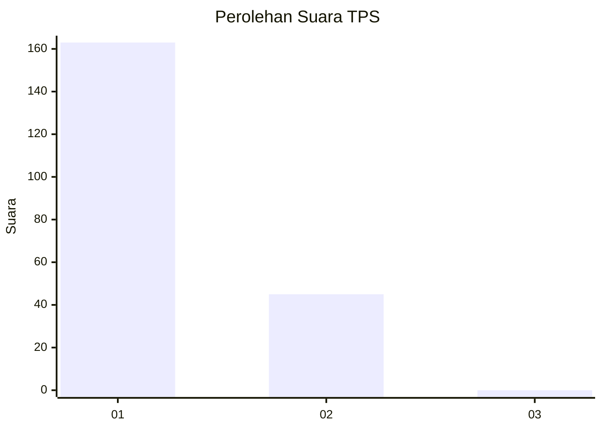
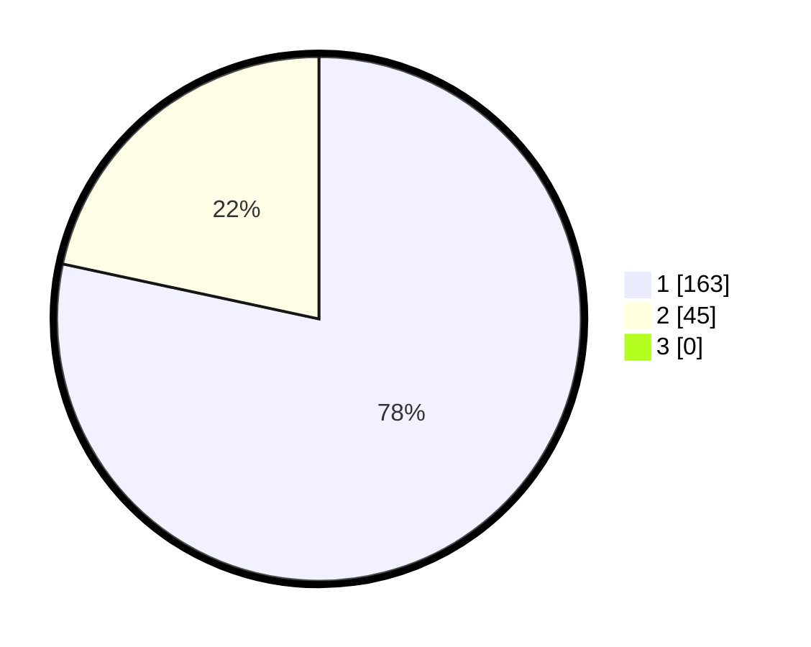

# Hasil

## Grafik

## Tabel

| No. | Nama Paslon    | Suara | Suara (raw) | Persentase |
|:--- |:-------------- | -----:| -----------:| ----------:|
| 1   | ANIES MUHAIMIN | 163   | [163][p-1]  | 78,37      |
| 2   | PRABOWO GIBRAN | 45    | [45][p-2]   | 21,63      |
| 3   | GANJAR MAHFUD  | 0     | [0][p-3]    | 0,00       |

[p-1]: https://github.com/gigit-pemilu/pemilu-2024-11-aceh/blob/main/pilpres/hitung-suara/sub/11-aceh/sub/02-aceh-tenggara/sub/01-lawe-alas/sub/2011-kuta-batu-i/sub/001-tps/sub/paslon-1.txt
[p-2]: https://github.com/gigit-pemilu/pemilu-2024-11-aceh/blob/main/pilpres/hitung-suara/sub/11-aceh/sub/02-aceh-tenggara/sub/01-lawe-alas/sub/2011-kuta-batu-i/sub/001-tps/sub/paslon-2.txt
[p-3]: https://github.com/gigit-pemilu/pemilu-2024-11-aceh/blob/main/pilpres/hitung-suara/sub/11-aceh/sub/02-aceh-tenggara/sub/01-lawe-alas/sub/2011-kuta-batu-i/sub/001-tps/sub/paslon-3.txt

## Foto C Plano

https://sirekap-obj-formc.kpu.go.id/0c48/pemilu/ppwp/11/02/01/20/11/1102012011001-20240215-035621--0d568840-edb5-4879-be14-cf9393289ed2.jpg

https://sirekap-obj-formc.kpu.go.id/0c48/pemilu/ppwp/11/02/01/20/11/1102012011001-20240215-035334--57977eac-b4b0-4c50-b834-b54f0065ab13.jpg

https://sirekap-obj-formc.kpu.go.id/0c48/pemilu/ppwp/11/02/01/20/11/1102012011001-20240215-035449--0cc614ac-31ec-48cc-96da-e9f5ce46b8d2.jpg

## Metadata

| Key        | Value               |
| ---------- | ------------------- |
| Time Stamp | 2024-02-15 15:00:29 |

