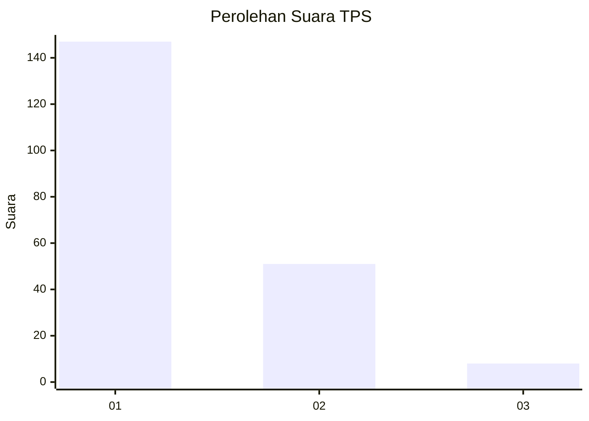
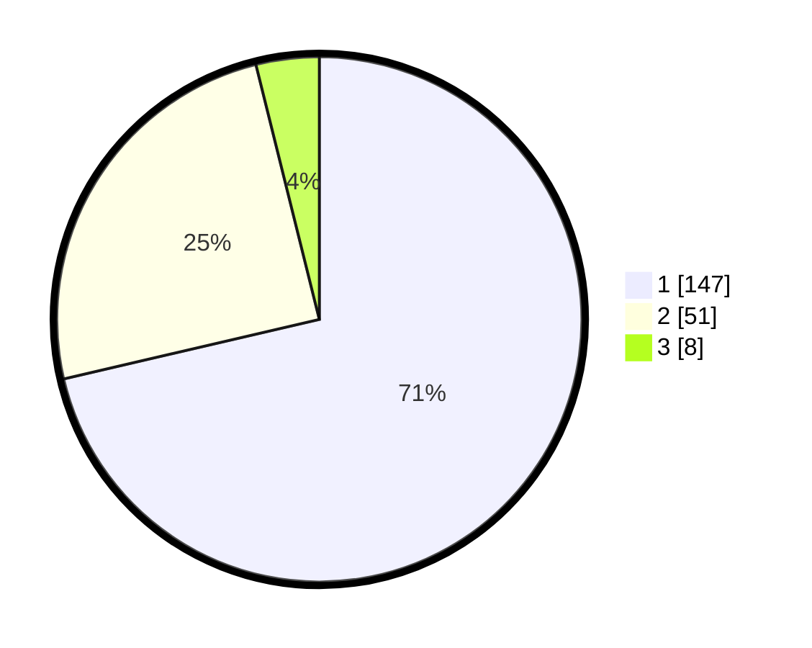

# Hasil

## Grafik

## Tabel

| No. | Nama Paslon    | Suara | Suara (raw) | Persentase |
|:--- |:-------------- | -----:| -----------:| ----------:|
| 1   | ANIES MUHAIMIN | 147   | [147][p-1]  | 71,36      |
| 2   | PRABOWO GIBRAN | 51    | [51][p-2]   | 24,76      |
| 3   | GANJAR MAHFUD  | 8     | [8][p-3]    | 3,88       |

[p-1]: https://github.com/gigit-pemilu/pemilu-2024-11-aceh/blob/main/pilpres/hitung-suara/sub/11-aceh/sub/02-aceh-tenggara/sub/01-lawe-alas/sub/2012-kuta-cingkam-i/sub/001-tps/sub/paslon-1.txt
[p-2]: https://github.com/gigit-pemilu/pemilu-2024-11-aceh/blob/main/pilpres/hitung-suara/sub/11-aceh/sub/02-aceh-tenggara/sub/01-lawe-alas/sub/2012-kuta-cingkam-i/sub/001-tps/sub/paslon-2.txt
[p-3]: https://github.com/gigit-pemilu/pemilu-2024-11-aceh/blob/main/pilpres/hitung-suara/sub/11-aceh/sub/02-aceh-tenggara/sub/01-lawe-alas/sub/2012-kuta-cingkam-i/sub/001-tps/sub/paslon-3.txt

## Foto C Plano

https://sirekap-obj-formc.kpu.go.id/d878/pemilu/ppwp/11/02/01/20/12/1102012012001-20240215-104411--a8d6ecbe-48ab-42de-91fd-0293e0caa716.jpg

https://sirekap-obj-formc.kpu.go.id/d878/pemilu/ppwp/11/02/01/20/12/1102012012001-20240215-104518--4d31bce8-e763-45b7-b2a9-31818680cb8b.jpg

https://sirekap-obj-formc.kpu.go.id/d878/pemilu/ppwp/11/02/01/20/12/1102012012001-20240215-104609--e16d5011-8436-47e2-82dd-d743ac2f8d26.jpg

## Metadata

| Key        | Value               |
| ---------- | ------------------- |
| Time Stamp | 2024-03-01 18:00:00 |

