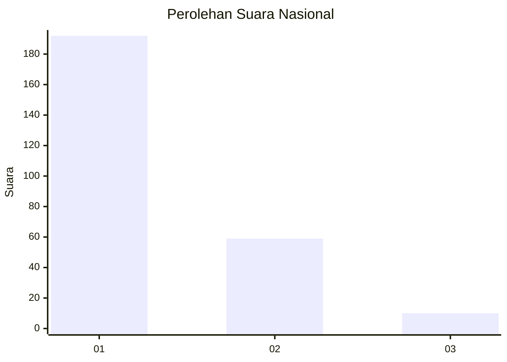
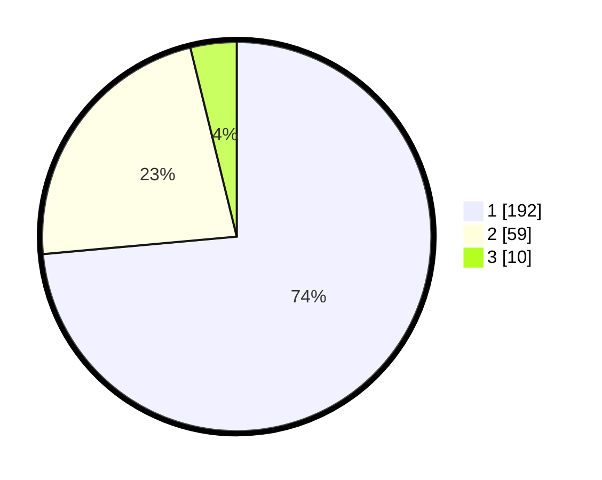

# Hasil

## Grafik

## Tabel

| No. | Nama Paslon    | Suara | Suara (raw) | Persentase |
|:--- |:-------------- | -----:| -----------:| ----------:|
| 1   | ANIES MUHAIMIN | 192   | [192][p-1]  | 73,56      |
| 2   | PRABOWO GIBRAN | 59    | [59][p-2]   | 22,61      |
| 3   | GANJAR MAHFUD  | 10    | [10][p-3]   | 3,83       |

[p-1]: https://github.com/gigit-pemilu/pemilu-2024/blob/main/pilpres/hitung-suara/sub/11-aceh/sub/02-aceh-tenggara/sub/01-lawe-alas/sub/2014-lawe-sempilang/sub/001-tps/sub/paslon-1.txt
[p-2]: https://github.com/gigit-pemilu/pemilu-2024/blob/main/pilpres/hitung-suara/sub/11-aceh/sub/02-aceh-tenggara/sub/01-lawe-alas/sub/2014-lawe-sempilang/sub/001-tps/sub/paslon-2.txt
[p-3]: https://github.com/gigit-pemilu/pemilu-2024/blob/main/pilpres/hitung-suara/sub/11-aceh/sub/02-aceh-tenggara/sub/01-lawe-alas/sub/2014-lawe-sempilang/sub/001-tps/sub/paslon-3.txt

## Foto C Plano

https://sirekap-obj-formc.kpu.go.id/e617/pemilu/ppwp/11/02/01/20/14/1102012014001-20240215-110616--9d701ad2-672b-462f-a089-b4afc05734dc.jpg

https://sirekap-obj-formc.kpu.go.id/e617/pemilu/ppwp/11/02/01/20/14/1102012014001-20240215-163406--ff35d813-05f9-4c36-8324-f5dcd20a311f.jpg

https://sirekap-obj-formc.kpu.go.id/e617/pemilu/ppwp/11/02/01/20/14/1102012014001-20240215-163608--f31effa7-3e09-466e-baa2-86f491ff21eb.jpg

## Metadata

| Key        | Value               |
| ---------- | ------------------- |
| Time Stamp | 2024-02-15 21:01:18 |

