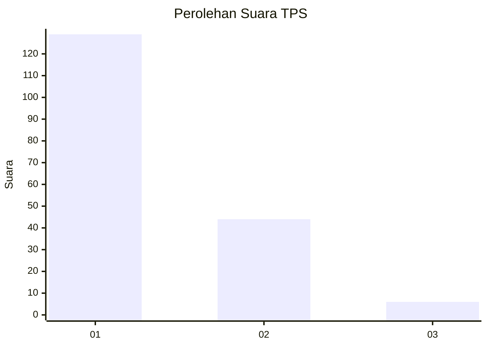
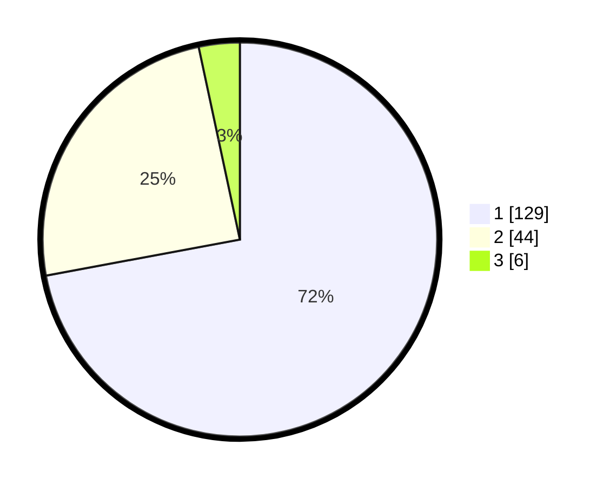

# Hasil

## Grafik

## Tabel

| No. | Nama Paslon    | Suara | Suara (raw) | Persentase |
|:--- |:-------------- | -----:| -----------:| ----------:|
| 1   | ANIES MUHAIMIN | 129   | [129][p-1]  | 72,07      |
| 2   | PRABOWO GIBRAN | 44    | [44][p-2]   | 24,58      |
| 3   | GANJAR MAHFUD  | 6     | [6][p-3]    | 3,35       |

[p-1]: https://github.com/gigit-pemilu/pemilu-2024-11-aceh/blob/main/pilpres/hitung-suara/sub/11-aceh/sub/02-aceh-tenggara/sub/01-lawe-alas/sub/2015-prapat-batu-nunggul/sub/001-tps/sub/paslon-1.txt
[p-2]: https://github.com/gigit-pemilu/pemilu-2024-11-aceh/blob/main/pilpres/hitung-suara/sub/11-aceh/sub/02-aceh-tenggara/sub/01-lawe-alas/sub/2015-prapat-batu-nunggul/sub/001-tps/sub/paslon-2.txt
[p-3]: https://github.com/gigit-pemilu/pemilu-2024-11-aceh/blob/main/pilpres/hitung-suara/sub/11-aceh/sub/02-aceh-tenggara/sub/01-lawe-alas/sub/2015-prapat-batu-nunggul/sub/001-tps/sub/paslon-3.txt

## Foto C Plano

https://sirekap-obj-formc.kpu.go.id/9b5f/pemilu/ppwp/11/02/01/20/15/1102012015001-20240215-143809--b0147d2c-21a5-48c6-a34e-918d48f8b383.jpg

https://sirekap-obj-formc.kpu.go.id/9b5f/pemilu/ppwp/11/02/01/20/15/1102012015001-20240215-122625--dc49bd28-a18b-4f89-8392-f2722b7b0e3b.jpg

https://sirekap-obj-formc.kpu.go.id/9b5f/pemilu/ppwp/11/02/01/20/15/1102012015001-20240215-122126--9e5fc6fe-6427-40cf-bc1f-766b6be0aaa4.jpg

## Metadata

| Key        | Value               |
| ---------- | ------------------- |
| Time Stamp | 2024-02-15 21:01:18 |

