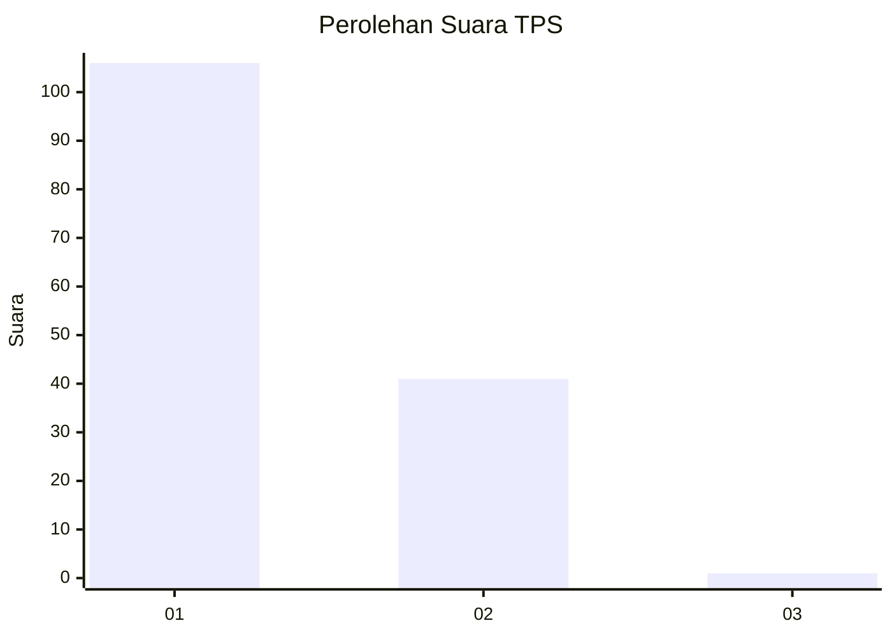
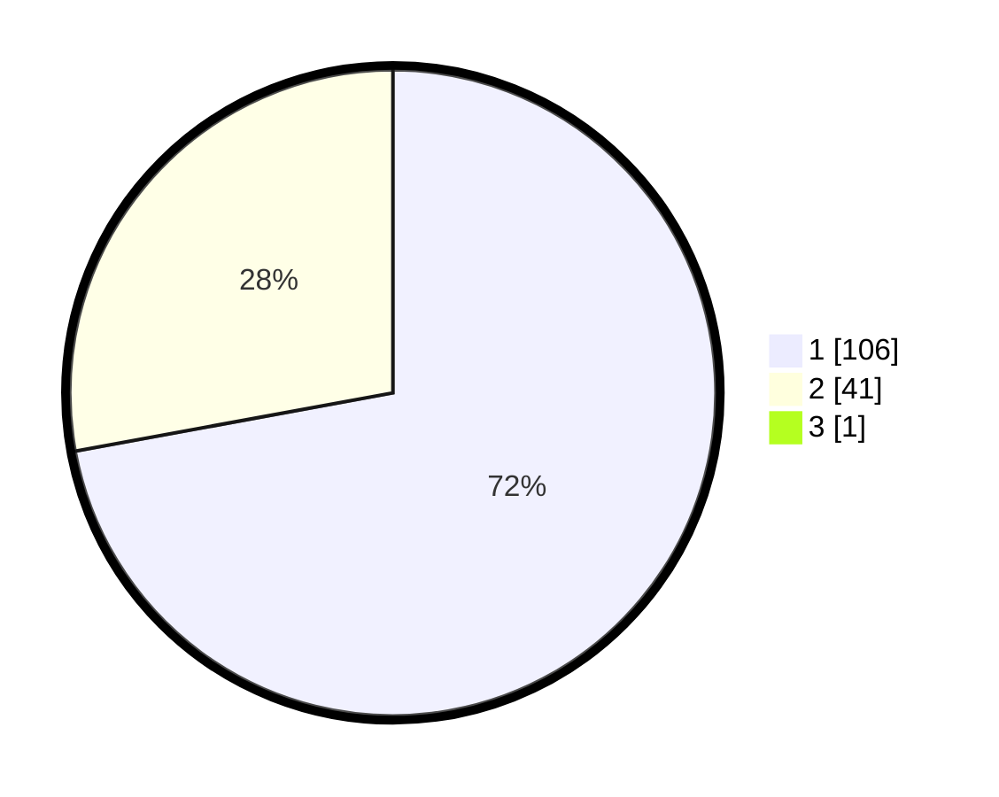

# Hasil

## Grafik

## Tabel

| No. | Nama Paslon    | Suara | Suara (raw) | Persentase |
|:--- |:-------------- | -----:| -----------:| ----------:|
| 1   | ANIES MUHAIMIN | 106   | [106][p-1]  | 71,62      |
| 2   | PRABOWO GIBRAN | 41    | [41][p-2]   | 27,70      |
| 3   | GANJAR MAHFUD  | 1     | [1][p-3]    | 0,68       |

[p-1]: https://github.com/gigit-pemilu/pemilu-2024-11-aceh/blob/main/pilpres/hitung-suara/sub/11-aceh/sub/02-aceh-tenggara/sub/01-lawe-alas/sub/2015-prapat-batu-nunggul/sub/002-tps/sub/paslon-1.txt
[p-2]: https://github.com/gigit-pemilu/pemilu-2024-11-aceh/blob/main/pilpres/hitung-suara/sub/11-aceh/sub/02-aceh-tenggara/sub/01-lawe-alas/sub/2015-prapat-batu-nunggul/sub/002-tps/sub/paslon-2.txt
[p-3]: https://github.com/gigit-pemilu/pemilu-2024-11-aceh/blob/main/pilpres/hitung-suara/sub/11-aceh/sub/02-aceh-tenggara/sub/01-lawe-alas/sub/2015-prapat-batu-nunggul/sub/002-tps/sub/paslon-3.txt

## Foto C Plano

https://sirekap-obj-formc.kpu.go.id/0432/pemilu/ppwp/11/02/01/20/15/1102012015002-20240215-101246--954bdc2c-d1ad-4cba-8355-5565fd3f55da.jpg

https://sirekap-obj-formc.kpu.go.id/0432/pemilu/ppwp/11/02/01/20/15/1102012015002-20240215-101408--6edf3ca3-ccca-4c7d-83d0-49612bbdd54d.jpg

https://sirekap-obj-formc.kpu.go.id/0432/pemilu/ppwp/11/02/01/20/15/1102012015002-20240215-101512--7571a77b-6d25-4db2-be9f-0a6d38d84925.jpg

## Metadata

| Key        | Value               |
| ---------- | ------------------- |
| Time Stamp | 2024-02-15 15:00:29 |

