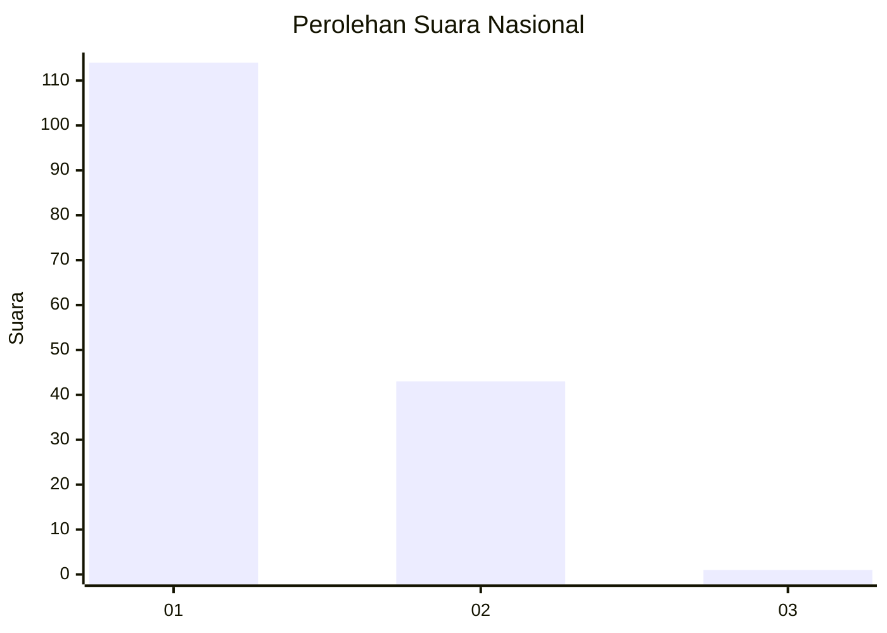
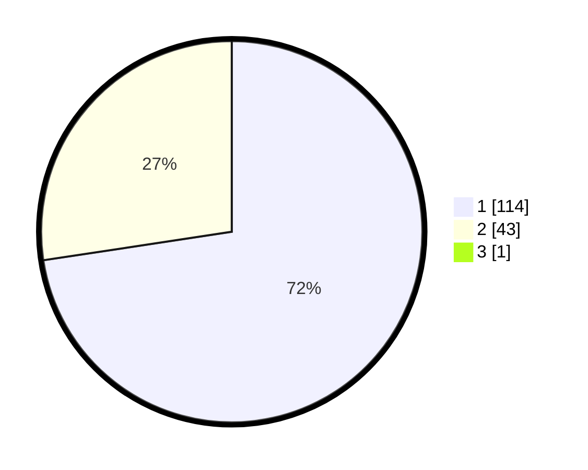

# Hasil

## Grafik

## Tabel

| No. | Nama Paslon    | Suara | Suara (raw) | Persentase |
|:--- |:-------------- | -----:| -----------:| ----------:|
| 1   | ANIES MUHAIMIN | 114   | [114][p-1]  | 72,15      |
| 2   | PRABOWO GIBRAN | 43    | [43][p-2]   | 27,22      |
| 3   | GANJAR MAHFUD  | 1     | [1][p-3]    | 0,63       |

[p-1]: https://github.com/gigit-pemilu/pemilu-2024/blob/main/pilpres/hitung-suara/sub/11-aceh/sub/02-aceh-tenggara/sub/01-lawe-alas/sub/2017-rih-mbelang/sub/002-tps/sub/paslon-1.txt
[p-2]: https://github.com/gigit-pemilu/pemilu-2024/blob/main/pilpres/hitung-suara/sub/11-aceh/sub/02-aceh-tenggara/sub/01-lawe-alas/sub/2017-rih-mbelang/sub/002-tps/sub/paslon-2.txt
[p-3]: https://github.com/gigit-pemilu/pemilu-2024/blob/main/pilpres/hitung-suara/sub/11-aceh/sub/02-aceh-tenggara/sub/01-lawe-alas/sub/2017-rih-mbelang/sub/002-tps/sub/paslon-3.txt

## Foto C Plano

https://sirekap-obj-formc.kpu.go.id/7725/pemilu/ppwp/11/02/01/20/17/1102012017002-20240217-171212--7511f6c8-14f0-4b11-9aa6-cfadc333295d.jpg

https://sirekap-obj-formc.kpu.go.id/7725/pemilu/ppwp/11/02/01/20/17/1102012017002-20240217-123840--9dee3f5a-03f8-4e12-9f42-800da551dd4d.jpg

https://sirekap-obj-formc.kpu.go.id/7725/pemilu/ppwp/11/02/01/20/17/1102012017002-20240217-124418--900d24af-ed36-41b7-af4b-08da576470b6.jpg

## Metadata

| Key        | Value               |
| ---------- | ------------------- |
| Time Stamp | 2024-02-24 22:31:28 |

