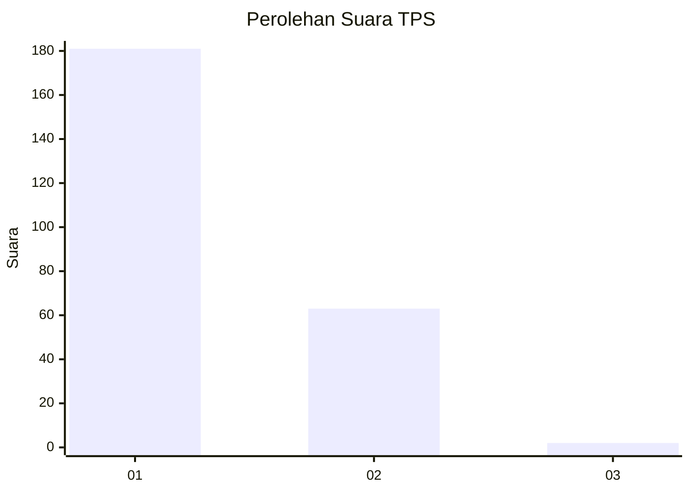
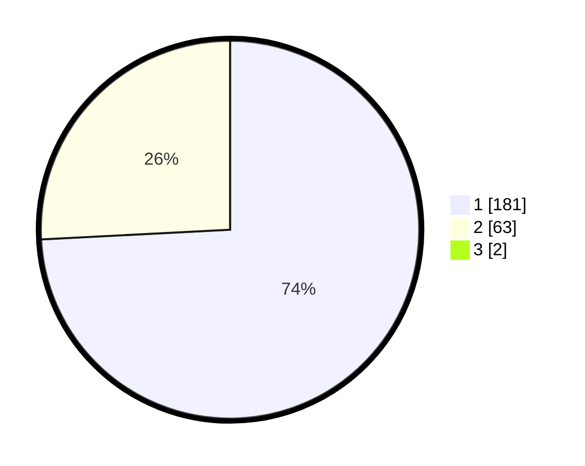

# Hasil

## Grafik

## Tabel

| No. | Nama Paslon    | Suara | Suara (raw) | Persentase |
|:--- |:-------------- | -----:| -----------:| ----------:|
| 1   | ANIES MUHAIMIN | 181   | [181][p-1]  | 73,58      |
| 2   | PRABOWO GIBRAN | 63    | [63][p-2]   | 25,61      |
| 3   | GANJAR MAHFUD  | 2     | [2][p-3]    | 0,81       |

[p-1]: https://github.com/gigit-pemilu/pemilu-2024-11-aceh/blob/main/pilpres/hitung-suara/sub/11-aceh/sub/02-aceh-tenggara/sub/01-lawe-alas/sub/2019-darul-amin/sub/001-tps/sub/paslon-1.txt
[p-2]: https://github.com/gigit-pemilu/pemilu-2024-11-aceh/blob/main/pilpres/hitung-suara/sub/11-aceh/sub/02-aceh-tenggara/sub/01-lawe-alas/sub/2019-darul-amin/sub/001-tps/sub/paslon-2.txt
[p-3]: https://github.com/gigit-pemilu/pemilu-2024-11-aceh/blob/main/pilpres/hitung-suara/sub/11-aceh/sub/02-aceh-tenggara/sub/01-lawe-alas/sub/2019-darul-amin/sub/001-tps/sub/paslon-3.txt

## Foto C Plano

https://sirekap-obj-formc.kpu.go.id/c0bd/pemilu/ppwp/11/02/01/20/19/1102012019001-20240215-040448--2961c58d-a5a7-4ef3-9c80-42dd00998235.jpg

https://sirekap-obj-formc.kpu.go.id/c0bd/pemilu/ppwp/11/02/01/20/19/1102012019001-20240215-040812--20d4354c-20d8-4975-bee7-f2f915b5d0c0.jpg

https://sirekap-obj-formc.kpu.go.id/c0bd/pemilu/ppwp/11/02/01/20/19/1102012019001-20240215-040930--e2d32ae1-b853-4fe0-9a18-b6b133b02e04.jpg

## Metadata

| Key        | Value               |
| ---------- | ------------------- |
| Time Stamp | 2024-02-19 06:16:00 |

## DATA PEMILIH TETAP

Jumlah pemilih dalam DPT: **278**.
 * L: **135**.
 * P: **143**.

## DATA PENGGUNA HAK PILIH

Jumlah pengguna hak pilih dalam DPT: **271**.
 * L: **131**.
 * P: **140**.

Jumlah pengguna hak pilih dalam DPTb: **0**.
 * L: **0**.
 * P: **0**.

Jumlah pengguna hak pilih dalam DPK: **8**.
 * L: **4**.
 * P: **4**.

Jumlah pengguna hak pilih: **279**.
 * L: **135**.
 * P: **144**.

## JUMLAH SUARA SAH DAN TIDAK SAH

JUMLAH SELURUH SUARA SAH: **246**.

JUMLAH SUARA TIDAK SAH: **33**.

JUMLAH SELURUH SUARA SAH DAN SUARA TIDAK SAH: **279**.

