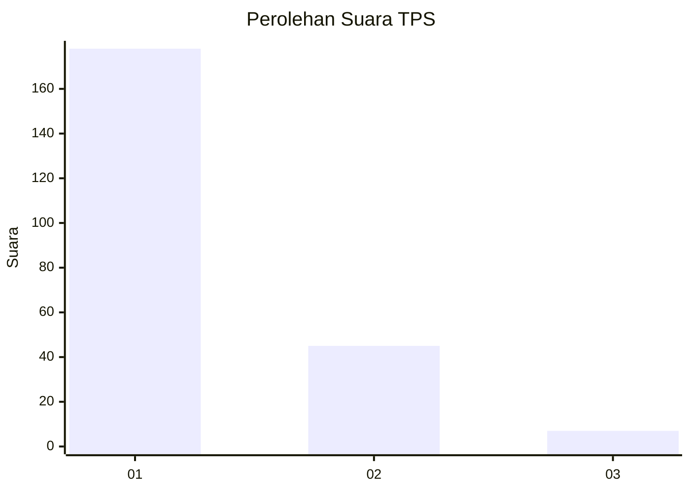
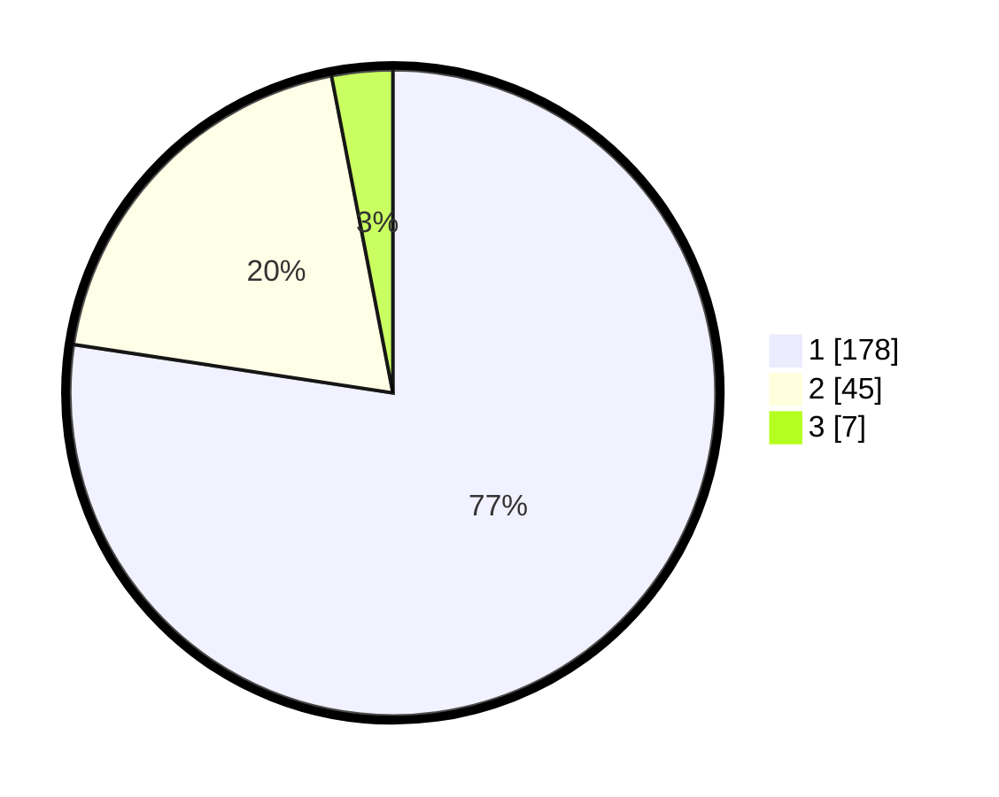

# Hasil

## Grafik

## Tabel

| No. | Nama Paslon    | Suara | Suara (raw) | Persentase |
|:--- |:-------------- | -----:| -----------:| ----------:|
| 1   | ANIES MUHAIMIN | 178   | [178][p-1]  | 77,39      |
| 2   | PRABOWO GIBRAN | 45    | [45][p-2]   | 19,57      |
| 3   | GANJAR MAHFUD  | 7     | [7][p-3]    | 3,04       |

[p-1]: https://github.com/gigit-pemilu/pemilu-2024-11-aceh/blob/main/pilpres/hitung-suara/sub/11-aceh/sub/02-aceh-tenggara/sub/01-lawe-alas/sub/2019-darul-amin/sub/002-tps/sub/paslon-1.txt
[p-2]: https://github.com/gigit-pemilu/pemilu-2024-11-aceh/blob/main/pilpres/hitung-suara/sub/11-aceh/sub/02-aceh-tenggara/sub/01-lawe-alas/sub/2019-darul-amin/sub/002-tps/sub/paslon-2.txt
[p-3]: https://github.com/gigit-pemilu/pemilu-2024-11-aceh/blob/main/pilpres/hitung-suara/sub/11-aceh/sub/02-aceh-tenggara/sub/01-lawe-alas/sub/2019-darul-amin/sub/002-tps/sub/paslon-3.txt

## Foto C Plano

https://sirekap-obj-formc.kpu.go.id/399c/pemilu/ppwp/11/02/01/20/19/1102012019002-20240214-155212--c3945131-20d5-434b-96a0-19b051a97172.jpg

https://sirekap-obj-formc.kpu.go.id/399c/pemilu/ppwp/11/02/01/20/19/1102012019002-20240215-093804--fa3f60b5-2df0-4c0a-afe1-ec8683302e60.jpg

## Metadata

| Key        | Value               |
| ---------- | ------------------- |
| Time Stamp | 2024-02-15 15:00:29 |

