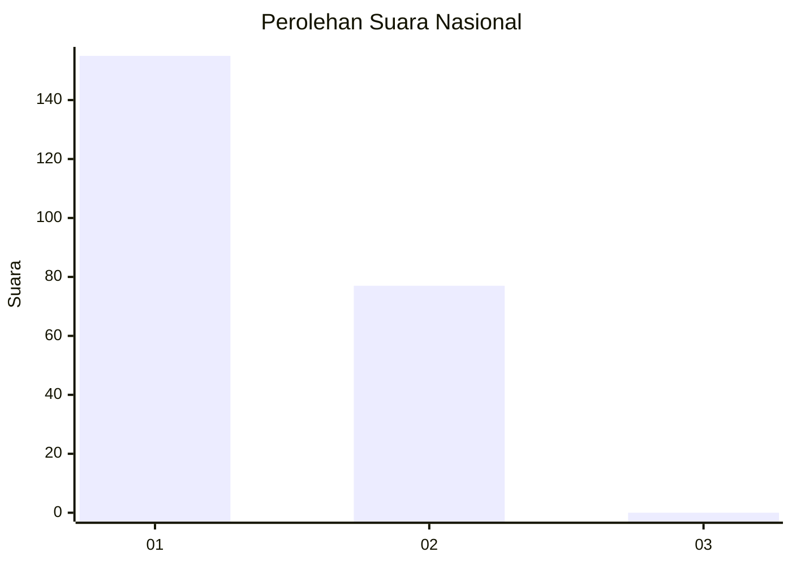
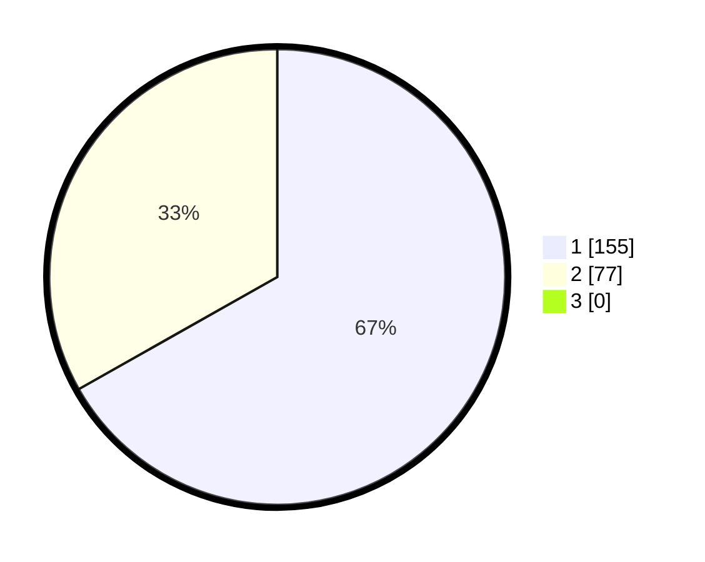

# Hasil

## Grafik

## Tabel

| No. | Nama Paslon    | Suara | Suara (raw) | Persentase |
|:--- |:-------------- | -----:| -----------:| ----------:|
| 1   | ANIES MUHAIMIN | 155   | [155][p-1]  | 66,81      |
| 2   | PRABOWO GIBRAN | 77    | [77][p-2]   | 33,19      |
| 3   | GANJAR MAHFUD  | 0     | [0][p-3]    | 0,00       |

[p-1]: https://github.com/gigit-pemilu/pemilu-2024/blob/main/pilpres/hitung-suara/sub/11-aceh/sub/02-aceh-tenggara/sub/01-lawe-alas/sub/2022-paye-munje/sub/001-tps/sub/paslon-1.txt
[p-2]: https://github.com/gigit-pemilu/pemilu-2024/blob/main/pilpres/hitung-suara/sub/11-aceh/sub/02-aceh-tenggara/sub/01-lawe-alas/sub/2022-paye-munje/sub/001-tps/sub/paslon-2.txt
[p-3]: https://github.com/gigit-pemilu/pemilu-2024/blob/main/pilpres/hitung-suara/sub/11-aceh/sub/02-aceh-tenggara/sub/01-lawe-alas/sub/2022-paye-munje/sub/001-tps/sub/paslon-3.txt

## Foto C Plano

https://sirekap-obj-formc.kpu.go.id/ad0a/pemilu/ppwp/11/02/01/20/22/1102012022001-20240215-091816--643245c5-6903-47da-8194-a91a4e7be458.jpg

https://sirekap-obj-formc.kpu.go.id/ad0a/pemilu/ppwp/11/02/01/20/22/1102012022001-20240215-092002--1f5e8444-fd2e-430b-8fa3-2b20ec7de2d5.jpg

https://sirekap-obj-formc.kpu.go.id/ad0a/pemilu/ppwp/11/02/01/20/22/1102012022001-20240215-092143--822d880e-79ff-4ef1-aed7-7845b93645bd.jpg

## Metadata

| Key        | Value               |
| ---------- | ------------------- |
| Time Stamp | 2024-02-24 22:31:28 |

