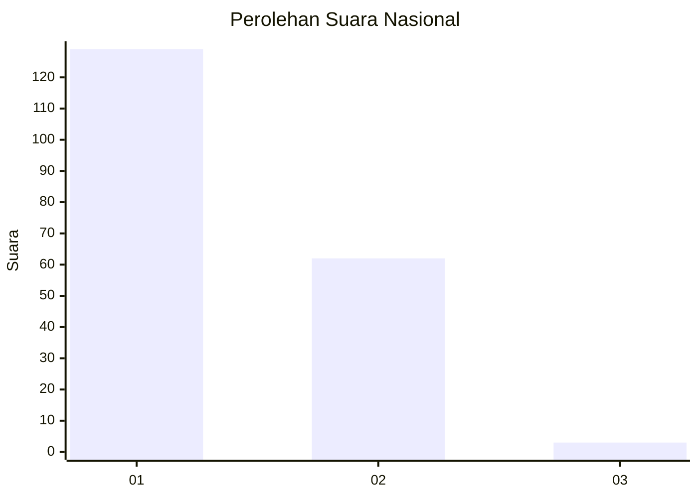
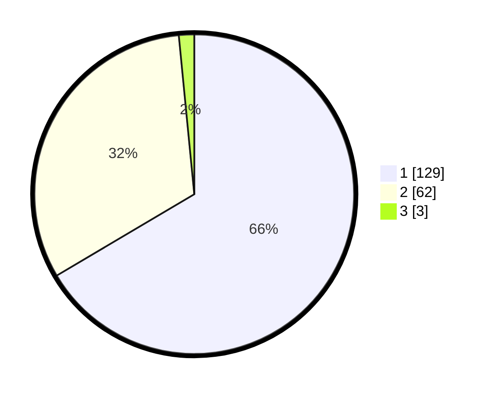

# Hasil

## Grafik

## Tabel

| No. | Nama Paslon    | Suara | Suara (raw) | Persentase |
|:--- |:-------------- | -----:| -----------:| ----------:|
| 1   | ANIES MUHAIMIN | 129   | [129][p-1]  | 66,49      |
| 2   | PRABOWO GIBRAN | 62    | [62][p-2]   | 31,96      |
| 3   | GANJAR MAHFUD  | 3     | [3][p-3]    | 1,55       |

[p-1]: https://github.com/gigit-pemilu/pemilu-2024/blob/main/pilpres/hitung-suara/sub/11-aceh/sub/02-aceh-tenggara/sub/01-lawe-alas/sub/2024-pasir-nunggul/sub/001-tps/sub/paslon-1.txt
[p-2]: https://github.com/gigit-pemilu/pemilu-2024/blob/main/pilpres/hitung-suara/sub/11-aceh/sub/02-aceh-tenggara/sub/01-lawe-alas/sub/2024-pasir-nunggul/sub/001-tps/sub/paslon-2.txt
[p-3]: https://github.com/gigit-pemilu/pemilu-2024/blob/main/pilpres/hitung-suara/sub/11-aceh/sub/02-aceh-tenggara/sub/01-lawe-alas/sub/2024-pasir-nunggul/sub/001-tps/sub/paslon-3.txt

## Foto C Plano

https://sirekap-obj-formc.kpu.go.id/b6a5/pemilu/ppwp/11/02/01/20/24/1102012024001-20240215-022345--b48aa14a-11ce-4174-97fb-1f3f5721b90a.jpg

https://sirekap-obj-formc.kpu.go.id/b6a5/pemilu/ppwp/11/02/01/20/24/1102012024001-20240215-022443--bd762d49-c48f-4426-9899-967a168ffb7f.jpg

https://sirekap-obj-formc.kpu.go.id/b6a5/pemilu/ppwp/11/02/01/20/24/1102012024001-20240215-022602--c7136911-7207-402a-8204-410a36485b59.jpg

## Metadata

| Key        | Value               |
| ---------- | ------------------- |
| Time Stamp | 2024-02-15 15:30:25 |

