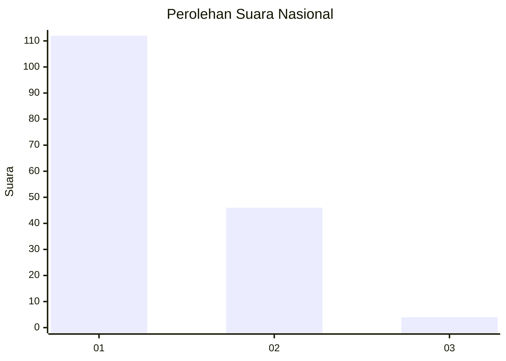
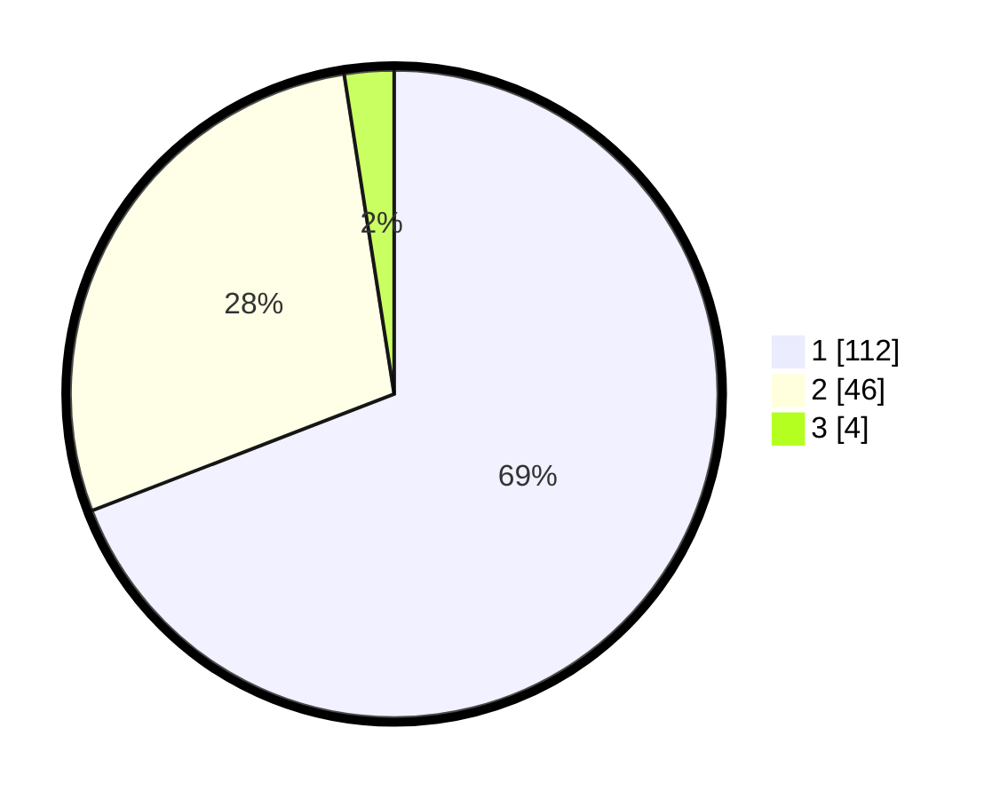

# Hasil

## Grafik

## Tabel

| No. | Nama Paslon    | Suara | Suara (raw) | Persentase |
|:--- |:-------------- | -----:| -----------:| ----------:|
| 1   | ANIES MUHAIMIN | 112   | [112][p-1]  | 69,14      |
| 2   | PRABOWO GIBRAN | 46    | [46][p-2]   | 28,40      |
| 3   | GANJAR MAHFUD  | 4     | [4][p-3]    | 2,47       |

[p-1]: https://github.com/gigit-pemilu/pemilu-2024/blob/main/pilpres/hitung-suara/sub/11-aceh/sub/02-aceh-tenggara/sub/01-lawe-alas/sub/2026-pintu-khimbe/sub/002-tps/sub/paslon-1.txt
[p-2]: https://github.com/gigit-pemilu/pemilu-2024/blob/main/pilpres/hitung-suara/sub/11-aceh/sub/02-aceh-tenggara/sub/01-lawe-alas/sub/2026-pintu-khimbe/sub/002-tps/sub/paslon-2.txt
[p-3]: https://github.com/gigit-pemilu/pemilu-2024/blob/main/pilpres/hitung-suara/sub/11-aceh/sub/02-aceh-tenggara/sub/01-lawe-alas/sub/2026-pintu-khimbe/sub/002-tps/sub/paslon-3.txt

## Foto C Plano

https://sirekap-obj-formc.kpu.go.id/3ccb/pemilu/ppwp/11/02/01/20/26/1102012026002-20240222-154931--8cbec827-ca4a-416a-9e3c-f55c9a61bced.jpg

https://sirekap-obj-formc.kpu.go.id/3ccb/pemilu/ppwp/11/02/01/20/26/1102012026002-20240222-154933--fd15a3e1-cd7b-431b-b6ee-bcc808887ca2.jpg

https://sirekap-obj-formc.kpu.go.id/3ccb/pemilu/ppwp/11/02/01/20/26/1102012026002-20240222-154932--c39c35fe-6e5e-41cf-9130-236cb5d20a31.jpg

## Metadata

| Key        | Value               |
| ---------- | ------------------- |
| Time Stamp | 2024-02-24 22:31:28 |

## DATA PEMILIH TETAP

Jumlah pemilih dalam DPT: **168**.
 * L: **89**.
 * P: **79**.

## DATA PENGGUNA HAK PILIH

Jumlah pengguna hak pilih dalam DPT: **164**.
 * L: **87**.
 * P: **77**.

Jumlah pengguna hak pilih dalam DPTb: **0**.
 * L: **0**.
 * P: **0**.

Jumlah pengguna hak pilih dalam DPK: **3**.
 * L: **0**.
 * P: **3**.

Jumlah pengguna hak pilih: **167**.
 * L: **87**.
 * P: **80**.

## JUMLAH SUARA SAH DAN TIDAK SAH

JUMLAH SELURUH SUARA SAH: **162**.

JUMLAH SUARA TIDAK SAH: **4**.

JUMLAH SELURUH SUARA SAH DAN SUARA TIDAK SAH: **166**.

