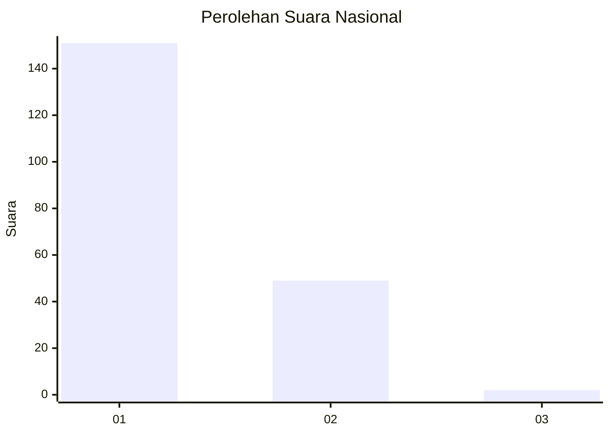
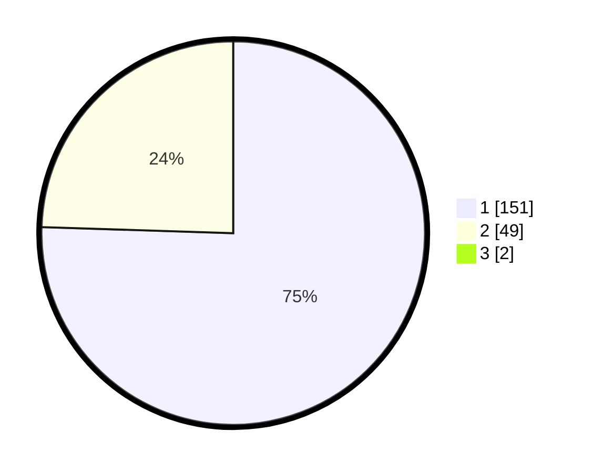

# Hasil

## Grafik

## Tabel

| No. | Nama Paslon    | Suara | Suara (raw) | Persentase |
|:--- |:-------------- | -----:| -----------:| ----------:|
| 1   | ANIES MUHAIMIN | 151   | [151][p-1]  | 74,75      |
| 2   | PRABOWO GIBRAN | 49    | [49][p-2]   | 24,26      |
| 3   | GANJAR MAHFUD  | 2     | [2][p-3]    | 0,99       |

[p-1]: https://github.com/gigit-pemilu/pemilu-2024/blob/main/pilpres/hitung-suara/sub/11-aceh/sub/02-aceh-tenggara/sub/01-lawe-alas/sub/2030-pasikh-nunang/sub/001-tps/sub/paslon-1.txt
[p-2]: https://github.com/gigit-pemilu/pemilu-2024/blob/main/pilpres/hitung-suara/sub/11-aceh/sub/02-aceh-tenggara/sub/01-lawe-alas/sub/2030-pasikh-nunang/sub/001-tps/sub/paslon-2.txt
[p-3]: https://github.com/gigit-pemilu/pemilu-2024/blob/main/pilpres/hitung-suara/sub/11-aceh/sub/02-aceh-tenggara/sub/01-lawe-alas/sub/2030-pasikh-nunang/sub/001-tps/sub/paslon-3.txt

## Foto C Plano

https://sirekap-obj-formc.kpu.go.id/9c27/pemilu/ppwp/11/02/01/20/30/1102012030001-20240215-084831--4e5f7c93-784a-44f6-a4a8-ecd734d33557.jpg

https://sirekap-obj-formc.kpu.go.id/9c27/pemilu/ppwp/11/02/01/20/30/1102012030001-20240215-085201--0cd7be38-e9ca-41d4-adcf-5a9c897588f3.jpg

https://sirekap-obj-formc.kpu.go.id/9c27/pemilu/ppwp/11/02/01/20/30/1102012030001-20240215-085346--c5944de7-1c7e-4c80-bfa4-fc3cc98e5769.jpg

## Metadata

| Key        | Value               |
| ---------- | ------------------- |
| Time Stamp | 2024-02-15 15:30:25 |

