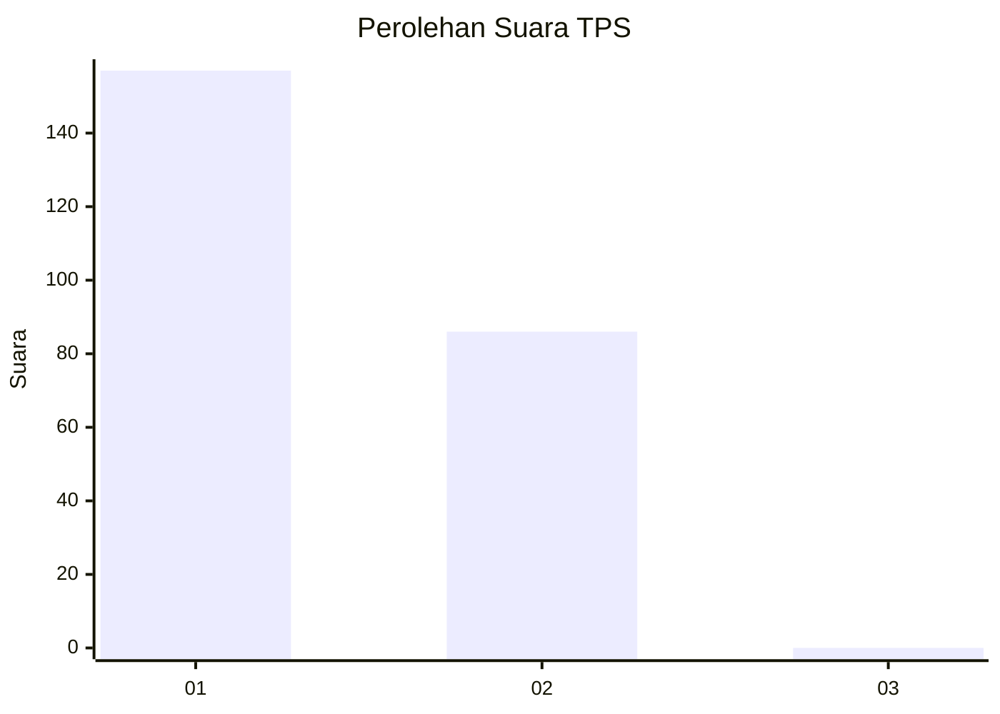
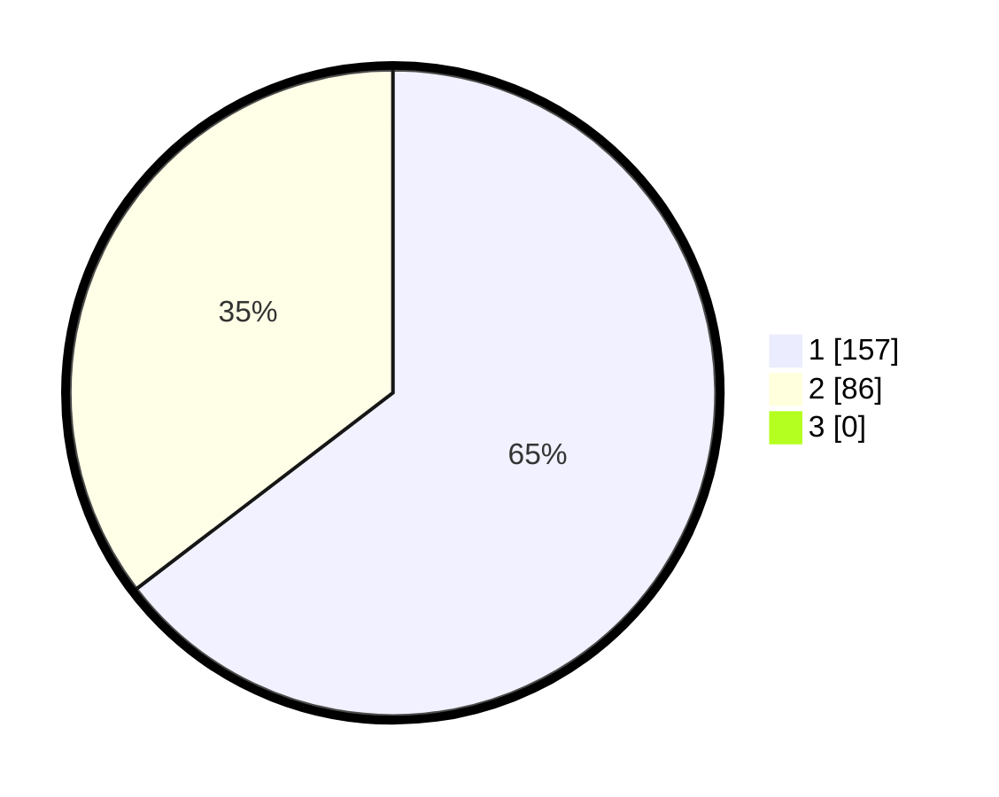

# Hasil

## Grafik

## Tabel

| No. | Nama Paslon    | Suara | Suara (raw) | Persentase |
|:--- |:-------------- | -----:| -----------:| ----------:|
| 1   | ANIES MUHAIMIN | 157   | [157][p-1]  | 64,61      |
| 2   | PRABOWO GIBRAN | 86    | [86][p-2]   | 35,39      |
| 3   | GANJAR MAHFUD  | 0     | [0][p-3]    | 0,00       |

[p-1]: https://github.com/gigit-pemilu/pemilu-2024-11-aceh/blob/main/pilpres/hitung-suara/sub/11-aceh/sub/02-aceh-tenggara/sub/01-lawe-alas/sub/2031-deleng-kukusen/sub/001-tps/sub/paslon-1.txt
[p-2]: https://github.com/gigit-pemilu/pemilu-2024-11-aceh/blob/main/pilpres/hitung-suara/sub/11-aceh/sub/02-aceh-tenggara/sub/01-lawe-alas/sub/2031-deleng-kukusen/sub/001-tps/sub/paslon-2.txt
[p-3]: https://github.com/gigit-pemilu/pemilu-2024-11-aceh/blob/main/pilpres/hitung-suara/sub/11-aceh/sub/02-aceh-tenggara/sub/01-lawe-alas/sub/2031-deleng-kukusen/sub/001-tps/sub/paslon-3.txt

## Foto C Plano

https://sirekap-obj-formc.kpu.go.id/11c3/pemilu/ppwp/11/02/01/20/31/1102012031001-20240221-212809--8e0d5c03-1ea5-4922-a467-a18d64ac16a5.jpg

https://sirekap-obj-formc.kpu.go.id/11c3/pemilu/ppwp/11/02/01/20/31/1102012031001-20240221-212954--210e722e-fdd8-4766-9519-3b1be3650b34.jpg

https://sirekap-obj-formc.kpu.go.id/11c3/pemilu/ppwp/11/02/01/20/31/1102012031001-20240221-213131--35fb5ad8-3e21-4000-a9f9-d051a39e234c.jpg

## Metadata

| Key        | Value               |
| ---------- | ------------------- |
| Time Stamp | 2024-02-24 22:31:28 |

