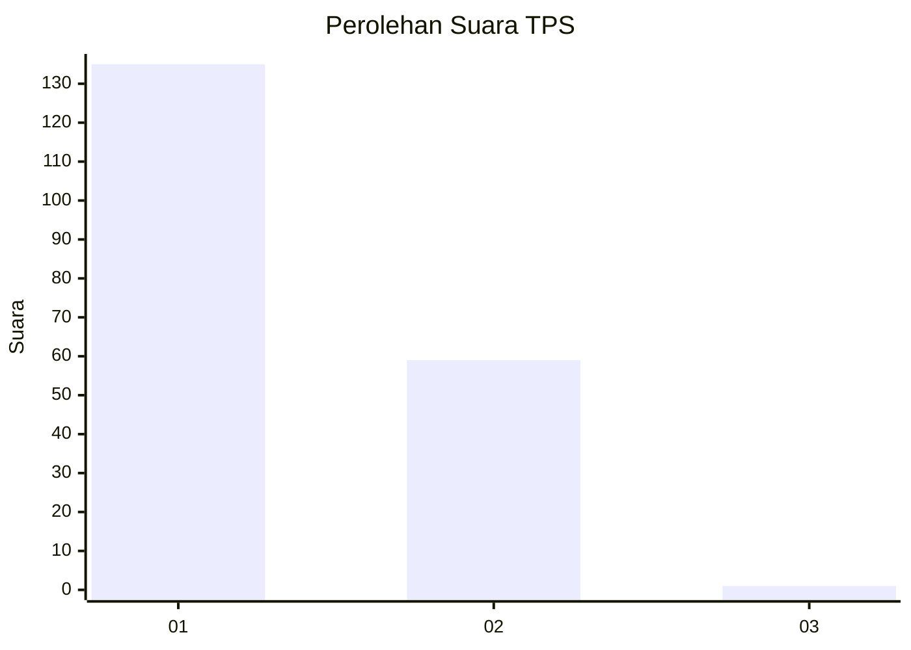
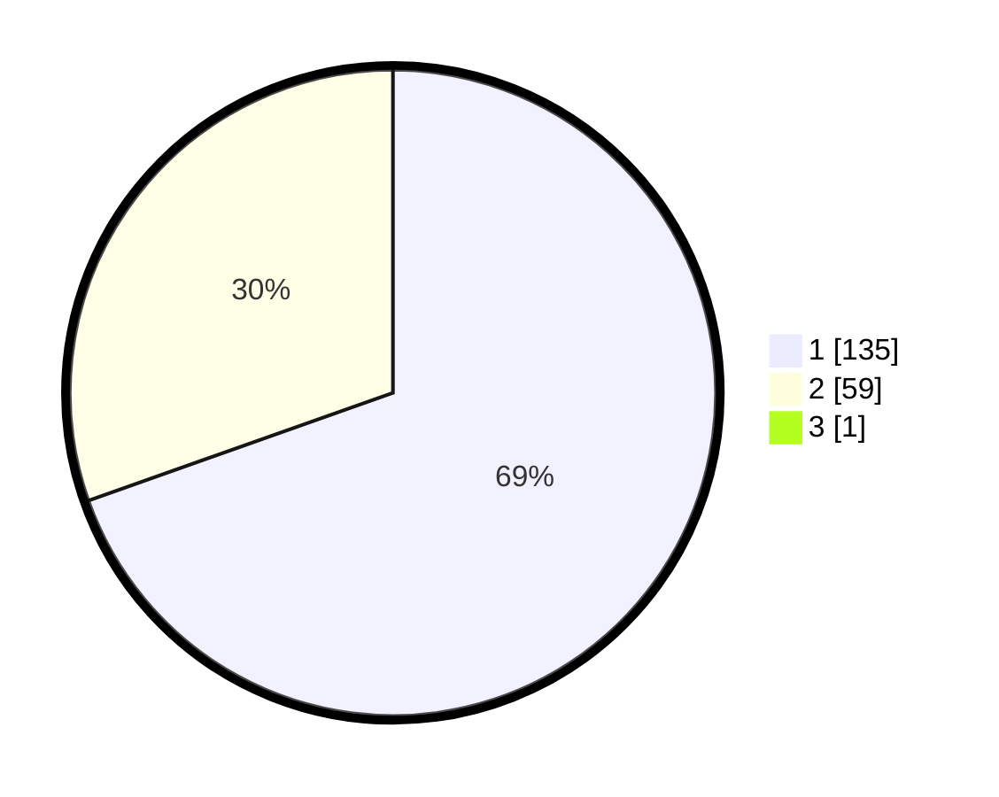

# Hasil

## Grafik

## Tabel

| No. | Nama Paslon    | Suara | Suara (raw) | Persentase |
|:--- |:-------------- | -----:| -----------:| ----------:|
| 1   | ANIES MUHAIMIN | 135   | [135][p-1]  | 69,23      |
| 2   | PRABOWO GIBRAN | 59    | [59][p-2]   | 30,26      |
| 3   | GANJAR MAHFUD  | 1     | [1][p-3]    | 0,51       |

[p-1]: https://github.com/gigit-pemilu/pemilu-2024-11-aceh/blob/main/pilpres/hitung-suara/sub/11-aceh/sub/02-aceh-tenggara/sub/02-lawe-sigala-gala/sub/2001-bukit-merdeka/sub/001-tps/sub/paslon-1.txt
[p-2]: https://github.com/gigit-pemilu/pemilu-2024-11-aceh/blob/main/pilpres/hitung-suara/sub/11-aceh/sub/02-aceh-tenggara/sub/02-lawe-sigala-gala/sub/2001-bukit-merdeka/sub/001-tps/sub/paslon-2.txt
[p-3]: https://github.com/gigit-pemilu/pemilu-2024-11-aceh/blob/main/pilpres/hitung-suara/sub/11-aceh/sub/02-aceh-tenggara/sub/02-lawe-sigala-gala/sub/2001-bukit-merdeka/sub/001-tps/sub/paslon-3.txt

## Foto C Plano

https://sirekap-obj-formc.kpu.go.id/2bca/pemilu/ppwp/11/02/02/20/01/1102022001001-20240215-084026--6ca24fa1-975e-480d-a9ef-76918c7d48dc.jpg

https://sirekap-obj-formc.kpu.go.id/2bca/pemilu/ppwp/11/02/02/20/01/1102022001001-20240215-084227--1204ec75-ea9c-4477-9d04-78bdd4f35dc3.jpg

https://sirekap-obj-formc.kpu.go.id/2bca/pemilu/ppwp/11/02/02/20/01/1102022001001-20240215-084830--6b33ba8b-ae1a-40b0-add2-b93902b6f3e8.jpg

## Metadata

| Key        | Value               |
| ---------- | ------------------- |
| Time Stamp | 2024-02-15 15:00:29 |

