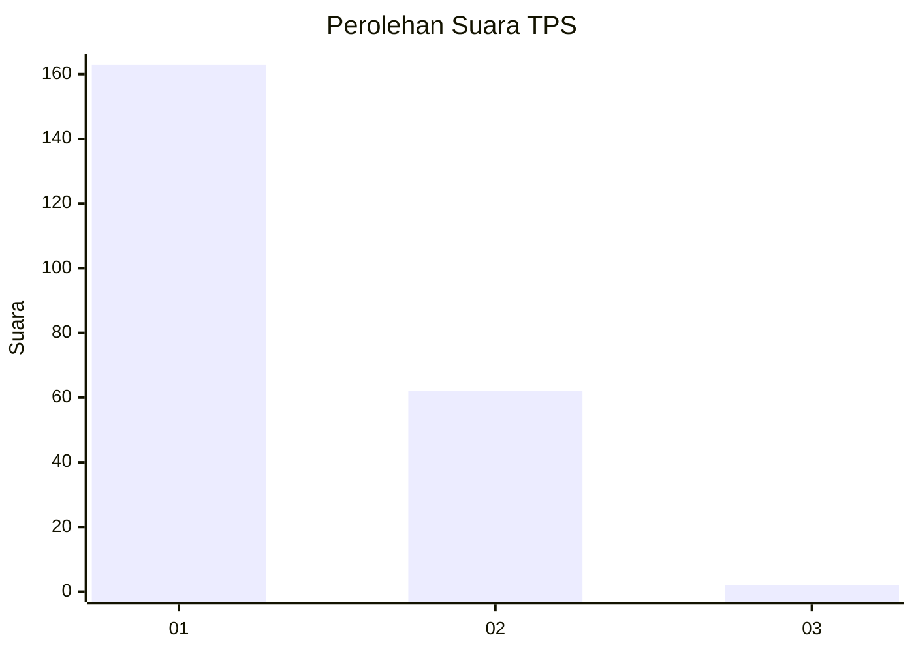
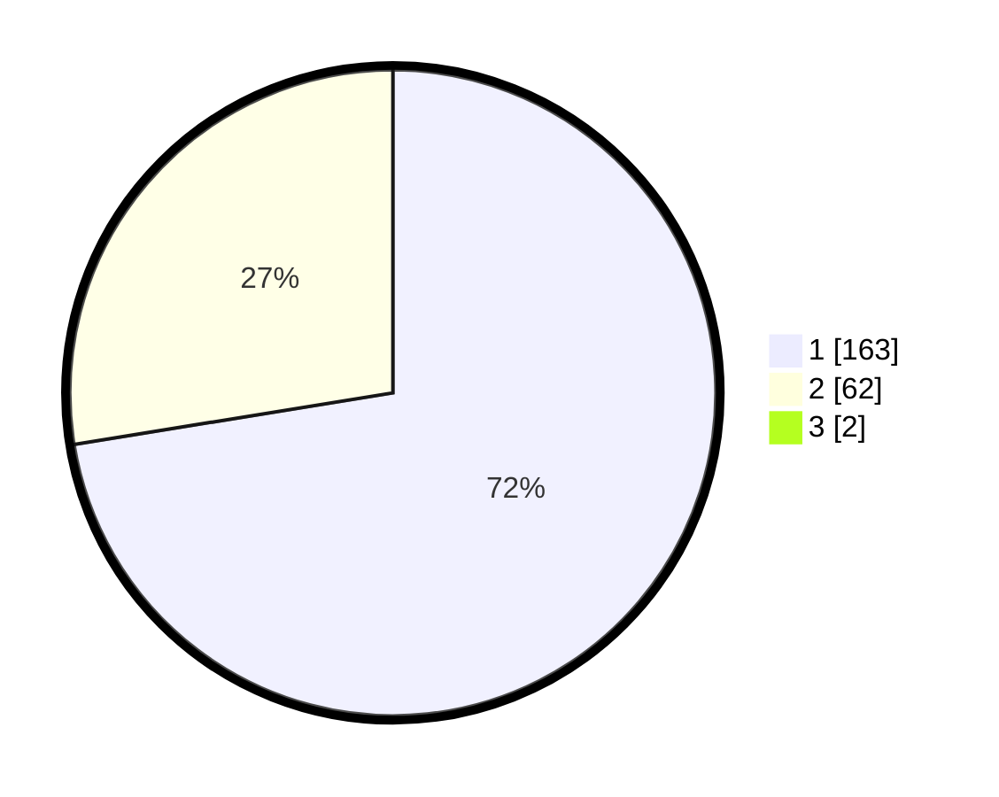

# Hasil

## Grafik

## Tabel

| No. | Nama Paslon    | Suara | Suara (raw) | Persentase |
|:--- |:-------------- | -----:| -----------:| ----------:|
| 1   | ANIES MUHAIMIN | 163   | [163][p-1]  | 71,81      |
| 2   | PRABOWO GIBRAN | 62    | [62][p-2]   | 27,31      |
| 3   | GANJAR MAHFUD  | 2     | [2][p-3]    | 0,88       |

[p-1]: https://github.com/gigit-pemilu/pemilu-2024-11-aceh/blob/main/pilpres/hitung-suara/sub/11-aceh/sub/02-aceh-tenggara/sub/02-lawe-sigala-gala/sub/2001-bukit-merdeka/sub/002-tps/sub/paslon-1.txt
[p-2]: https://github.com/gigit-pemilu/pemilu-2024-11-aceh/blob/main/pilpres/hitung-suara/sub/11-aceh/sub/02-aceh-tenggara/sub/02-lawe-sigala-gala/sub/2001-bukit-merdeka/sub/002-tps/sub/paslon-2.txt
[p-3]: https://github.com/gigit-pemilu/pemilu-2024-11-aceh/blob/main/pilpres/hitung-suara/sub/11-aceh/sub/02-aceh-tenggara/sub/02-lawe-sigala-gala/sub/2001-bukit-merdeka/sub/002-tps/sub/paslon-3.txt

## Foto C Plano

https://sirekap-obj-formc.kpu.go.id/b867/pemilu/ppwp/11/02/02/20/01/1102022001002-20240217-164053--7d063608-1cfc-4c7e-a581-3adc114d1899.jpg

https://sirekap-obj-formc.kpu.go.id/b867/pemilu/ppwp/11/02/02/20/01/1102022001002-20240217-143037--f86ae382-1f54-4d6b-afe9-fe06da3f5a2a.jpg

https://sirekap-obj-formc.kpu.go.id/b867/pemilu/ppwp/11/02/02/20/01/1102022001002-20240217-164054--1aca2a59-a389-4b8f-9870-13a2bf0e85f2.jpg

## Metadata

| Key        | Value               |
| ---------- | ------------------- |
| Time Stamp | 2024-02-21 11:00:00 |

## DATA PEMILIH TETAP

Jumlah pemilih dalam DPT: **249**.
 * L: **115**.
 * P: **134**.

## DATA PENGGUNA HAK PILIH

Jumlah pengguna hak pilih dalam DPT: **236**.
 * L: **110**.
 * P: **126**.

Jumlah pengguna hak pilih dalam DPTb: **0**.
 * L: **0**.
 * P: **0**.

Jumlah pengguna hak pilih dalam DPK: **0**.
 * L: **0**.
 * P: **0**.

Jumlah pengguna hak pilih: **236**.
 * L: **110**.
 * P: **126**.

## JUMLAH SUARA SAH DAN TIDAK SAH

JUMLAH SELURUH SUARA SAH: **227**.

JUMLAH SUARA TIDAK SAH: **9**.

JUMLAH SELURUH SUARA SAH DAN SUARA TIDAK SAH: **236**.

