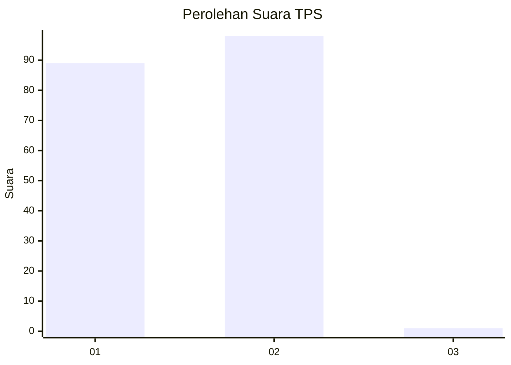
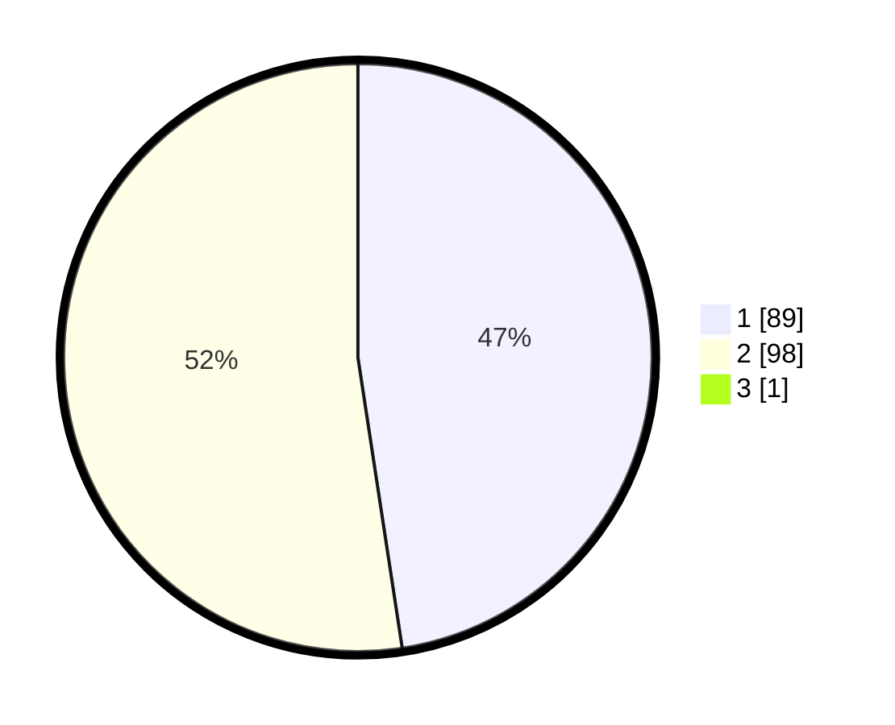

# Hasil

## Grafik

## Tabel

| No. | Nama Paslon    | Suara | Suara (raw) | Persentase |
|:--- |:-------------- | -----:| -----------:| ----------:|
| 1   | ANIES MUHAIMIN | 89    | [89][p-1]   | 47,34      |
| 2   | PRABOWO GIBRAN | 98    | [98][p-2]   | 52,13      |
| 3   | GANJAR MAHFUD  | 1     | [1][p-3]    | 0,53       |

[p-1]: https://github.com/gigit-pemilu/pemilu-2024-11-aceh/blob/main/pilpres/hitung-suara/sub/11-aceh/sub/02-aceh-tenggara/sub/02-lawe-sigala-gala/sub/2002-darul-aman/sub/002-tps/sub/paslon-1.txt
[p-2]: https://github.com/gigit-pemilu/pemilu-2024-11-aceh/blob/main/pilpres/hitung-suara/sub/11-aceh/sub/02-aceh-tenggara/sub/02-lawe-sigala-gala/sub/2002-darul-aman/sub/002-tps/sub/paslon-2.txt
[p-3]: https://github.com/gigit-pemilu/pemilu-2024-11-aceh/blob/main/pilpres/hitung-suara/sub/11-aceh/sub/02-aceh-tenggara/sub/02-lawe-sigala-gala/sub/2002-darul-aman/sub/002-tps/sub/paslon-3.txt

## Foto C Plano

https://sirekap-obj-formc.kpu.go.id/41c2/pemilu/ppwp/11/02/02/20/02/1102022002002-20240215-105317--06f8bf1a-6751-4bdd-820f-679474e2d3a6.jpg

https://sirekap-obj-formc.kpu.go.id/41c2/pemilu/ppwp/11/02/02/20/02/1102022002002-20240215-105457--3569534c-a392-42de-bdc7-22296d91481c.jpg

https://sirekap-obj-formc.kpu.go.id/41c2/pemilu/ppwp/11/02/02/20/02/1102022002002-20240215-105545--8816924e-ed89-44ab-9bcb-36ed71ae538a.jpg

## Metadata

| Key        | Value               |
| ---------- | ------------------- |
| Time Stamp | 2024-02-24 22:31:28 |

