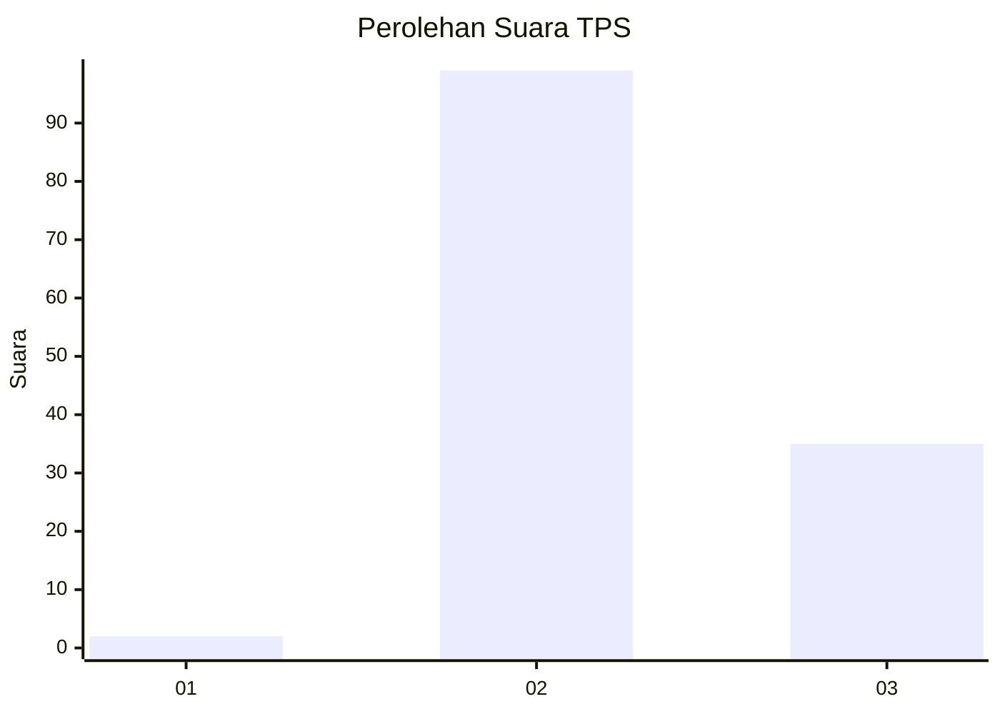
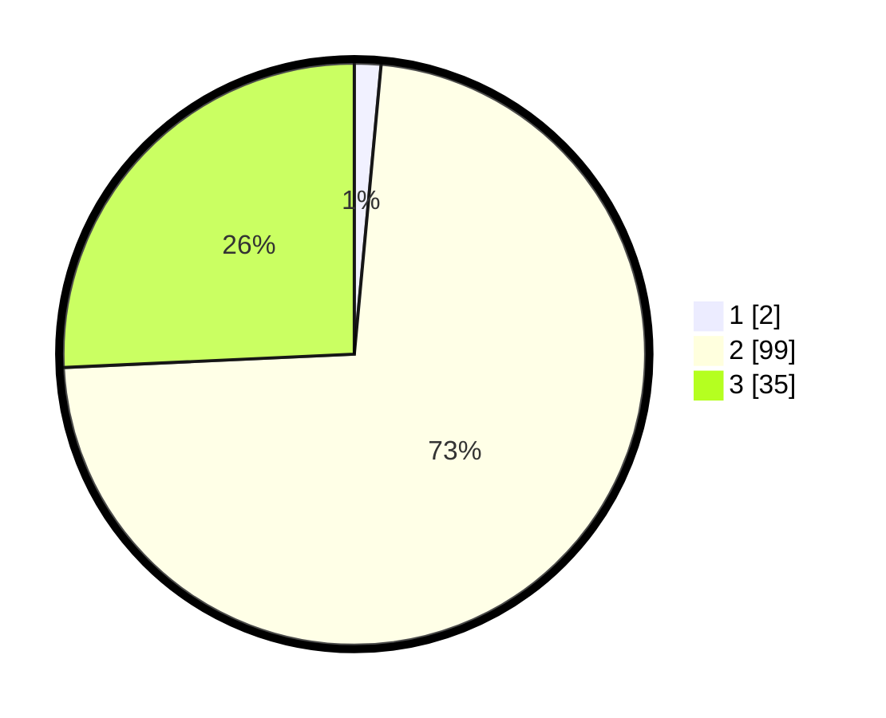

# Hasil

## Grafik

## Tabel

| No. | Nama Paslon    | Suara | Suara (raw) | Persentase |
|:--- |:-------------- | -----:| -----------:| ----------:|
| 1   | ANIES MUHAIMIN | 2     | [2][p-1]    | 1,47       |
| 2   | PRABOWO GIBRAN | 99    | [99][p-2]   | 72,79      |
| 3   | GANJAR MAHFUD  | 35    | [35][p-3]   | 25,74      |

[p-1]: https://github.com/gigit-pemilu/pemilu-2024-11-aceh/blob/main/pilpres/hitung-suara/sub/11-aceh/sub/02-aceh-tenggara/sub/02-lawe-sigala-gala/sub/2003-lawe-kesumpat/sub/002-tps/sub/paslon-1.txt
[p-2]: https://github.com/gigit-pemilu/pemilu-2024-11-aceh/blob/main/pilpres/hitung-suara/sub/11-aceh/sub/02-aceh-tenggara/sub/02-lawe-sigala-gala/sub/2003-lawe-kesumpat/sub/002-tps/sub/paslon-2.txt
[p-3]: https://github.com/gigit-pemilu/pemilu-2024-11-aceh/blob/main/pilpres/hitung-suara/sub/11-aceh/sub/02-aceh-tenggara/sub/02-lawe-sigala-gala/sub/2003-lawe-kesumpat/sub/002-tps/sub/paslon-3.txt

## Foto C Plano

https://sirekap-obj-formc.kpu.go.id/39d1/pemilu/ppwp/11/02/02/20/03/1102022003002-20240216-145634--429eea56-dfaa-47e3-95ed-ef52493f9fe2.jpg

https://sirekap-obj-formc.kpu.go.id/39d1/pemilu/ppwp/11/02/02/20/03/1102022003002-20240216-145636--552f78b5-b7c9-4868-8cdc-89cae24b456b.jpg

https://sirekap-obj-formc.kpu.go.id/39d1/pemilu/ppwp/11/02/02/20/03/1102022003002-20240216-145635--567a8998-ecbf-45f3-a310-ce9c3e7c59cb.jpg

## Metadata

| Key        | Value               |
| ---------- | ------------------- |
| Time Stamp | 2024-02-16 17:00:00 |

## DATA PEMILIH TETAP

Jumlah pemilih dalam DPT: **175**.
 * L: **75**.
 * P: **100**.

## DATA PENGGUNA HAK PILIH

Jumlah pengguna hak pilih dalam DPT: **130**.
 * L: **59**.
 * P: **71**.

Jumlah pengguna hak pilih dalam DPTb: **1**.
 * L: **0**.
 * P: **1**.

Jumlah pengguna hak pilih dalam DPK: **5**.
 * L: **1**.
 * P: **4**.

Jumlah pengguna hak pilih: **135**.
 * L: **60**.
 * P: **76**.

## JUMLAH SUARA SAH DAN TIDAK SAH

JUMLAH SELURUH SUARA SAH: **135**.

JUMLAH SUARA TIDAK SAH: **1**.

JUMLAH SELURUH SUARA SAH DAN SUARA TIDAK SAH: **136**.

