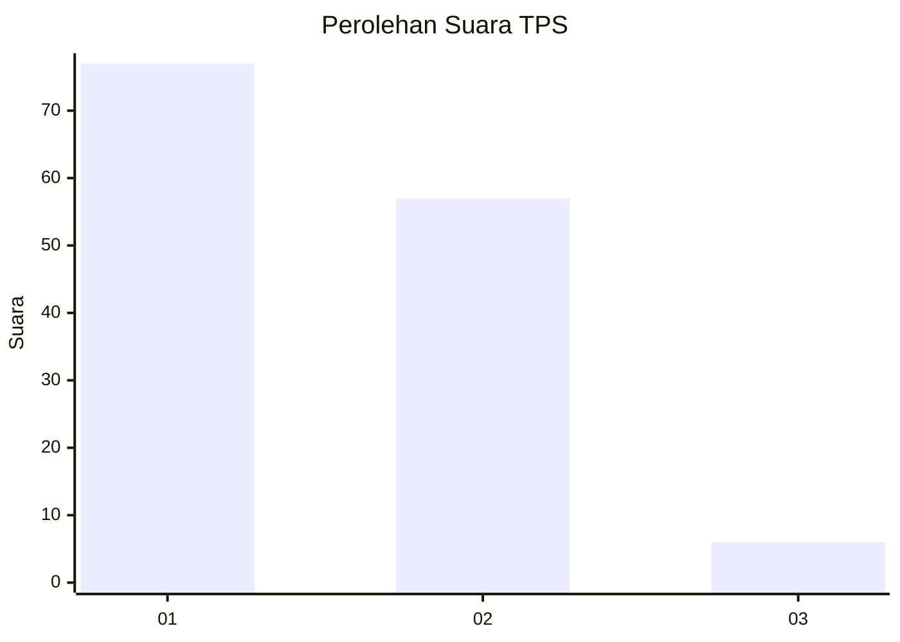
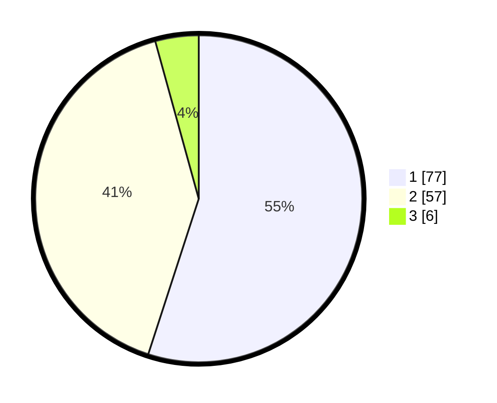

# Hasil

## Grafik

## Tabel

| No. | Nama Paslon    | Suara | Suara (raw) | Persentase |
|:--- |:-------------- | -----:| -----------:| ----------:|
| 1   | ANIES MUHAIMIN | 77    | [77][p-1]   | 55,00      |
| 2   | PRABOWO GIBRAN | 57    | [57][p-2]   | 40,71      |
| 3   | GANJAR MAHFUD  | 6     | [6][p-3]    | 4,29       |

[p-1]: https://github.com/gigit-pemilu/pemilu-2024-11-aceh/blob/main/pilpres/hitung-suara/sub/11-aceh/sub/02-aceh-tenggara/sub/02-lawe-sigala-gala/sub/2007-lawe-sigala-barat/sub/002-tps/sub/paslon-1.txt
[p-2]: https://github.com/gigit-pemilu/pemilu-2024-11-aceh/blob/main/pilpres/hitung-suara/sub/11-aceh/sub/02-aceh-tenggara/sub/02-lawe-sigala-gala/sub/2007-lawe-sigala-barat/sub/002-tps/sub/paslon-2.txt
[p-3]: https://github.com/gigit-pemilu/pemilu-2024-11-aceh/blob/main/pilpres/hitung-suara/sub/11-aceh/sub/02-aceh-tenggara/sub/02-lawe-sigala-gala/sub/2007-lawe-sigala-barat/sub/002-tps/sub/paslon-3.txt

## Foto C Plano

https://sirekap-obj-formc.kpu.go.id/cc05/pemilu/ppwp/11/02/02/20/07/1102022007002-20240215-010314--bcd4ada5-e95b-41f7-b21f-e06d83cf60ed.jpg

https://sirekap-obj-formc.kpu.go.id/cc05/pemilu/ppwp/11/02/02/20/07/1102022007002-20240215-005720--e0ec021a-5c71-4b78-84be-ae2ace67149f.jpg

https://sirekap-obj-formc.kpu.go.id/cc05/pemilu/ppwp/11/02/02/20/07/1102022007002-20240215-010546--b38f256c-2673-4587-a9cc-87ab3fa386ca.jpg

## Metadata

| Key        | Value               |
| ---------- | ------------------- |
| Time Stamp | 2024-02-25 11:00:00 |

## DATA PEMILIH TETAP

Jumlah pemilih dalam DPT: **185**.
 * L: **95**.
 * P: **90**.

## DATA PENGGUNA HAK PILIH

Jumlah pengguna hak pilih dalam DPT: **145**.
 * L: **74**.
 * P: **71**.

Jumlah pengguna hak pilih dalam DPTb: **145**.
 * L: **74**.
 * P: **71**.

Jumlah pengguna hak pilih dalam DPK: **0**.
 * L: **0**.
 * P: **0**.

Jumlah pengguna hak pilih: **145**.
 * L: **74**.
 * P: **71**.

## JUMLAH SUARA SAH DAN TIDAK SAH

JUMLAH SELURUH SUARA SAH: **141**.

JUMLAH SUARA TIDAK SAH: **4**.

JUMLAH SELURUH SUARA SAH DAN SUARA TIDAK SAH: **145**.

