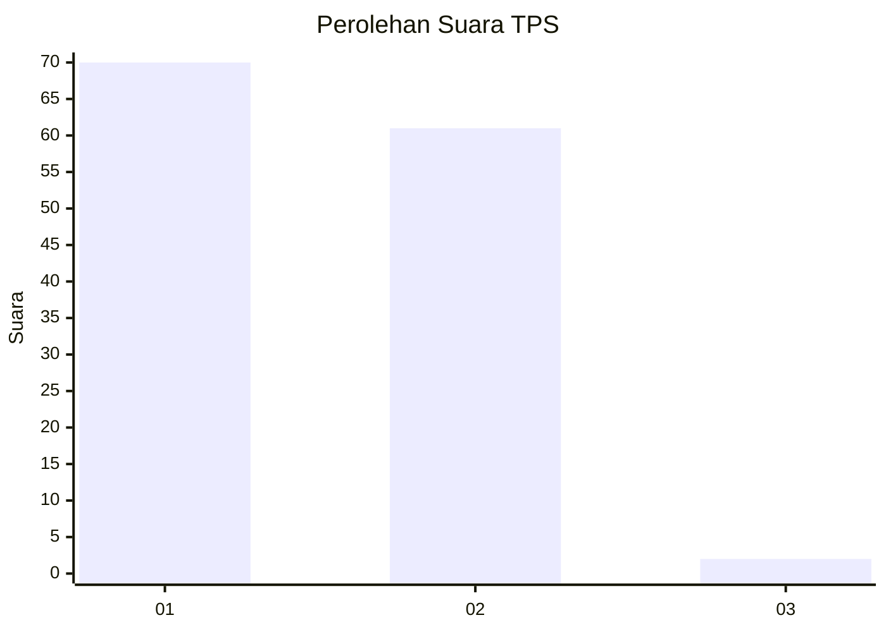
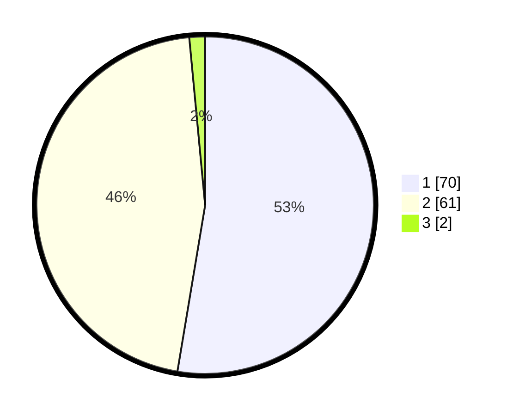

# Hasil

## Grafik

## Tabel

| No. | Nama Paslon    | Suara | Suara (raw) | Persentase |
|:--- |:-------------- | -----:| -----------:| ----------:|
| 1   | ANIES MUHAIMIN | 70    | [70][p-1]   | 52,63      |
| 2   | PRABOWO GIBRAN | 61    | [61][p-2]   | 45,86      |
| 3   | GANJAR MAHFUD  | 2     | [2][p-3]    | 1,50       |

[p-1]: https://github.com/gigit-pemilu/pemilu-2024-11-aceh/blob/main/pilpres/hitung-suara/sub/11-aceh/sub/02-aceh-tenggara/sub/02-lawe-sigala-gala/sub/2007-lawe-sigala-barat/sub/003-tps/sub/paslon-1.txt
[p-2]: https://github.com/gigit-pemilu/pemilu-2024-11-aceh/blob/main/pilpres/hitung-suara/sub/11-aceh/sub/02-aceh-tenggara/sub/02-lawe-sigala-gala/sub/2007-lawe-sigala-barat/sub/003-tps/sub/paslon-2.txt
[p-3]: https://github.com/gigit-pemilu/pemilu-2024-11-aceh/blob/main/pilpres/hitung-suara/sub/11-aceh/sub/02-aceh-tenggara/sub/02-lawe-sigala-gala/sub/2007-lawe-sigala-barat/sub/003-tps/sub/paslon-3.txt

## Foto C Plano

https://sirekap-obj-formc.kpu.go.id/2492/pemilu/ppwp/11/02/02/20/07/1102022007003-20240216-143953--e739dffd-e2a9-4373-bd02-65f8d6da95b0.jpg

https://sirekap-obj-formc.kpu.go.id/2492/pemilu/ppwp/11/02/02/20/07/1102022007003-20240216-143954--127cadd4-d7dd-4831-90c2-6628dab85695.jpg

https://sirekap-obj-formc.kpu.go.id/2492/pemilu/ppwp/11/02/02/20/07/1102022007003-20240216-143954--c2f78987-88f2-4d2b-992c-8a6200a31ae2.jpg

## Metadata

| Key        | Value               |
| ---------- | ------------------- |
| Time Stamp | 2024-02-16 21:01:00 |

## DATA PEMILIH TETAP

Jumlah pemilih dalam DPT: **161**.
 * L: **65**.
 * P: **96**.

## DATA PENGGUNA HAK PILIH

Jumlah pengguna hak pilih dalam DPT: **123**.
 * L: **45**.
 * P: **78**.

Jumlah pengguna hak pilih dalam DPTb: **3**.
 * L: **2**.
 * P: **1**.

Jumlah pengguna hak pilih dalam DPK: **9**.
 * L: **4**.
 * P: **8**.

Jumlah pengguna hak pilih: **135**.
 * L: **51**.
 * P: **84**.

## JUMLAH SUARA SAH DAN TIDAK SAH

JUMLAH SELURUH SUARA SAH: **133**.

JUMLAH SUARA TIDAK SAH: **2**.

JUMLAH SELURUH SUARA SAH DAN SUARA TIDAK SAH: **135**.

