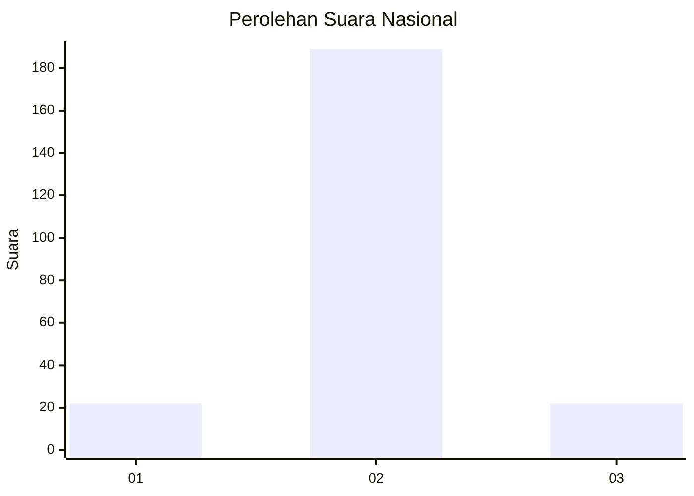
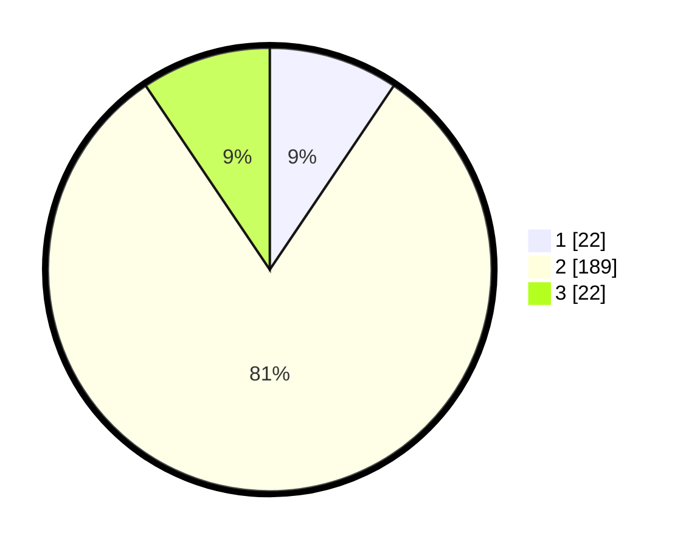

# Hasil

## Grafik

## Tabel

| No. | Nama Paslon    | Suara | Suara (raw) | Persentase |
|:--- |:-------------- | -----:| -----------:| ----------:|
| 1   | ANIES MUHAIMIN | 22    | [22][p-1]   | 9,44       |
| 2   | PRABOWO GIBRAN | 189   | [189][p-2]  | 81,12      |
| 3   | GANJAR MAHFUD  | 22    | [22][p-3]   | 9,44       |

[p-1]: https://github.com/gigit-pemilu/pemilu-2024/blob/main/pilpres/hitung-suara/sub/11-aceh/sub/02-aceh-tenggara/sub/02-lawe-sigala-gala/sub/2009-kute-tengah/sub/002-tps/sub/paslon-1.txt
[p-2]: https://github.com/gigit-pemilu/pemilu-2024/blob/main/pilpres/hitung-suara/sub/11-aceh/sub/02-aceh-tenggara/sub/02-lawe-sigala-gala/sub/2009-kute-tengah/sub/002-tps/sub/paslon-2.txt
[p-3]: https://github.com/gigit-pemilu/pemilu-2024/blob/main/pilpres/hitung-suara/sub/11-aceh/sub/02-aceh-tenggara/sub/02-lawe-sigala-gala/sub/2009-kute-tengah/sub/002-tps/sub/paslon-3.txt

## Foto C Plano

https://sirekap-obj-formc.kpu.go.id/2a4d/pemilu/ppwp/11/02/02/20/09/1102022009002-20240216-190447--7080016a-b9b7-45dd-9e61-3c3c6fbb2eee.jpg

https://sirekap-obj-formc.kpu.go.id/2a4d/pemilu/ppwp/11/02/02/20/09/1102022009002-20240216-190448--a8d9c252-1f64-46fc-82e1-8dd31e31d041.jpg

https://sirekap-obj-formc.kpu.go.id/2a4d/pemilu/ppwp/11/02/02/20/09/1102022009002-20240216-190447--5309cf76-d1fc-4fef-bc88-0a092e598fe5.jpg

## Metadata

| Key        | Value               |
| ---------- | ------------------- |
| Time Stamp | 2024-02-16 21:01:00 |

## DATA PEMILIH TETAP

Jumlah pemilih dalam DPT: **276**.
 * L: **122**.
 * P: **154**.

## DATA PENGGUNA HAK PILIH

Jumlah pengguna hak pilih dalam DPT: **223**.
 * L: **95**.
 * P: **128**.

Jumlah pengguna hak pilih dalam DPTb: **0**.
 * L: **0**.
 * P: **0**.

Jumlah pengguna hak pilih dalam DPK: **13**.
 * L: **7**.
 * P: **6**.

Jumlah pengguna hak pilih: **236**.
 * L: **102**.
 * P: **134**.

## JUMLAH SUARA SAH DAN TIDAK SAH

JUMLAH SELURUH SUARA SAH: **233**.

JUMLAH SUARA TIDAK SAH: **3**.

JUMLAH SELURUH SUARA SAH DAN SUARA TIDAK SAH: **236**.

