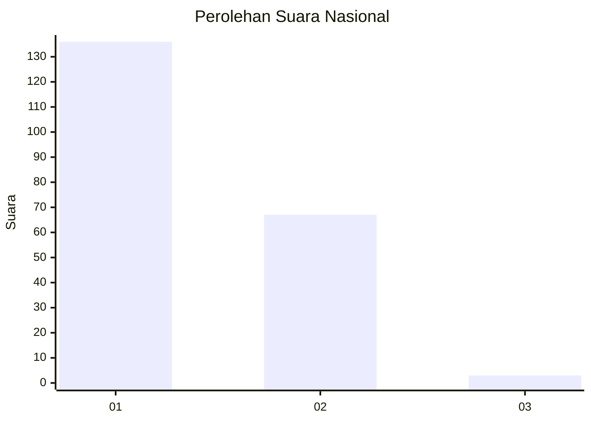
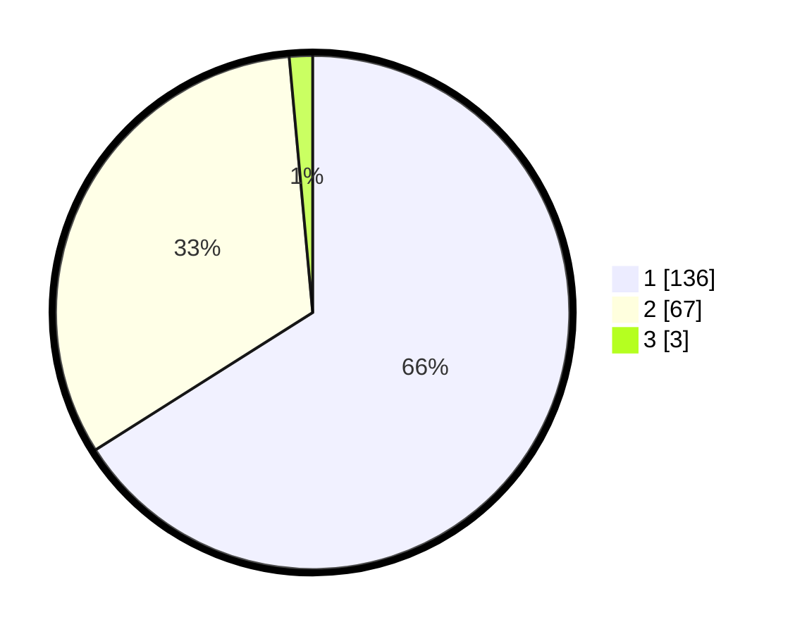

# Hasil

## Grafik

## Tabel

| No. | Nama Paslon    | Suara | Suara (raw) | Persentase |
|:--- |:-------------- | -----:| -----------:| ----------:|
| 1   | ANIES MUHAIMIN | 136   | [136][p-1]  | 66,02      |
| 2   | PRABOWO GIBRAN | 67    | [67][p-2]   | 32,52      |
| 3   | GANJAR MAHFUD  | 3     | [3][p-3]    | 1,46       |

[p-1]: https://github.com/gigit-pemilu/pemilu-2024/blob/main/pilpres/hitung-suara/sub/11-aceh/sub/02-aceh-tenggara/sub/02-lawe-sigala-gala/sub/2014-lawe-loning-aman/sub/002-tps/sub/paslon-1.txt
[p-2]: https://github.com/gigit-pemilu/pemilu-2024/blob/main/pilpres/hitung-suara/sub/11-aceh/sub/02-aceh-tenggara/sub/02-lawe-sigala-gala/sub/2014-lawe-loning-aman/sub/002-tps/sub/paslon-2.txt
[p-3]: https://github.com/gigit-pemilu/pemilu-2024/blob/main/pilpres/hitung-suara/sub/11-aceh/sub/02-aceh-tenggara/sub/02-lawe-sigala-gala/sub/2014-lawe-loning-aman/sub/002-tps/sub/paslon-3.txt

## Foto C Plano

https://sirekap-obj-formc.kpu.go.id/3aea/pemilu/ppwp/11/02/02/20/14/1102022014002-20240220-091942--08e40c6f-63f8-4831-b23d-248419efa3e4.jpg

https://sirekap-obj-formc.kpu.go.id/3aea/pemilu/ppwp/11/02/02/20/14/1102022014002-20240220-092029--f1b56fde-85d8-4397-a8e1-4d6fb7ab52f7.jpg

https://sirekap-obj-formc.kpu.go.id/3aea/pemilu/ppwp/11/02/02/20/14/1102022014002-20240220-092105--4afcb894-6702-45c9-8d2b-161bd3cd8a6b.jpg

## Metadata

| Key        | Value               |
| ---------- | ------------------- |
| Time Stamp | 2024-02-25 16:00:00 |

