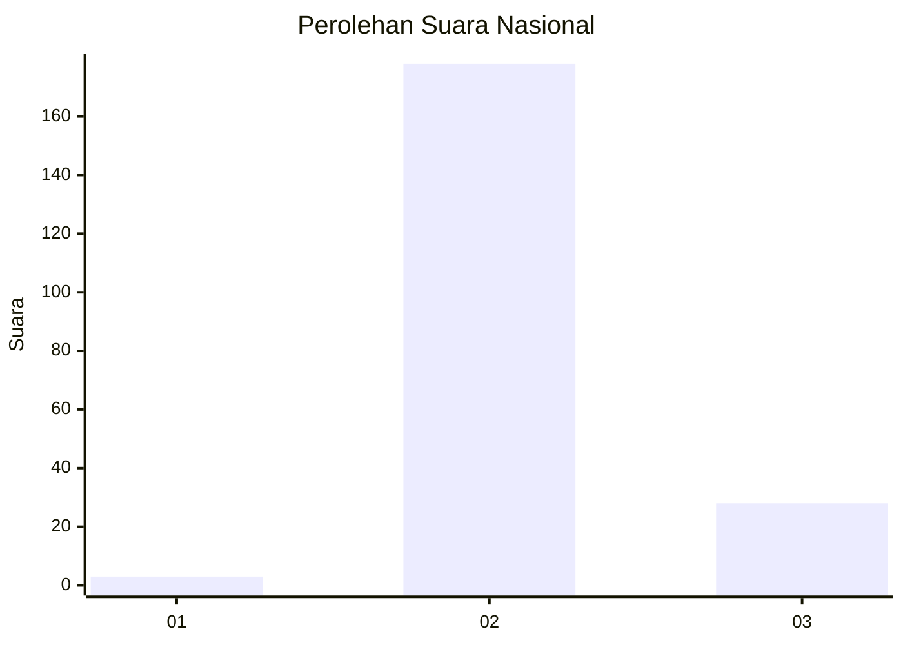
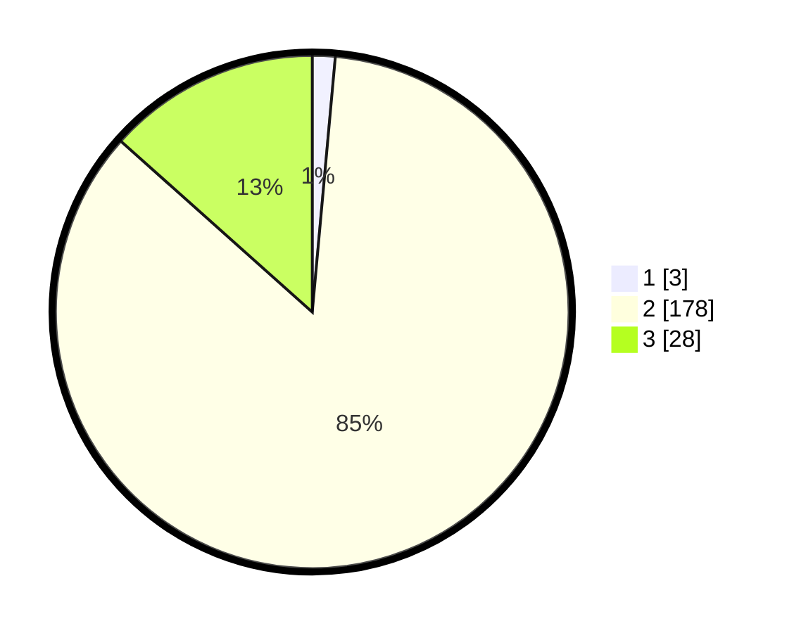

# Hasil

## Grafik

## Tabel

| No. | Nama Paslon    | Suara | Suara (raw) | Persentase |
|:--- |:-------------- | -----:| -----------:| ----------:|
| 1   | ANIES MUHAIMIN | 3     | [3][p-1]    | 1,44       |
| 2   | PRABOWO GIBRAN | 178   | [178][p-2]  | 85,17      |
| 3   | GANJAR MAHFUD  | 28    | [28][p-3]   | 13,40      |

[p-1]: https://github.com/gigit-pemilu/pemilu-2024/blob/main/pilpres/hitung-suara/sub/11-aceh/sub/02-aceh-tenggara/sub/02-lawe-sigala-gala/sub/2016-lawe-tua-makmur/sub/001-tps/sub/paslon-1.txt
[p-2]: https://github.com/gigit-pemilu/pemilu-2024/blob/main/pilpres/hitung-suara/sub/11-aceh/sub/02-aceh-tenggara/sub/02-lawe-sigala-gala/sub/2016-lawe-tua-makmur/sub/001-tps/sub/paslon-2.txt
[p-3]: https://github.com/gigit-pemilu/pemilu-2024/blob/main/pilpres/hitung-suara/sub/11-aceh/sub/02-aceh-tenggara/sub/02-lawe-sigala-gala/sub/2016-lawe-tua-makmur/sub/001-tps/sub/paslon-3.txt

## Foto C Plano

https://sirekap-obj-formc.kpu.go.id/a0f4/pemilu/ppwp/11/02/02/20/16/1102022016001-20240214-233627--3566aa6b-4728-4c1c-b377-bc28f2a74ee8.jpg

https://sirekap-obj-formc.kpu.go.id/a0f4/pemilu/ppwp/11/02/02/20/16/1102022016001-20240214-233758--fcf4ec24-2eed-4082-9406-3e7f89742b62.jpg

https://sirekap-obj-formc.kpu.go.id/a0f4/pemilu/ppwp/11/02/02/20/16/1102022016001-20240214-234001--1987cdba-4d69-455e-bc82-de66843801d2.jpg

## Metadata

| Key        | Value               |
| ---------- | ------------------- |
| Time Stamp | 2024-02-15 12:00:28 |

## DATA PEMILIH TETAP

Jumlah pemilih dalam DPT: **246**.
 * L: **112**.
 * P: **134**.

## DATA PENGGUNA HAK PILIH

Jumlah pengguna hak pilih dalam DPT: **207**.
 * L: **399**.
 * P: **107**.

Jumlah pengguna hak pilih dalam DPTb: **3**.
 * L: **8**.
 * P: **2**.

Jumlah pengguna hak pilih dalam DPK: **22**.
 * L: **0**.
 * P: **2**.

Jumlah pengguna hak pilih: **262**.
 * L: **309**.
 * P: **161**.

## JUMLAH SUARA SAH DAN TIDAK SAH

JUMLAH SELURUH SUARA SAH: **209**.

JUMLAH SUARA TIDAK SAH: **3**.

JUMLAH SELURUH SUARA SAH DAN SUARA TIDAK SAH: **262**.

