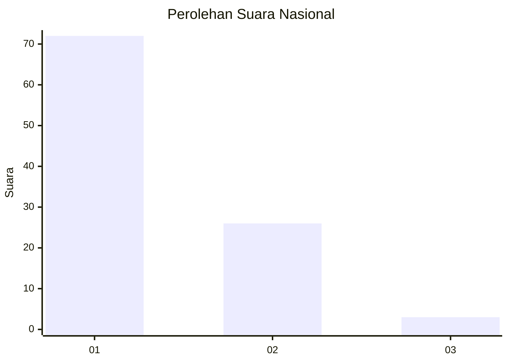
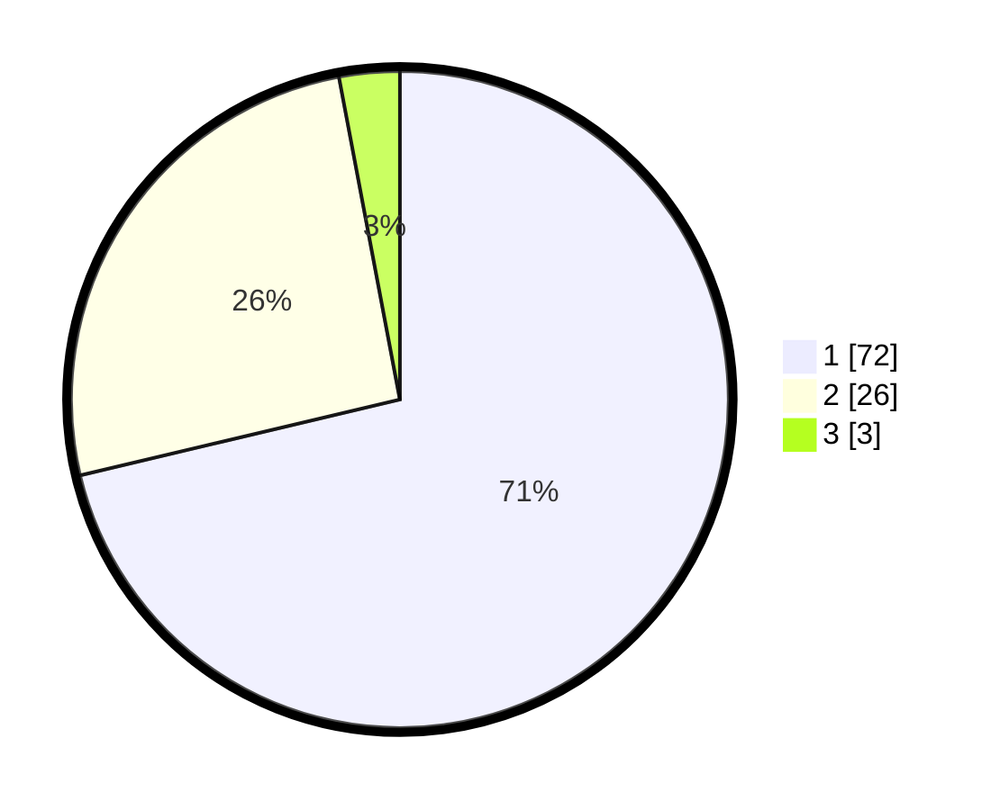

# Hasil

## Grafik

## Tabel

| No. | Nama Paslon    | Suara | Suara (raw) | Persentase |
|:--- |:-------------- | -----:| -----------:| ----------:|
| 1   | ANIES MUHAIMIN | 72    | [72][p-1]   | 71,29      |
| 2   | PRABOWO GIBRAN | 26    | [26][p-2]   | 25,74      |
| 3   | GANJAR MAHFUD  | 3     | [3][p-3]    | 2,97       |

[p-1]: https://github.com/gigit-pemilu/pemilu-2024/blob/main/pilpres/hitung-suara/sub/11-aceh/sub/02-aceh-tenggara/sub/02-lawe-sigala-gala/sub/2021-enmiya-batu-dua-ratus/sub/002-tps/sub/paslon-1.txt
[p-2]: https://github.com/gigit-pemilu/pemilu-2024/blob/main/pilpres/hitung-suara/sub/11-aceh/sub/02-aceh-tenggara/sub/02-lawe-sigala-gala/sub/2021-enmiya-batu-dua-ratus/sub/002-tps/sub/paslon-2.txt
[p-3]: https://github.com/gigit-pemilu/pemilu-2024/blob/main/pilpres/hitung-suara/sub/11-aceh/sub/02-aceh-tenggara/sub/02-lawe-sigala-gala/sub/2021-enmiya-batu-dua-ratus/sub/002-tps/sub/paslon-3.txt

## Foto C Plano

https://sirekap-obj-formc.kpu.go.id/a9f3/pemilu/ppwp/11/02/02/20/21/1102022021002-20240216-141314--46137ebe-b6d3-4e9e-b800-4f44aea00b26.jpg

https://sirekap-obj-formc.kpu.go.id/a9f3/pemilu/ppwp/11/02/02/20/21/1102022021002-20240216-141316--4104e1e2-b3db-47f7-8c35-d7f6c869c5fd.jpg

https://sirekap-obj-formc.kpu.go.id/a9f3/pemilu/ppwp/11/02/02/20/21/1102022021002-20240216-141315--e9af860a-f201-4168-957c-926d1d05a773.jpg

## Metadata

| Key        | Value               |
| ---------- | ------------------- |
| Time Stamp | 2024-02-16 22:30:00 |

## DATA PEMILIH TETAP

Jumlah pemilih dalam DPT: **118**.
 * L: **55**.
 * P: **66**.

## DATA PENGGUNA HAK PILIH

Jumlah pengguna hak pilih dalam DPT: **101**.
 * L: **44**.
 * P: **57**.

Jumlah pengguna hak pilih dalam DPTb: **0**.
 * L: **0**.
 * P: **0**.

Jumlah pengguna hak pilih dalam DPK: **0**.
 * L: **0**.
 * P: **0**.

Jumlah pengguna hak pilih: **101**.
 * L: **44**.
 * P: **57**.

## JUMLAH SUARA SAH DAN TIDAK SAH

JUMLAH SELURUH SUARA SAH: **101**.

JUMLAH SUARA TIDAK SAH: **0**.

JUMLAH SELURUH SUARA SAH DAN SUARA TIDAK SAH: **101**.

