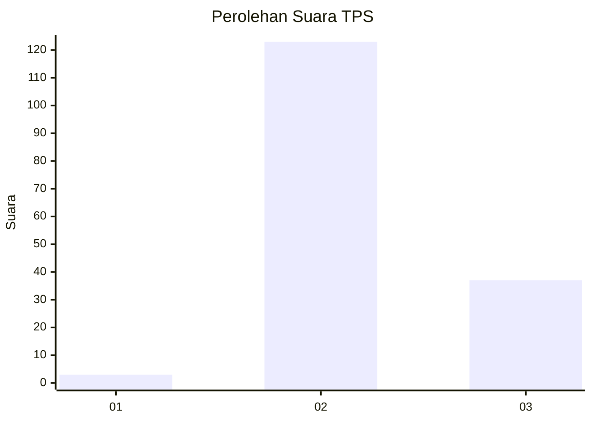
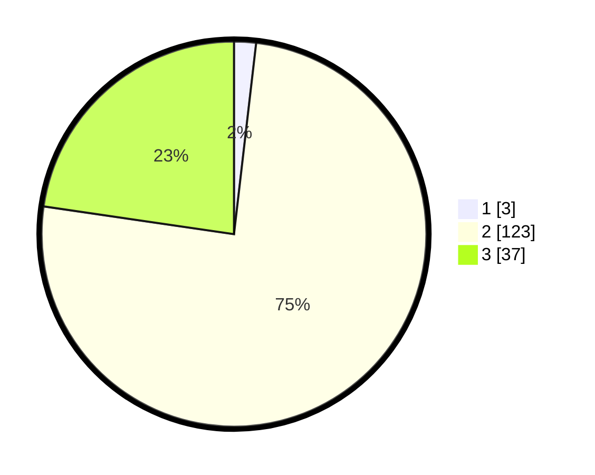

# Hasil

## Grafik

## Tabel

| No. | Nama Paslon    | Suara | Suara (raw) | Persentase |
|:--- |:-------------- | -----:| -----------:| ----------:|
| 1   | ANIES MUHAIMIN | 3     | [3][p-1]    | 1,84       |
| 2   | PRABOWO GIBRAN | 123   | [123][p-2]  | 75,46      |
| 3   | GANJAR MAHFUD  | 37    | [37][p-3]   | 22,70      |

[p-1]: https://github.com/gigit-pemilu/pemilu-2024-11-aceh/blob/main/pilpres/hitung-suara/sub/11-aceh/sub/02-aceh-tenggara/sub/02-lawe-sigala-gala/sub/2026-gaya-jaya/sub/001-tps/sub/paslon-1.txt
[p-2]: https://github.com/gigit-pemilu/pemilu-2024-11-aceh/blob/main/pilpres/hitung-suara/sub/11-aceh/sub/02-aceh-tenggara/sub/02-lawe-sigala-gala/sub/2026-gaya-jaya/sub/001-tps/sub/paslon-2.txt
[p-3]: https://github.com/gigit-pemilu/pemilu-2024-11-aceh/blob/main/pilpres/hitung-suara/sub/11-aceh/sub/02-aceh-tenggara/sub/02-lawe-sigala-gala/sub/2026-gaya-jaya/sub/001-tps/sub/paslon-3.txt

## Foto C Plano

https://sirekap-obj-formc.kpu.go.id/a7ef/pemilu/ppwp/11/02/02/20/26/1102022026001-20240215-001536--17f07880-19c3-419c-a30e-029dad51dd33.jpg

https://sirekap-obj-formc.kpu.go.id/a7ef/pemilu/ppwp/11/02/02/20/26/1102022026001-20240215-001750--580cfb39-b4c6-4c5e-9d72-4d705c8f8fc0.jpg

https://sirekap-obj-formc.kpu.go.id/a7ef/pemilu/ppwp/11/02/02/20/26/1102022026001-20240215-002322--4920ded8-ef8c-4ff6-b865-d2794ab4c5cb.jpg

## Metadata

| Key        | Value               |
| ---------- | ------------------- |
| Time Stamp | 2024-02-24 22:31:28 |

