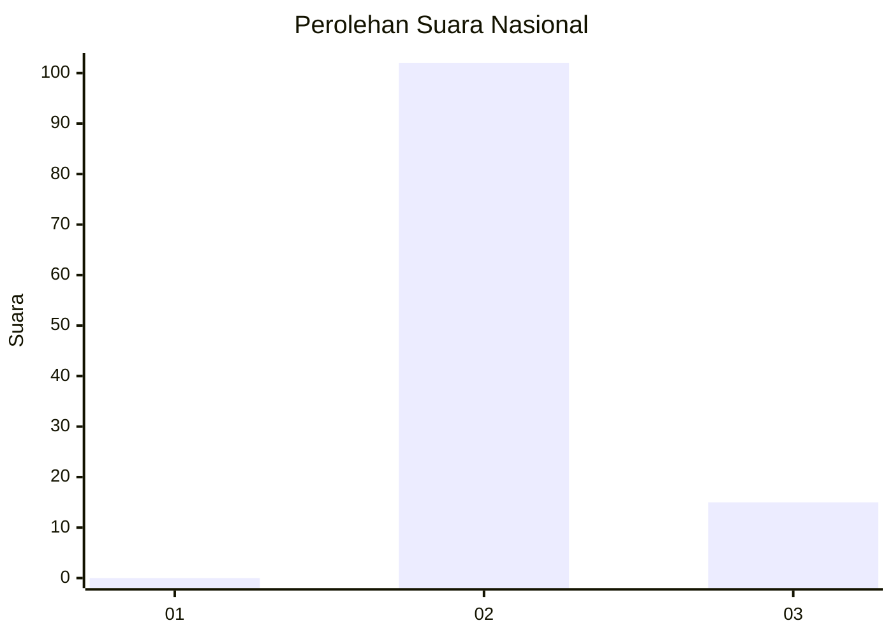
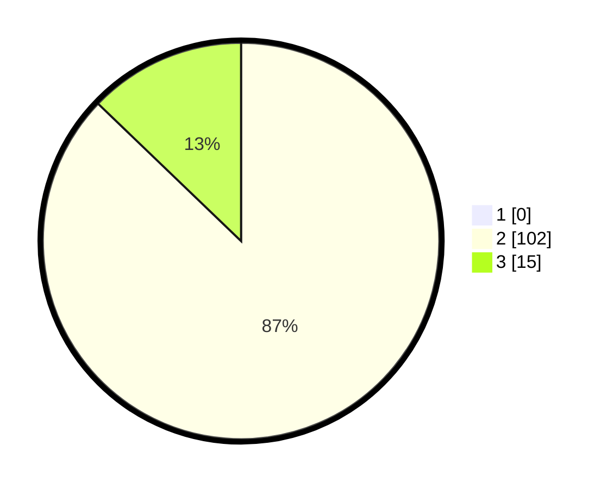

# Hasil

## Grafik

## Tabel

| No. | Nama Paslon    | Suara | Suara (raw) | Persentase |
|:--- |:-------------- | -----:| -----------:| ----------:|
| 1   | ANIES MUHAIMIN | 0     | [0][p-1]    | 0,00       |
| 2   | PRABOWO GIBRAN | 102   | [102][p-2]  | 87,18      |
| 3   | GANJAR MAHFUD  | 15    | [15][p-3]   | 12,82      |

[p-1]: https://github.com/gigit-pemilu/pemilu-2024/blob/main/pilpres/hitung-suara/sub/11-aceh/sub/02-aceh-tenggara/sub/02-lawe-sigala-gala/sub/2030-karya-indah/sub/002-tps/sub/paslon-1.txt
[p-2]: https://github.com/gigit-pemilu/pemilu-2024/blob/main/pilpres/hitung-suara/sub/11-aceh/sub/02-aceh-tenggara/sub/02-lawe-sigala-gala/sub/2030-karya-indah/sub/002-tps/sub/paslon-2.txt
[p-3]: https://github.com/gigit-pemilu/pemilu-2024/blob/main/pilpres/hitung-suara/sub/11-aceh/sub/02-aceh-tenggara/sub/02-lawe-sigala-gala/sub/2030-karya-indah/sub/002-tps/sub/paslon-3.txt

## Foto C Plano

https://sirekap-obj-formc.kpu.go.id/91ca/pemilu/ppwp/11/02/02/20/30/1102022030002-20240215-000733--4578354c-4878-4991-ae39-dac8b274f99b.jpg

https://sirekap-obj-formc.kpu.go.id/91ca/pemilu/ppwp/11/02/02/20/30/1102022030002-20240215-000940--ef2ab8e6-5ada-4982-9952-e926f8f14e79.jpg

https://sirekap-obj-formc.kpu.go.id/91ca/pemilu/ppwp/11/02/02/20/30/1102022030002-20240215-001014--8aea224d-1160-4235-b8a9-b8bcdc55a1c0.jpg

## Metadata

| Key        | Value               |
| ---------- | ------------------- |
| Time Stamp | 2024-02-15 12:00:28 |

