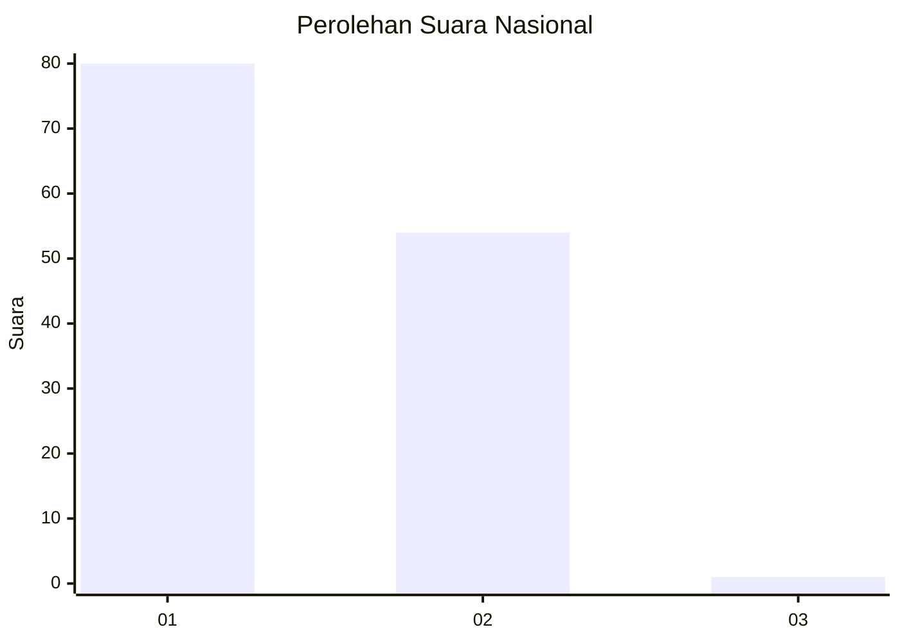
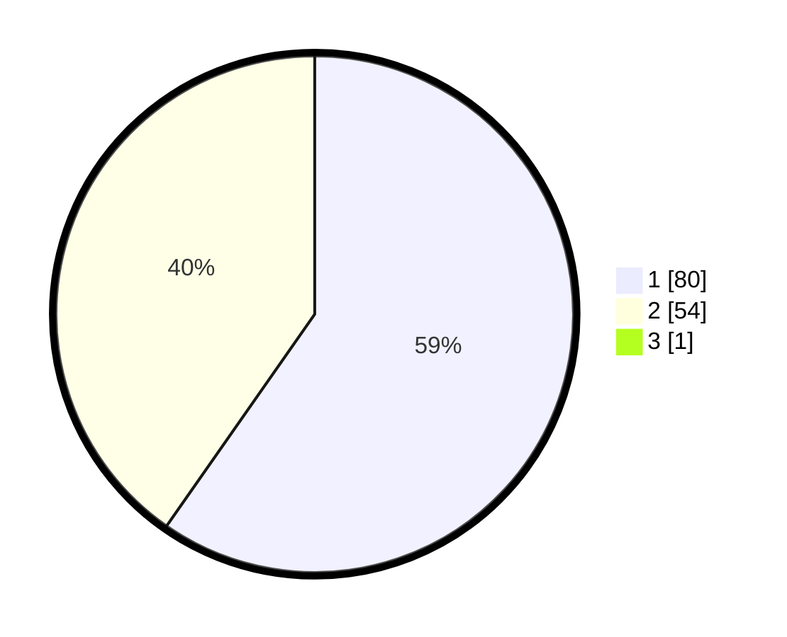

# Hasil

## Grafik

## Tabel

| No. | Nama Paslon    | Suara | Suara (raw) | Persentase |
|:--- |:-------------- | -----:| -----------:| ----------:|
| 1   | ANIES MUHAIMIN | 80    | [80][p-1]   | 59,26      |
| 2   | PRABOWO GIBRAN | 54    | [54][p-2]   | 40,00      |
| 3   | GANJAR MAHFUD  | 1     | [1][p-3]    | 0,74       |

[p-1]: https://github.com/gigit-pemilu/pemilu-2024/blob/main/pilpres/hitung-suara/sub/11-aceh/sub/02-aceh-tenggara/sub/02-lawe-sigala-gala/sub/2033-lawe-pekhidinen/sub/001-tps/sub/paslon-1.txt
[p-2]: https://github.com/gigit-pemilu/pemilu-2024/blob/main/pilpres/hitung-suara/sub/11-aceh/sub/02-aceh-tenggara/sub/02-lawe-sigala-gala/sub/2033-lawe-pekhidinen/sub/001-tps/sub/paslon-2.txt
[p-3]: https://github.com/gigit-pemilu/pemilu-2024/blob/main/pilpres/hitung-suara/sub/11-aceh/sub/02-aceh-tenggara/sub/02-lawe-sigala-gala/sub/2033-lawe-pekhidinen/sub/001-tps/sub/paslon-3.txt

## Foto C Plano

https://sirekap-obj-formc.kpu.go.id/964c/pemilu/ppwp/11/02/02/20/33/1102022033001-20240222-112900--dec2c296-7b1b-4743-9003-a42b7c3a08a9.jpg

https://sirekap-obj-formc.kpu.go.id/964c/pemilu/ppwp/11/02/02/20/33/1102022033001-20240222-112901--8fdf0b73-7346-4590-9f98-368808ad70c0.jpg

https://sirekap-obj-formc.kpu.go.id/964c/pemilu/ppwp/11/02/02/20/33/1102022033001-20240215-083608--c40d8fa0-ef9b-4e35-a9ef-ee3a760520c9.jpg

## Metadata

| Key        | Value               |
| ---------- | ------------------- |
| Time Stamp | 2024-02-24 22:31:28 |

## DATA PEMILIH TETAP

Jumlah pemilih dalam DPT: **164**.
 * L: **79**.
 * P: **85**.

## DATA PENGGUNA HAK PILIH

Jumlah pengguna hak pilih dalam DPT: **128**.
 * L: **63**.
 * P: **65**.

Jumlah pengguna hak pilih dalam DPTb: **5**.
 * L: **1**.
 * P: **4**.

Jumlah pengguna hak pilih dalam DPK: **6**.
 * L: **2**.
 * P: **4**.

Jumlah pengguna hak pilih: **139**.
 * L: **66**.
 * P: **73**.

## JUMLAH SUARA SAH DAN TIDAK SAH

JUMLAH SELURUH SUARA SAH: **135**.

JUMLAH SUARA TIDAK SAH: **4**.

JUMLAH SELURUH SUARA SAH DAN SUARA TIDAK SAH: **139**.

