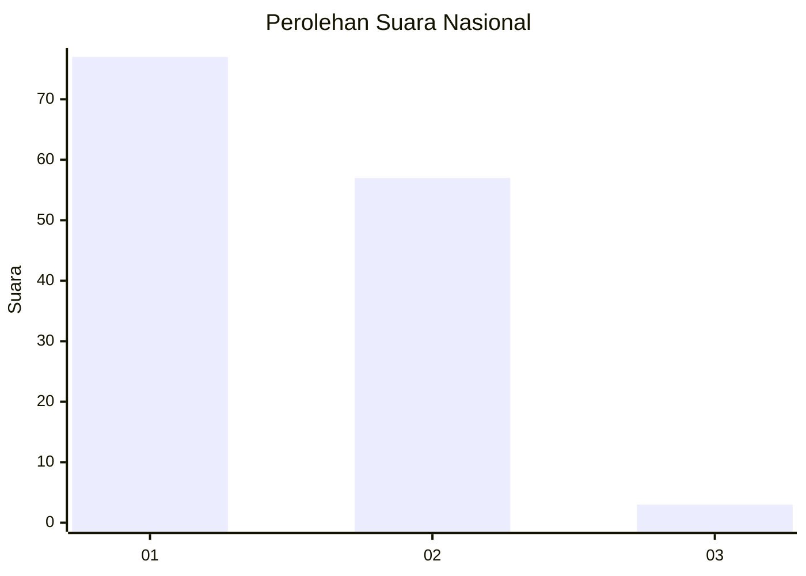
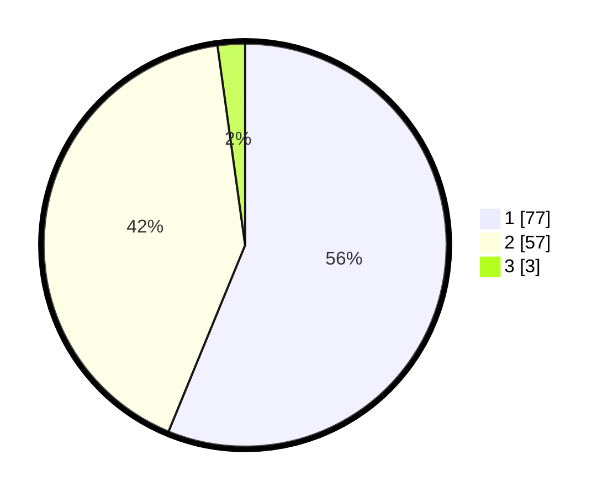

# Hasil

## Grafik

## Tabel

| No. | Nama Paslon    | Suara | Suara (raw) | Persentase |
|:--- |:-------------- | -----:| -----------:| ----------:|
| 1   | ANIES MUHAIMIN | 77    | [77][p-1]   | 56,20      |
| 2   | PRABOWO GIBRAN | 57    | [57][p-2]   | 41,61      |
| 3   | GANJAR MAHFUD  | 3     | [3][p-3]    | 2,19       |

[p-1]: https://github.com/gigit-pemilu/pemilu-2024/blob/main/pilpres/hitung-suara/sub/11-aceh/sub/02-aceh-tenggara/sub/02-lawe-sigala-gala/sub/2033-lawe-pekhidinen/sub/002-tps/sub/paslon-1.txt
[p-2]: https://github.com/gigit-pemilu/pemilu-2024/blob/main/pilpres/hitung-suara/sub/11-aceh/sub/02-aceh-tenggara/sub/02-lawe-sigala-gala/sub/2033-lawe-pekhidinen/sub/002-tps/sub/paslon-2.txt
[p-3]: https://github.com/gigit-pemilu/pemilu-2024/blob/main/pilpres/hitung-suara/sub/11-aceh/sub/02-aceh-tenggara/sub/02-lawe-sigala-gala/sub/2033-lawe-pekhidinen/sub/002-tps/sub/paslon-3.txt

## Foto C Plano

https://sirekap-obj-formc.kpu.go.id/a52c/pemilu/ppwp/11/02/02/20/33/1102022033002-20240214-203824--8635b249-e906-4dae-8b98-de2d524651f4.jpg

https://sirekap-obj-formc.kpu.go.id/a52c/pemilu/ppwp/11/02/02/20/33/1102022033002-20240216-192056--e5a00f96-561e-4501-b37b-1de55b838b8f.jpg

https://sirekap-obj-formc.kpu.go.id/a52c/pemilu/ppwp/11/02/02/20/33/1102022033002-20240216-192056--0b812ead-d2a9-4a7d-81b8-f756d55d92b0.jpg

## Metadata

| Key        | Value               |
| ---------- | ------------------- |
| Time Stamp | 2024-02-16 23:00:00 |

## DATA PEMILIH TETAP

Jumlah pemilih dalam DPT: **162**.
 * L: **76**.
 * P: **86**.

## DATA PENGGUNA HAK PILIH

Jumlah pengguna hak pilih dalam DPT: **138**.
 * L: **69**.
 * P: **69**.

Jumlah pengguna hak pilih dalam DPTb: **0**.
 * L: **0**.
 * P: **0**.

Jumlah pengguna hak pilih dalam DPK: **4**.
 * L: **3**.
 * P: **1**.

Jumlah pengguna hak pilih: **142**.
 * L: **72**.
 * P: **70**.

## JUMLAH SUARA SAH DAN TIDAK SAH

JUMLAH SELURUH SUARA SAH: **137**.

JUMLAH SUARA TIDAK SAH: **5**.

JUMLAH SELURUH SUARA SAH DAN SUARA TIDAK SAH: **142**.

