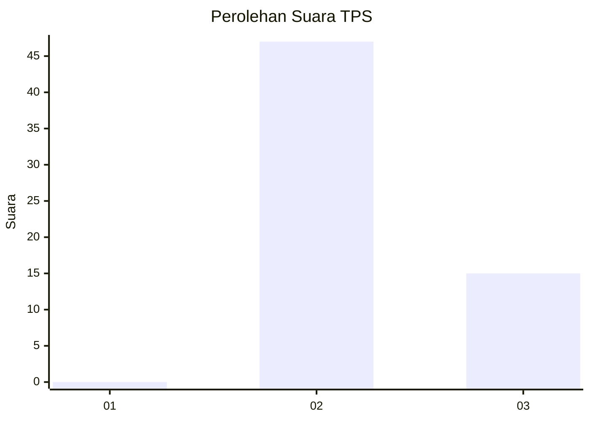
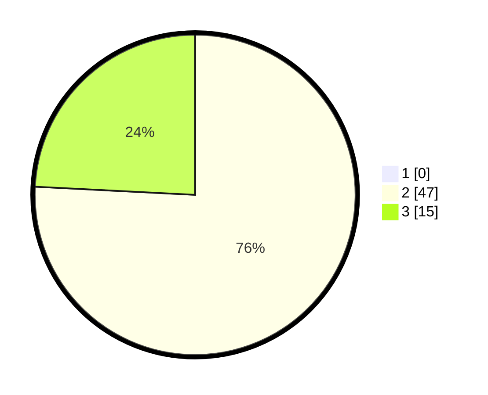

# Hasil

## Grafik

## Tabel

| No. | Nama Paslon    | Suara | Suara (raw) | Persentase |
|:--- |:-------------- | -----:| -----------:| ----------:|
| 1   | ANIES MUHAIMIN | 0     | [0][p-1]    | 0,00       |
| 2   | PRABOWO GIBRAN | 47    | [47][p-2]   | 75,81      |
| 3   | GANJAR MAHFUD  | 15    | [15][p-3]   | 24,19      |

[p-1]: https://github.com/gigit-pemilu/pemilu-2024-11-aceh/blob/main/pilpres/hitung-suara/sub/11-aceh/sub/02-aceh-tenggara/sub/02-lawe-sigala-gala/sub/2034-kertimbang/sub/001-tps/sub/paslon-1.txt
[p-2]: https://github.com/gigit-pemilu/pemilu-2024-11-aceh/blob/main/pilpres/hitung-suara/sub/11-aceh/sub/02-aceh-tenggara/sub/02-lawe-sigala-gala/sub/2034-kertimbang/sub/001-tps/sub/paslon-2.txt
[p-3]: https://github.com/gigit-pemilu/pemilu-2024-11-aceh/blob/main/pilpres/hitung-suara/sub/11-aceh/sub/02-aceh-tenggara/sub/02-lawe-sigala-gala/sub/2034-kertimbang/sub/001-tps/sub/paslon-3.txt

## Foto C Plano

https://sirekap-obj-formc.kpu.go.id/d1c2/pemilu/ppwp/11/02/02/20/34/1102022034001-20240215-041447--7c35e88f-2a4c-4055-bdbf-5d8d2ae6b97b.jpg

https://sirekap-obj-formc.kpu.go.id/d1c2/pemilu/ppwp/11/02/02/20/34/1102022034001-20240215-022359--1ea39d98-b705-4dbf-b8fe-55987f27f820.jpg

https://sirekap-obj-formc.kpu.go.id/d1c2/pemilu/ppwp/11/02/02/20/34/1102022034001-20240215-022426--5e0a3645-c694-4e24-a7ee-caa395289a7e.jpg

## Metadata

| Key        | Value               |
| ---------- | ------------------- |
| Time Stamp | 2024-02-15 05:00:24 |

