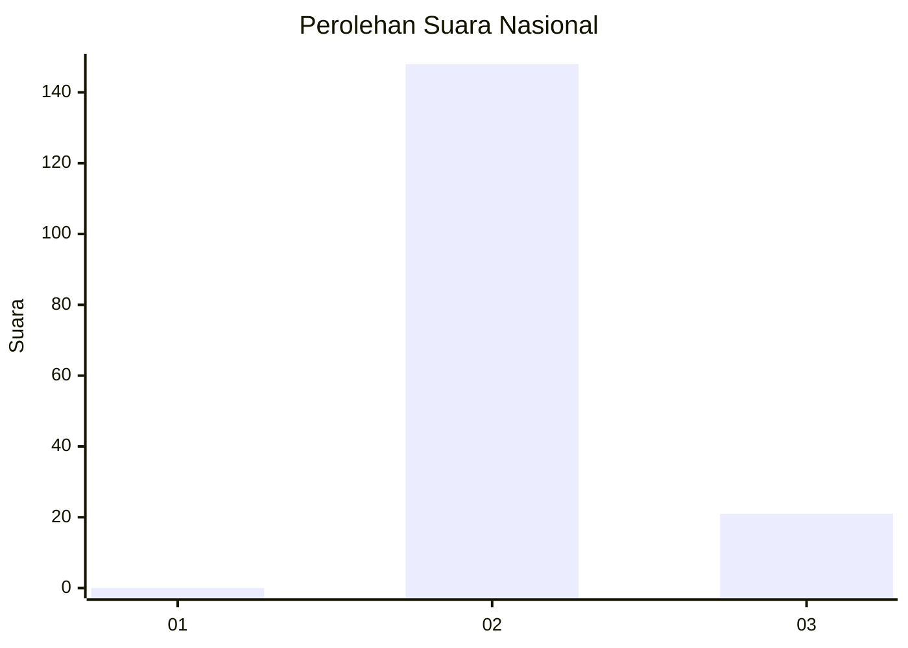
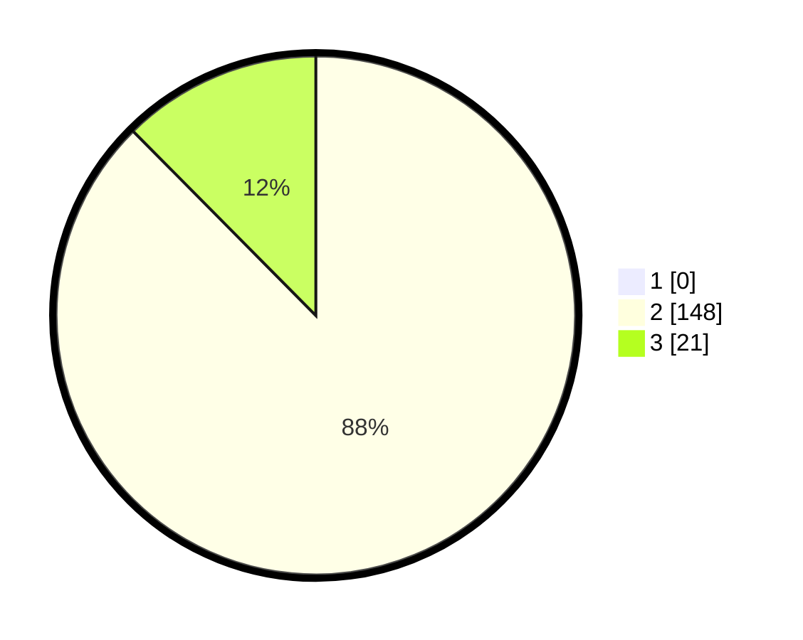

# Hasil

## Grafik

## Tabel

| No. | Nama Paslon    | Suara | Suara (raw) | Persentase |
|:--- |:-------------- | -----:| -----------:| ----------:|
| 1   | ANIES MUHAIMIN | 0     | [0][p-1]    | 0,00       |
| 2   | PRABOWO GIBRAN | 148   | [148][p-2]  | 87,57      |
| 3   | GANJAR MAHFUD  | 21    | [21][p-3]   | 12,43      |

[p-1]: https://github.com/gigit-pemilu/pemilu-2024/blob/main/pilpres/hitung-suara/sub/11-aceh/sub/02-aceh-tenggara/sub/02-lawe-sigala-gala/sub/2035-ndauh-nitenggo/sub/001-tps/sub/paslon-1.txt
[p-2]: https://github.com/gigit-pemilu/pemilu-2024/blob/main/pilpres/hitung-suara/sub/11-aceh/sub/02-aceh-tenggara/sub/02-lawe-sigala-gala/sub/2035-ndauh-nitenggo/sub/001-tps/sub/paslon-2.txt
[p-3]: https://github.com/gigit-pemilu/pemilu-2024/blob/main/pilpres/hitung-suara/sub/11-aceh/sub/02-aceh-tenggara/sub/02-lawe-sigala-gala/sub/2035-ndauh-nitenggo/sub/001-tps/sub/paslon-3.txt

## Foto C Plano

https://sirekap-obj-formc.kpu.go.id/67cf/pemilu/ppwp/11/02/02/20/35/1102022035001-20240215-012149--40106b3d-834e-4fb3-826c-2b9744bc82ac.jpg

https://sirekap-obj-formc.kpu.go.id/67cf/pemilu/ppwp/11/02/02/20/35/1102022035001-20240215-011817--e8330bb8-2a5e-4543-8c0a-e34a915ee030.jpg

https://sirekap-obj-formc.kpu.go.id/67cf/pemilu/ppwp/11/02/02/20/35/1102022035001-20240215-012428--cd13e1d4-2a38-44d3-bf4f-f63bd2c4c025.jpg

## Metadata

| Key        | Value               |
| ---------- | ------------------- |
| Time Stamp | 2024-02-24 22:31:28 |

