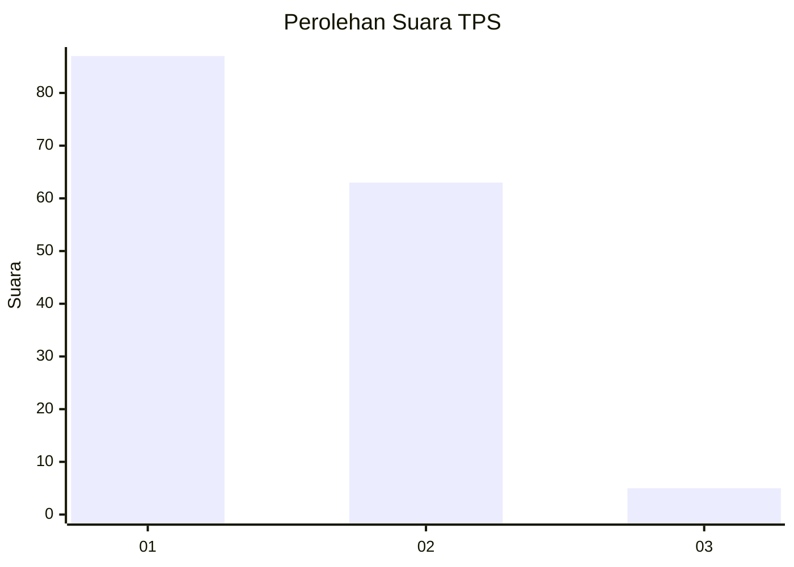
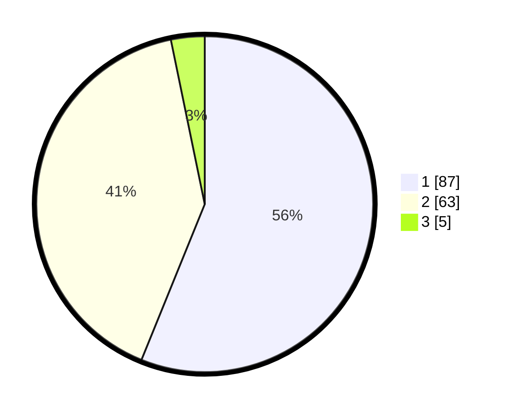

# Hasil

## Grafik

## Tabel

| No. | Nama Paslon    | Suara | Suara (raw) | Persentase |
|:--- |:-------------- | -----:| -----------:| ----------:|
| 1   | ANIES MUHAIMIN | 87    | [87][p-1]   | 56,13      |
| 2   | PRABOWO GIBRAN | 63    | [63][p-2]   | 40,65      |
| 3   | GANJAR MAHFUD  | 5     | [5][p-3]    | 3,23       |

[p-1]: https://github.com/gigit-pemilu/pemilu-2024-11-aceh/blob/main/pilpres/hitung-suara/sub/11-aceh/sub/02-aceh-tenggara/sub/03-bambel/sub/2001-bambel-gabungan/sub/001-tps/sub/paslon-1.txt
[p-2]: https://github.com/gigit-pemilu/pemilu-2024-11-aceh/blob/main/pilpres/hitung-suara/sub/11-aceh/sub/02-aceh-tenggara/sub/03-bambel/sub/2001-bambel-gabungan/sub/001-tps/sub/paslon-2.txt
[p-3]: https://github.com/gigit-pemilu/pemilu-2024-11-aceh/blob/main/pilpres/hitung-suara/sub/11-aceh/sub/02-aceh-tenggara/sub/03-bambel/sub/2001-bambel-gabungan/sub/001-tps/sub/paslon-3.txt

## Foto C Plano

https://sirekap-obj-formc.kpu.go.id/d066/pemilu/ppwp/11/02/03/20/01/1102032001001-20240216-134044--45fb8d05-26c4-487b-8fee-3ef57baa519f.jpg

https://sirekap-obj-formc.kpu.go.id/d066/pemilu/ppwp/11/02/03/20/01/1102032001001-20240216-134045--32b80613-effa-4e8a-b30c-83545ac2c473.jpg

https://sirekap-obj-formc.kpu.go.id/d066/pemilu/ppwp/11/02/03/20/01/1102032001001-20240216-134044--6009338e-1510-452c-8fe5-158cbf334322.jpg

## Metadata

| Key        | Value               |
| ---------- | ------------------- |
| Time Stamp | 2024-02-16 23:00:00 |

## DATA PEMILIH TETAP

Jumlah pemilih dalam DPT: **170**.
 * L: **79**.
 * P: **91**.

## DATA PENGGUNA HAK PILIH

Jumlah pengguna hak pilih dalam DPT: **154**.
 * L: **69**.
 * P: **85**.

Jumlah pengguna hak pilih dalam DPTb: **1**.
 * L: **0**.
 * P: **1**.

Jumlah pengguna hak pilih dalam DPK: **3**.
 * L: **2**.
 * P: **1**.

Jumlah pengguna hak pilih: **158**.
 * L: **71**.
 * P: **87**.

## JUMLAH SUARA SAH DAN TIDAK SAH

JUMLAH SELURUH SUARA SAH: **155**.

JUMLAH SUARA TIDAK SAH: **3**.

JUMLAH SELURUH SUARA SAH DAN SUARA TIDAK SAH: **158**.

