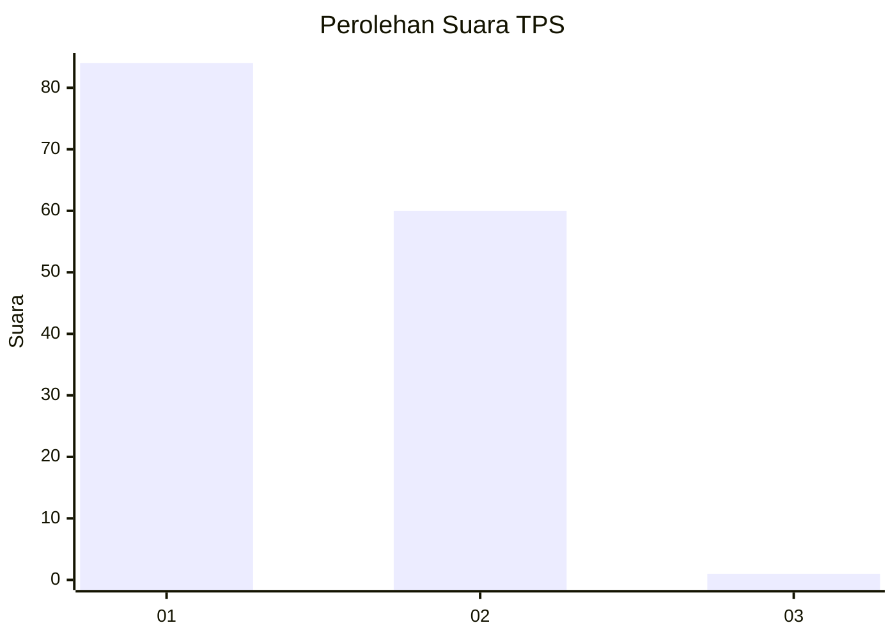
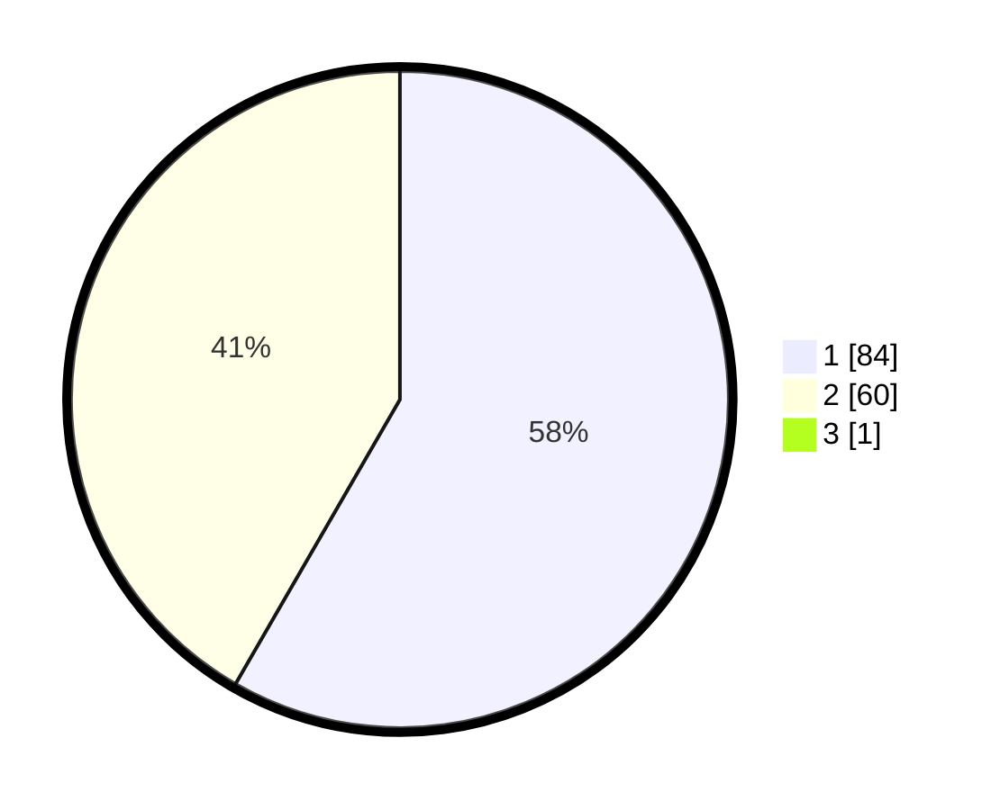

# Hasil

## Grafik

## Tabel

| No. | Nama Paslon    | Suara | Suara (raw) | Persentase |
|:--- |:-------------- | -----:| -----------:| ----------:|
| 1   | ANIES MUHAIMIN | 84    | [84][p-1]   | 57,93      |
| 2   | PRABOWO GIBRAN | 60    | [60][p-2]   | 41,38      |
| 3   | GANJAR MAHFUD  | 1     | [1][p-3]    | 0,69       |

[p-1]: https://github.com/gigit-pemilu/pemilu-2024-11-aceh/blob/main/pilpres/hitung-suara/sub/11-aceh/sub/02-aceh-tenggara/sub/03-bambel/sub/2001-bambel-gabungan/sub/002-tps/sub/paslon-1.txt
[p-2]: https://github.com/gigit-pemilu/pemilu-2024-11-aceh/blob/main/pilpres/hitung-suara/sub/11-aceh/sub/02-aceh-tenggara/sub/03-bambel/sub/2001-bambel-gabungan/sub/002-tps/sub/paslon-2.txt
[p-3]: https://github.com/gigit-pemilu/pemilu-2024-11-aceh/blob/main/pilpres/hitung-suara/sub/11-aceh/sub/02-aceh-tenggara/sub/03-bambel/sub/2001-bambel-gabungan/sub/002-tps/sub/paslon-3.txt

## Foto C Plano

https://sirekap-obj-formc.kpu.go.id/fb97/pemilu/ppwp/11/02/03/20/01/1102032001002-20240216-131810--885ddcaf-08da-49bc-80b3-dc8d24753d40.jpg

https://sirekap-obj-formc.kpu.go.id/fb97/pemilu/ppwp/11/02/03/20/01/1102032001002-20240216-131811--7a1df426-618c-4213-b656-1768bd46f9b5.jpg

https://sirekap-obj-formc.kpu.go.id/fb97/pemilu/ppwp/11/02/03/20/01/1102032001002-20240216-131810--c7543835-a601-4774-b590-e99625301080.jpg

## Metadata

| Key        | Value               |
| ---------- | ------------------- |
| Time Stamp | 2024-02-16 23:00:00 |

## DATA PEMILIH TETAP

Jumlah pemilih dalam DPT: **158**.
 * L: **76**.
 * P: **82**.

## DATA PENGGUNA HAK PILIH

Jumlah pengguna hak pilih dalam DPT: **145**.
 * L: **70**.
 * P: **75**.

Jumlah pengguna hak pilih dalam DPTb: **0**.
 * L: **0**.
 * P: **0**.

Jumlah pengguna hak pilih dalam DPK: **145**.
 * L: **70**.
 * P: **75**.

Jumlah pengguna hak pilih: **145**.
 * L: **70**.
 * P: **75**.

## JUMLAH SUARA SAH DAN TIDAK SAH

JUMLAH SELURUH SUARA SAH: **145**.

JUMLAH SUARA TIDAK SAH: **0**.

JUMLAH SELURUH SUARA SAH DAN SUARA TIDAK SAH: **145**.

