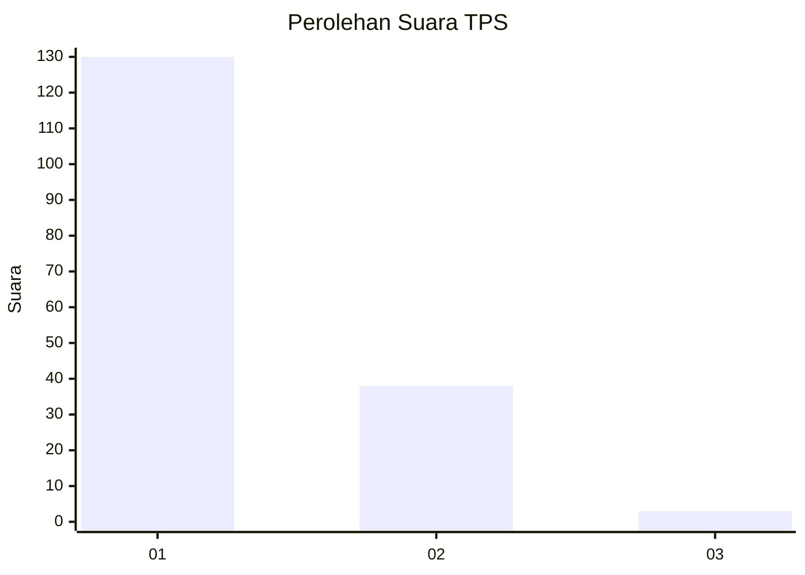
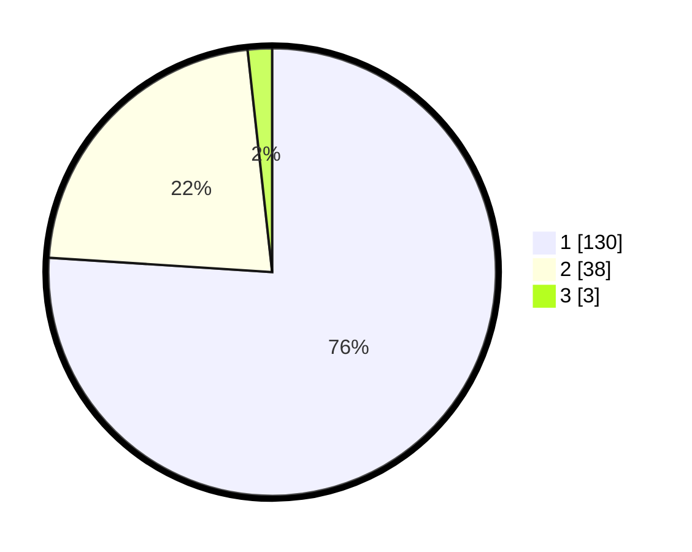

# Hasil

## Grafik

## Tabel

| No. | Nama Paslon    | Suara | Suara (raw) | Persentase |
|:--- |:-------------- | -----:| -----------:| ----------:|
| 1   | ANIES MUHAIMIN | 130   | [130][p-1]  | 76,02      |
| 2   | PRABOWO GIBRAN | 38    | [38][p-2]   | 22,22      |
| 3   | GANJAR MAHFUD  | 3     | [3][p-3]    | 1,75       |

[p-1]: https://github.com/gigit-pemilu/pemilu-2024-11-aceh/blob/main/pilpres/hitung-suara/sub/11-aceh/sub/02-aceh-tenggara/sub/03-bambel/sub/2001-bambel-gabungan/sub/003-tps/sub/paslon-1.txt
[p-2]: https://github.com/gigit-pemilu/pemilu-2024-11-aceh/blob/main/pilpres/hitung-suara/sub/11-aceh/sub/02-aceh-tenggara/sub/03-bambel/sub/2001-bambel-gabungan/sub/003-tps/sub/paslon-2.txt
[p-3]: https://github.com/gigit-pemilu/pemilu-2024-11-aceh/blob/main/pilpres/hitung-suara/sub/11-aceh/sub/02-aceh-tenggara/sub/03-bambel/sub/2001-bambel-gabungan/sub/003-tps/sub/paslon-3.txt

## Foto C Plano

https://sirekap-obj-formc.kpu.go.id/a477/pemilu/ppwp/11/02/03/20/01/1102032001003-20240216-131243--430dd68d-1407-4a1f-aa8d-3c7ea77b6a0c.jpg

https://sirekap-obj-formc.kpu.go.id/a477/pemilu/ppwp/11/02/03/20/01/1102032001003-20240216-131245--b78a7e0d-56c2-4dd4-8c83-aedec42044ff.jpg

https://sirekap-obj-formc.kpu.go.id/a477/pemilu/ppwp/11/02/03/20/01/1102032001003-20240216-131244--0d478624-7e7c-48c4-a580-d4b45803b271.jpg

## Metadata

| Key        | Value               |
| ---------- | ------------------- |
| Time Stamp | 2024-02-16 23:00:00 |

## DATA PEMILIH TETAP

Jumlah pemilih dalam DPT: **191**.
 * L: **97**.
 * P: **94**.

## DATA PENGGUNA HAK PILIH

Jumlah pengguna hak pilih dalam DPT: **170**.
 * L: **85**.
 * P: **85**.

Jumlah pengguna hak pilih dalam DPTb: **0**.
 * L: **0**.
 * P: **0**.

Jumlah pengguna hak pilih dalam DPK: **5**.
 * L: **2**.
 * P: **3**.

Jumlah pengguna hak pilih: **175**.
 * L: **87**.
 * P: **88**.

## JUMLAH SUARA SAH DAN TIDAK SAH

JUMLAH SELURUH SUARA SAH: **171**.

JUMLAH SUARA TIDAK SAH: **4**.

JUMLAH SELURUH SUARA SAH DAN SUARA TIDAK SAH: **175**.

