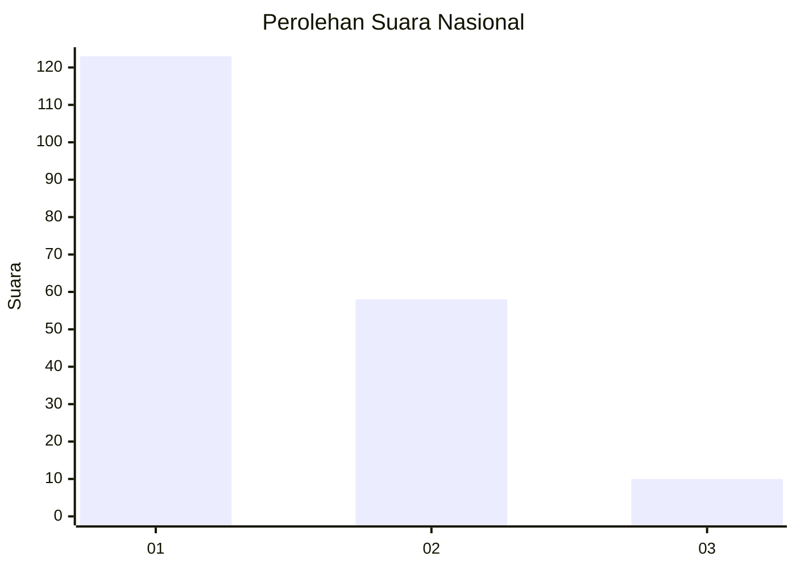
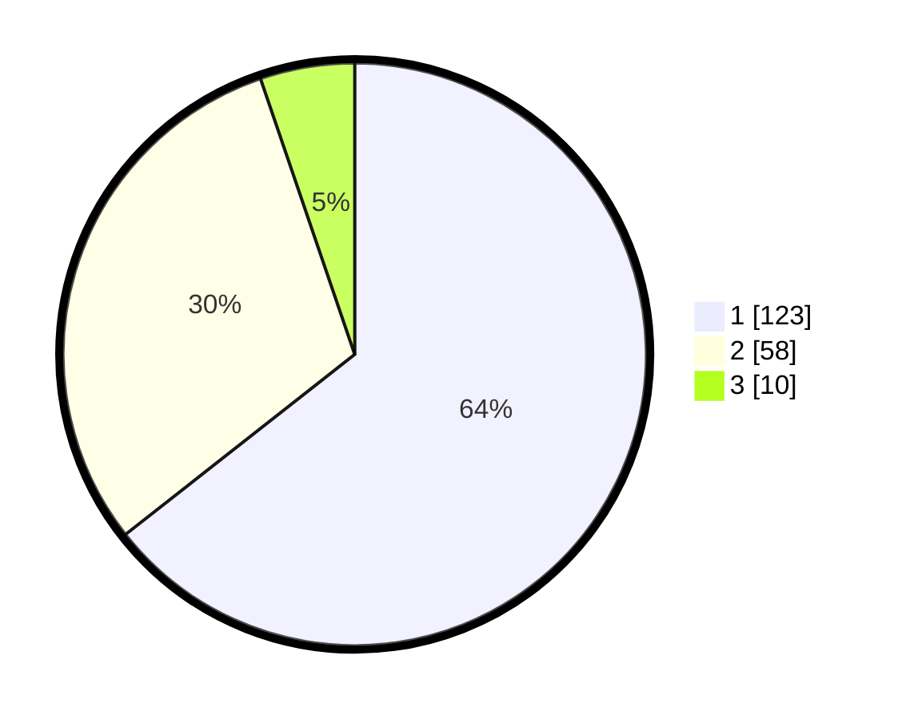

# Hasil

## Grafik

## Tabel

| No. | Nama Paslon    | Suara | Suara (raw) | Persentase |
|:--- |:-------------- | -----:| -----------:| ----------:|
| 1   | ANIES MUHAIMIN | 123   | [123][p-1]  | 64,40      |
| 2   | PRABOWO GIBRAN | 58    | [58][p-2]   | 30,37      |
| 3   | GANJAR MAHFUD  | 10    | [10][p-3]   | 5,24       |

[p-1]: https://github.com/gigit-pemilu/pemilu-2024/blob/main/pilpres/hitung-suara/sub/11-aceh/sub/02-aceh-tenggara/sub/03-bambel/sub/2001-bambel-gabungan/sub/004-tps/sub/paslon-1.txt
[p-2]: https://github.com/gigit-pemilu/pemilu-2024/blob/main/pilpres/hitung-suara/sub/11-aceh/sub/02-aceh-tenggara/sub/03-bambel/sub/2001-bambel-gabungan/sub/004-tps/sub/paslon-2.txt
[p-3]: https://github.com/gigit-pemilu/pemilu-2024/blob/main/pilpres/hitung-suara/sub/11-aceh/sub/02-aceh-tenggara/sub/03-bambel/sub/2001-bambel-gabungan/sub/004-tps/sub/paslon-3.txt

## Foto C Plano

https://sirekap-obj-formc.kpu.go.id/4ea1/pemilu/ppwp/11/02/03/20/01/1102032001004-20240216-144145--540f545c-11c2-450f-91fc-3995120b312a.jpg

https://sirekap-obj-formc.kpu.go.id/4ea1/pemilu/ppwp/11/02/03/20/01/1102032001004-20240216-144146--ad56e69b-0bc2-4183-8d92-a731d58422f0.jpg

https://sirekap-obj-formc.kpu.go.id/4ea1/pemilu/ppwp/11/02/03/20/01/1102032001004-20240216-144146--072a2793-e35a-4f27-94c9-f91f341d038d.jpg

## Metadata

| Key        | Value               |
| ---------- | ------------------- |
| Time Stamp | 2024-02-16 23:00:00 |

## DATA PEMILIH TETAP

Jumlah pemilih dalam DPT: **211**.
 * L: **103**.
 * P: **108**.

## DATA PENGGUNA HAK PILIH

Jumlah pengguna hak pilih dalam DPT: **190**.
 * L: **94**.
 * P: **96**.

Jumlah pengguna hak pilih dalam DPTb: **1**.
 * L: **0**.
 * P: **1**.

Jumlah pengguna hak pilih dalam DPK: **0**.
 * L: **0**.
 * P: **0**.

Jumlah pengguna hak pilih: **191**.
 * L: **94**.
 * P: **97**.

## JUMLAH SUARA SAH DAN TIDAK SAH

JUMLAH SELURUH SUARA SAH: **191**.

JUMLAH SUARA TIDAK SAH: **0**.

JUMLAH SELURUH SUARA SAH DAN SUARA TIDAK SAH: **191**.

