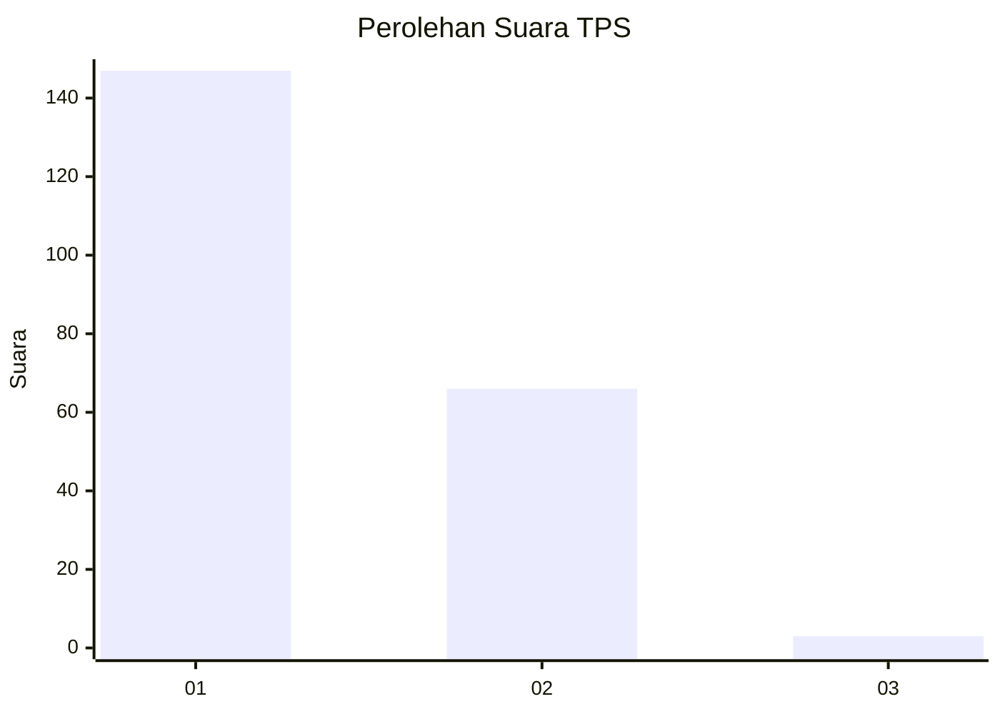
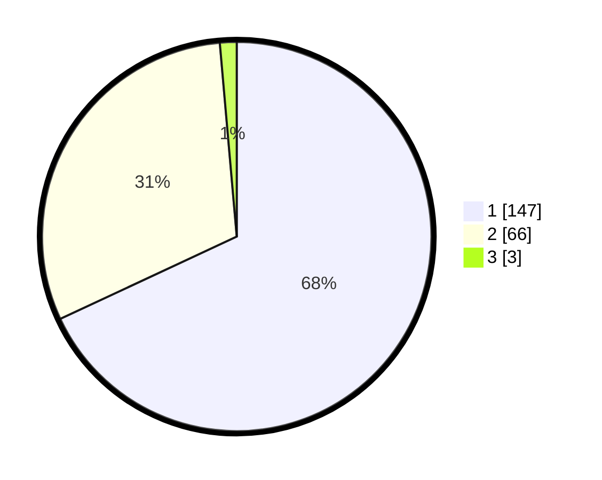

# Hasil

## Grafik

## Tabel

| No. | Nama Paslon    | Suara | Suara (raw) | Persentase |
|:--- |:-------------- | -----:| -----------:| ----------:|
| 1   | ANIES MUHAIMIN | 147   | [147][p-1]  | 68,06      |
| 2   | PRABOWO GIBRAN | 66    | [66][p-2]   | 30,56      |
| 3   | GANJAR MAHFUD  | 3     | [3][p-3]    | 1,39       |

[p-1]: https://github.com/gigit-pemilu/pemilu-2024-11-aceh/blob/main/pilpres/hitung-suara/sub/11-aceh/sub/02-aceh-tenggara/sub/03-bambel/sub/2005-lawe-hijo/sub/001-tps/sub/paslon-1.txt
[p-2]: https://github.com/gigit-pemilu/pemilu-2024-11-aceh/blob/main/pilpres/hitung-suara/sub/11-aceh/sub/02-aceh-tenggara/sub/03-bambel/sub/2005-lawe-hijo/sub/001-tps/sub/paslon-2.txt
[p-3]: https://github.com/gigit-pemilu/pemilu-2024-11-aceh/blob/main/pilpres/hitung-suara/sub/11-aceh/sub/02-aceh-tenggara/sub/03-bambel/sub/2005-lawe-hijo/sub/001-tps/sub/paslon-3.txt

## Foto C Plano

https://sirekap-obj-formc.kpu.go.id/061c/pemilu/ppwp/11/02/03/20/05/1102032005001-20240216-145707--b767bbd4-e310-43e7-94d8-b81aa5fdc72e.jpg

https://sirekap-obj-formc.kpu.go.id/061c/pemilu/ppwp/11/02/03/20/05/1102032005001-20240216-145709--dae5adbf-0366-4f9a-ac8a-d1b506bfae1c.jpg

https://sirekap-obj-formc.kpu.go.id/061c/pemilu/ppwp/11/02/03/20/05/1102032005001-20240216-145708--8a3d7513-76a3-4e0a-bfbf-0ebfe6b75d91.jpg

## Metadata

| Key        | Value               |
| ---------- | ------------------- |
| Time Stamp | 2024-02-16 23:00:00 |

## DATA PEMILIH TETAP

Jumlah pemilih dalam DPT: **265**.
 * L: **131**.
 * P: **134**.

## DATA PENGGUNA HAK PILIH

Jumlah pengguna hak pilih dalam DPT: **217**.
 * L: **105**.
 * P: **112**.

Jumlah pengguna hak pilih dalam DPTb: **0**.
 * L: **0**.
 * P: **0**.

Jumlah pengguna hak pilih dalam DPK: **0**.
 * L: **0**.
 * P: **0**.

Jumlah pengguna hak pilih: **217**.
 * L: **105**.
 * P: **112**.

## JUMLAH SUARA SAH DAN TIDAK SAH

JUMLAH SELURUH SUARA SAH: **216**.

JUMLAH SUARA TIDAK SAH: **1**.

JUMLAH SELURUH SUARA SAH DAN SUARA TIDAK SAH: **217**.

