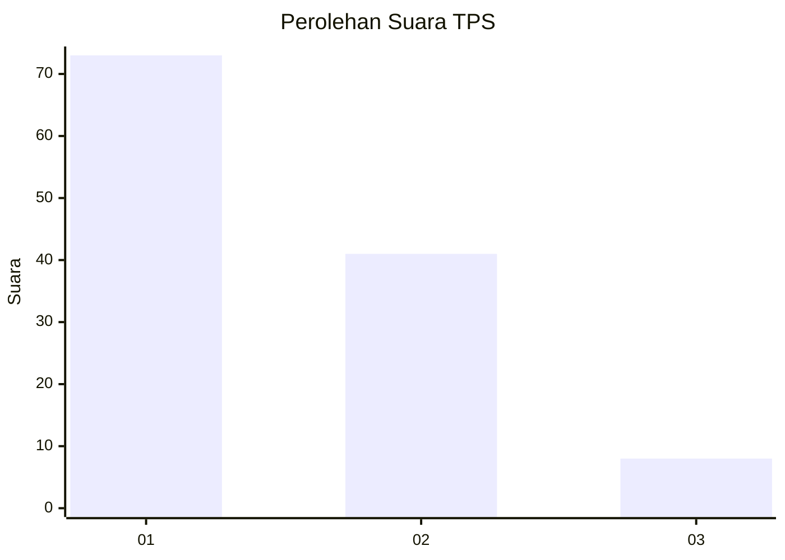
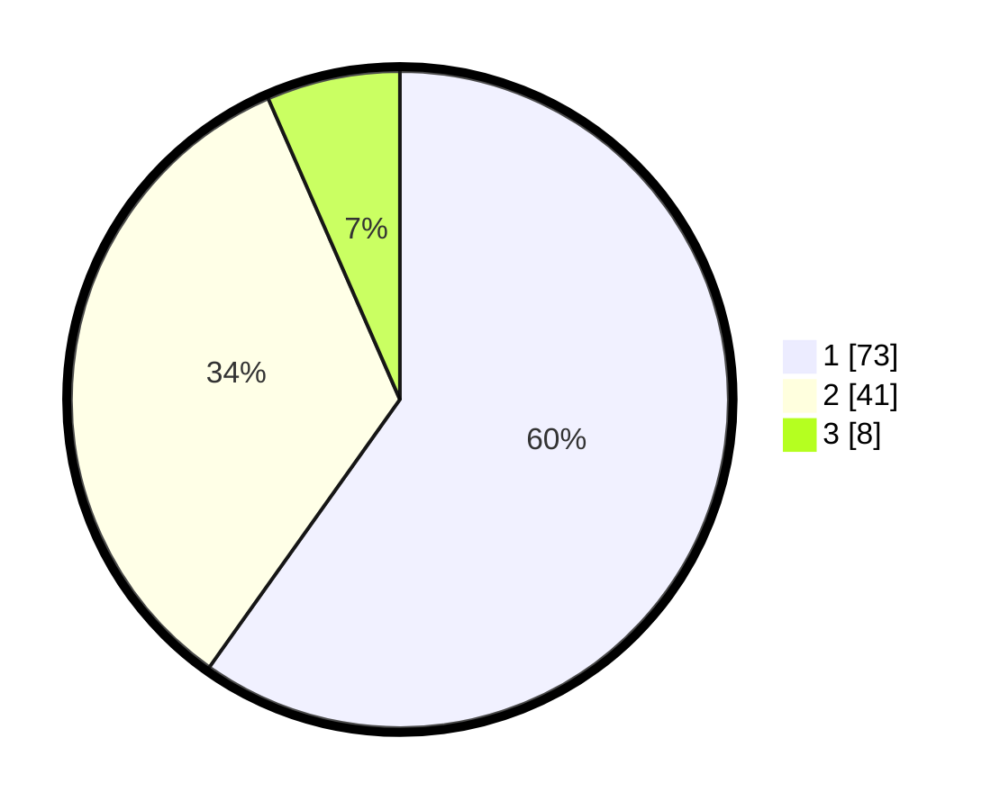

# Hasil

## Grafik

## Tabel

| No. | Nama Paslon    | Suara | Suara (raw) | Persentase |
|:--- |:-------------- | -----:| -----------:| ----------:|
| 1   | ANIES MUHAIMIN | 73    | [73][p-1]   | 59,84      |
| 2   | PRABOWO GIBRAN | 41    | [41][p-2]   | 33,61      |
| 3   | GANJAR MAHFUD  | 8     | [8][p-3]    | 6,56       |

[p-1]: https://github.com/gigit-pemilu/pemilu-2024-11-aceh/blob/main/pilpres/hitung-suara/sub/11-aceh/sub/02-aceh-tenggara/sub/03-bambel/sub/2006-pinding/sub/001-tps/sub/paslon-1.txt
[p-2]: https://github.com/gigit-pemilu/pemilu-2024-11-aceh/blob/main/pilpres/hitung-suara/sub/11-aceh/sub/02-aceh-tenggara/sub/03-bambel/sub/2006-pinding/sub/001-tps/sub/paslon-2.txt
[p-3]: https://github.com/gigit-pemilu/pemilu-2024-11-aceh/blob/main/pilpres/hitung-suara/sub/11-aceh/sub/02-aceh-tenggara/sub/03-bambel/sub/2006-pinding/sub/001-tps/sub/paslon-3.txt

## Foto C Plano

https://sirekap-obj-formc.kpu.go.id/aced/pemilu/ppwp/11/02/03/20/06/1102032006001-20240217-151923--95cf3e1a-474e-4fa9-a733-c9f9cfb6b71b.jpg

https://sirekap-obj-formc.kpu.go.id/aced/pemilu/ppwp/11/02/03/20/06/1102032006001-20240214-205748--4f466345-067c-4f19-aa58-cdb17c50c0e0.jpg

https://sirekap-obj-formc.kpu.go.id/aced/pemilu/ppwp/11/02/03/20/06/1102032006001-20240214-205936--5c4204e4-4249-4dbe-8e6d-5ba135b2f7f1.jpg

## Metadata

| Key        | Value               |
| ---------- | ------------------- |
| Time Stamp | 2024-02-17 16:00:02 |

