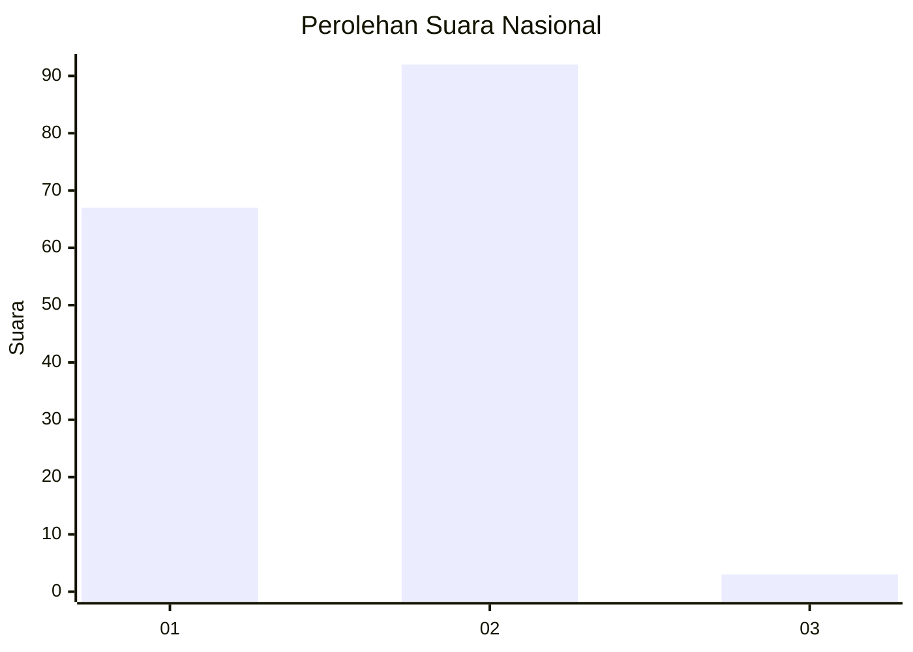
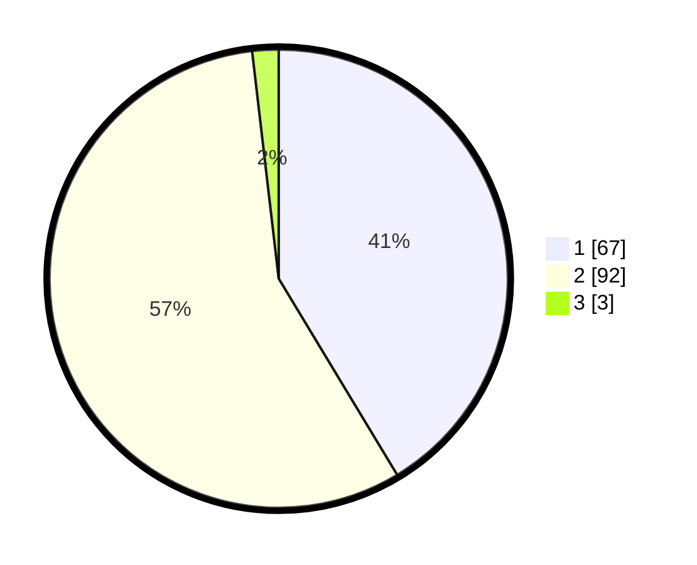

# Hasil

## Grafik

## Tabel

| No. | Nama Paslon    | Suara | Suara (raw) | Persentase |
|:--- |:-------------- | -----:| -----------:| ----------:|
| 1   | ANIES MUHAIMIN | 67    | [67][p-1]   | 41,36      |
| 2   | PRABOWO GIBRAN | 92    | [92][p-2]   | 56,79      |
| 3   | GANJAR MAHFUD  | 3     | [3][p-3]    | 1,85       |

[p-1]: https://github.com/gigit-pemilu/pemilu-2024/blob/main/pilpres/hitung-suara/sub/11-aceh/sub/02-aceh-tenggara/sub/03-bambel/sub/2014-terutung-payung-hulu/sub/001-tps/sub/paslon-1.txt
[p-2]: https://github.com/gigit-pemilu/pemilu-2024/blob/main/pilpres/hitung-suara/sub/11-aceh/sub/02-aceh-tenggara/sub/03-bambel/sub/2014-terutung-payung-hulu/sub/001-tps/sub/paslon-2.txt
[p-3]: https://github.com/gigit-pemilu/pemilu-2024/blob/main/pilpres/hitung-suara/sub/11-aceh/sub/02-aceh-tenggara/sub/03-bambel/sub/2014-terutung-payung-hulu/sub/001-tps/sub/paslon-3.txt

## Foto C Plano

https://sirekap-obj-formc.kpu.go.id/1fd7/pemilu/ppwp/11/02/03/20/14/1102032014001-20240215-010301--3a108f2e-50dd-4aea-8bd5-5bda685845ce.jpg

https://sirekap-obj-formc.kpu.go.id/1fd7/pemilu/ppwp/11/02/03/20/14/1102032014001-20240215-010329--68dc9e54-67b9-4b97-ac8c-2278eb3f2b42.jpg

https://sirekap-obj-formc.kpu.go.id/1fd7/pemilu/ppwp/11/02/03/20/14/1102032014001-20240215-010232--1319f8eb-49fc-4474-b268-a5c51e14ffdc.jpg

## Metadata

| Key        | Value               |
| ---------- | ------------------- |
| Time Stamp | 2024-02-24 22:31:28 |

