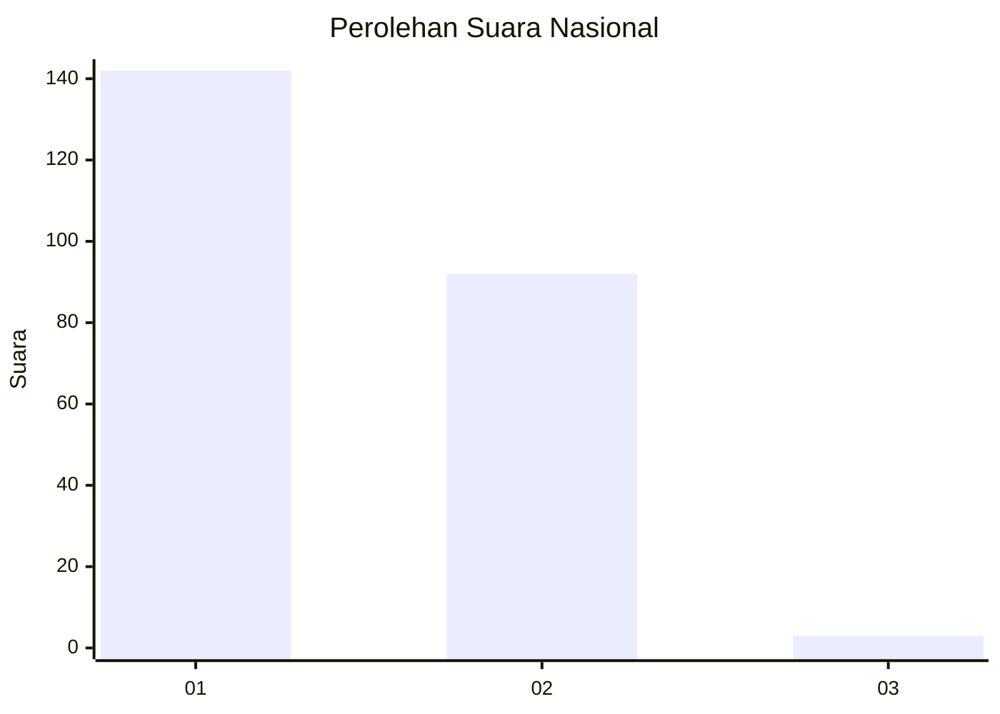
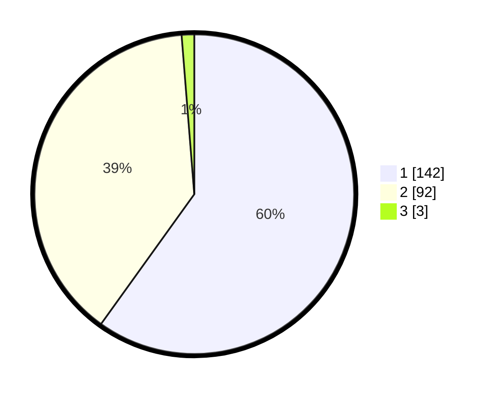

# Hasil

## Grafik

## Tabel

| No. | Nama Paslon    | Suara | Suara (raw) | Persentase |
|:--- |:-------------- | -----:| -----------:| ----------:|
| 1   | ANIES MUHAIMIN | 142   | [142][p-1]  | 59,92      |
| 2   | PRABOWO GIBRAN | 92    | [92][p-2]   | 38,82      |
| 3   | GANJAR MAHFUD  | 3     | [3][p-3]    | 1,27       |

[p-1]: https://github.com/gigit-pemilu/pemilu-2024/blob/main/pilpres/hitung-suara/sub/11-aceh/sub/02-aceh-tenggara/sub/03-bambel/sub/2016-tualang-sembilar/sub/002-tps/sub/paslon-1.txt
[p-2]: https://github.com/gigit-pemilu/pemilu-2024/blob/main/pilpres/hitung-suara/sub/11-aceh/sub/02-aceh-tenggara/sub/03-bambel/sub/2016-tualang-sembilar/sub/002-tps/sub/paslon-2.txt
[p-3]: https://github.com/gigit-pemilu/pemilu-2024/blob/main/pilpres/hitung-suara/sub/11-aceh/sub/02-aceh-tenggara/sub/03-bambel/sub/2016-tualang-sembilar/sub/002-tps/sub/paslon-3.txt

## Foto C Plano

https://sirekap-obj-formc.kpu.go.id/774a/pemilu/ppwp/11/02/03/20/16/1102032016002-20240216-145122--cb254a0d-8490-4aec-86db-4dd5309d53a8.jpg

https://sirekap-obj-formc.kpu.go.id/774a/pemilu/ppwp/11/02/03/20/16/1102032016002-20240216-145126--bd68524f-0cbf-4c0b-9171-06eb24897274.jpg

https://sirekap-obj-formc.kpu.go.id/774a/pemilu/ppwp/11/02/03/20/16/1102032016002-20240216-145124--05423666-868e-40cc-bfcd-f309050c3821.jpg

## Metadata

| Key        | Value               |
| ---------- | ------------------- |
| Time Stamp | 2024-02-16 23:00:00 |

## DATA PEMILIH TETAP

Jumlah pemilih dalam DPT: **234**.
 * L: **110**.
 * P: **124**.

## DATA PENGGUNA HAK PILIH

Jumlah pengguna hak pilih dalam DPT: **228**.
 * L: **107**.
 * P: **121**.

Jumlah pengguna hak pilih dalam DPTb: **0**.
 * L: **0**.
 * P: **0**.

Jumlah pengguna hak pilih dalam DPK: **9**.
 * L: **2**.
 * P: **7**.

Jumlah pengguna hak pilih: **237**.
 * L: **109**.
 * P: **128**.

## JUMLAH SUARA SAH DAN TIDAK SAH

JUMLAH SELURUH SUARA SAH: **237**.

JUMLAH SUARA TIDAK SAH: **0**.

JUMLAH SELURUH SUARA SAH DAN SUARA TIDAK SAH: **237**.

