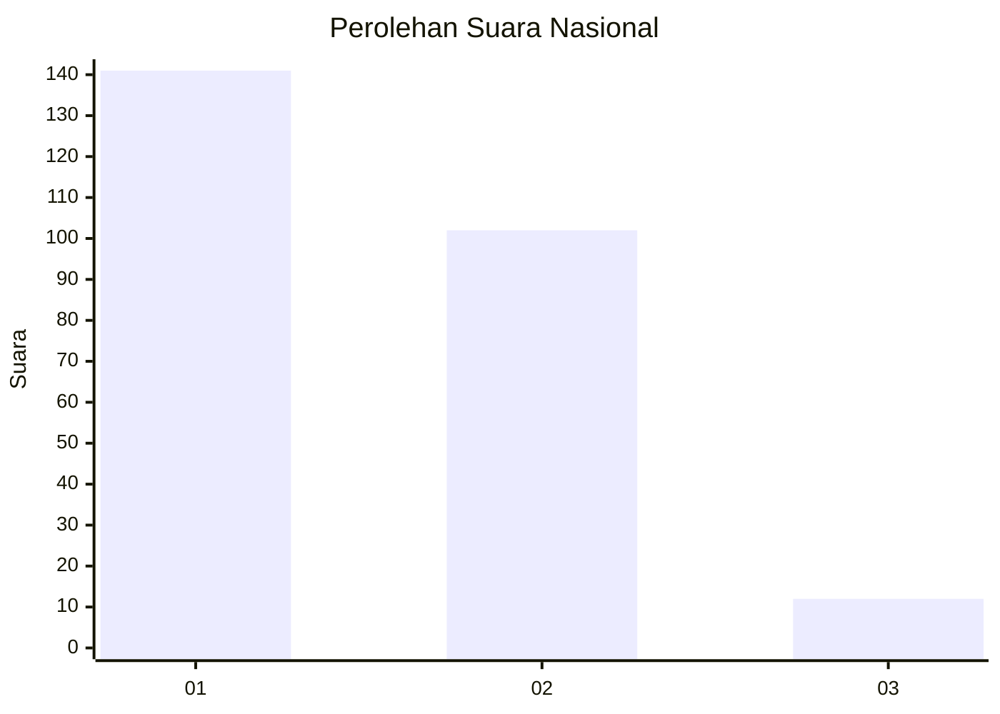
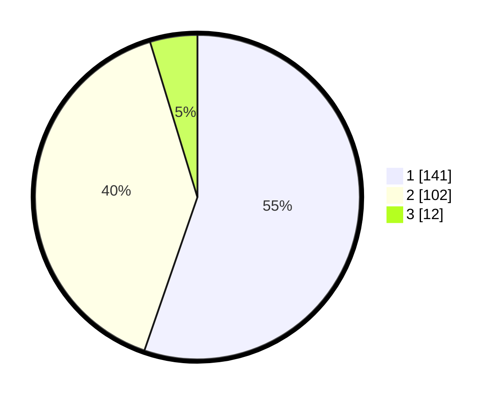

# Hasil

## Grafik

## Tabel

| No. | Nama Paslon    | Suara | Suara (raw) | Persentase |
|:--- |:-------------- | -----:| -----------:| ----------:|
| 1   | ANIES MUHAIMIN | 141   | [141][p-1]  | 55,29      |
| 2   | PRABOWO GIBRAN | 102   | [102][p-2]  | 40,00      |
| 3   | GANJAR MAHFUD  | 12    | [12][p-3]   | 4,71       |

[p-1]: https://github.com/gigit-pemilu/pemilu-2024/blob/main/pilpres/hitung-suara/sub/11-aceh/sub/02-aceh-tenggara/sub/03-bambel/sub/2023-bambel/sub/001-tps/sub/paslon-1.txt
[p-2]: https://github.com/gigit-pemilu/pemilu-2024/blob/main/pilpres/hitung-suara/sub/11-aceh/sub/02-aceh-tenggara/sub/03-bambel/sub/2023-bambel/sub/001-tps/sub/paslon-2.txt
[p-3]: https://github.com/gigit-pemilu/pemilu-2024/blob/main/pilpres/hitung-suara/sub/11-aceh/sub/02-aceh-tenggara/sub/03-bambel/sub/2023-bambel/sub/001-tps/sub/paslon-3.txt

## Foto C Plano

https://sirekap-obj-formc.kpu.go.id/f2f0/pemilu/ppwp/11/02/03/20/23/1102032023001-20240217-230206--b7313bd4-8c14-4a9c-b221-162c5b7658e0.jpg

https://sirekap-obj-formc.kpu.go.id/f2f0/pemilu/ppwp/11/02/03/20/23/1102032023001-20240217-231320--1ae302ba-a1b4-45bd-a448-fca710d1e716.jpg

https://sirekap-obj-formc.kpu.go.id/f2f0/pemilu/ppwp/11/02/03/20/23/1102032023001-20240217-231328--3db753e0-63af-4c58-b91d-8f12933fb189.jpg

## Metadata

| Key        | Value               |
| ---------- | ------------------- |
| Time Stamp | 2024-02-24 22:31:28 |

