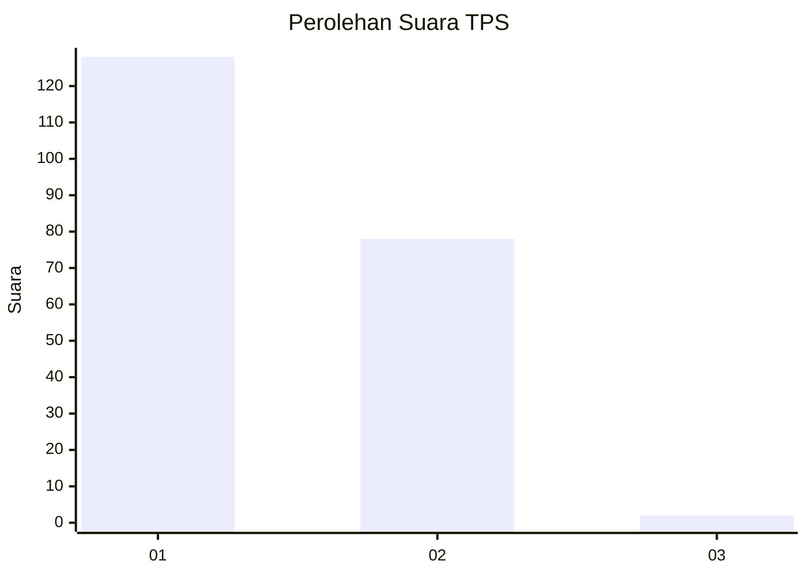
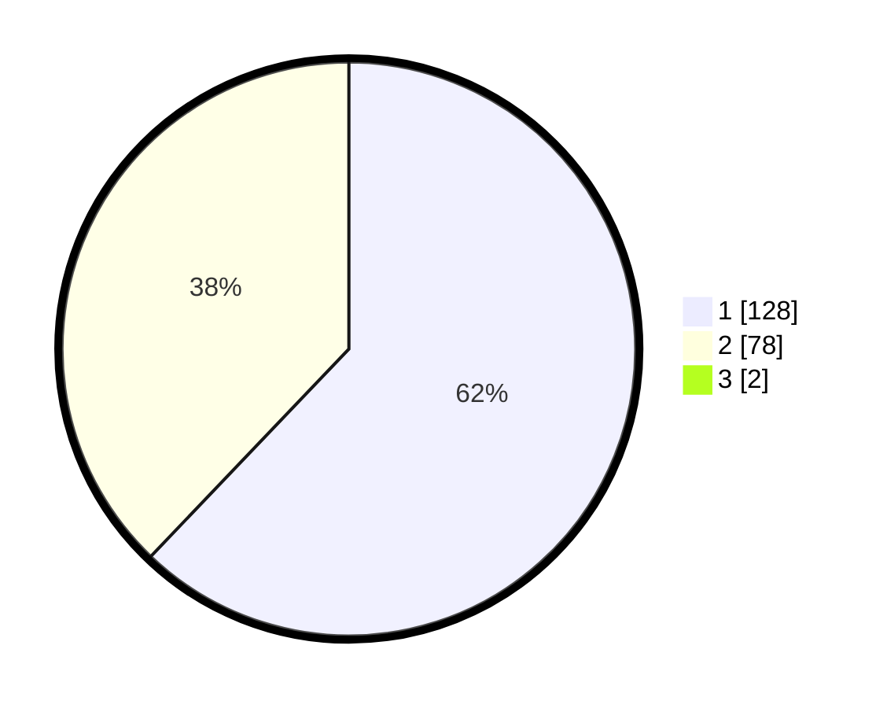

# Hasil

## Grafik

## Tabel

| No. | Nama Paslon    | Suara | Suara (raw) | Persentase |
|:--- |:-------------- | -----:| -----------:| ----------:|
| 1   | ANIES MUHAIMIN | 128   | [128][p-1]  | 61,54      |
| 2   | PRABOWO GIBRAN | 78    | [78][p-2]   | 37,50      |
| 3   | GANJAR MAHFUD  | 2     | [2][p-3]    | 0,96       |

[p-1]: https://github.com/gigit-pemilu/pemilu-2024-11-aceh/blob/main/pilpres/hitung-suara/sub/11-aceh/sub/02-aceh-tenggara/sub/03-bambel/sub/2025-lawe-kihing/sub/001-tps/sub/paslon-1.txt
[p-2]: https://github.com/gigit-pemilu/pemilu-2024-11-aceh/blob/main/pilpres/hitung-suara/sub/11-aceh/sub/02-aceh-tenggara/sub/03-bambel/sub/2025-lawe-kihing/sub/001-tps/sub/paslon-2.txt
[p-3]: https://github.com/gigit-pemilu/pemilu-2024-11-aceh/blob/main/pilpres/hitung-suara/sub/11-aceh/sub/02-aceh-tenggara/sub/03-bambel/sub/2025-lawe-kihing/sub/001-tps/sub/paslon-3.txt

## Foto C Plano

https://sirekap-obj-formc.kpu.go.id/7d26/pemilu/ppwp/11/02/03/20/25/1102032025001-20240222-112833--d7410f5f-34b3-4bdb-a864-ef49fd1fbf88.jpg

https://sirekap-obj-formc.kpu.go.id/7d26/pemilu/ppwp/11/02/03/20/25/1102032025001-20240222-093251--8df6fa35-c0df-4602-8d9e-4290493bdabb.jpg

## Metadata

| Key        | Value               |
| ---------- | ------------------- |
| Time Stamp | 2024-02-22 12:00:00 |

