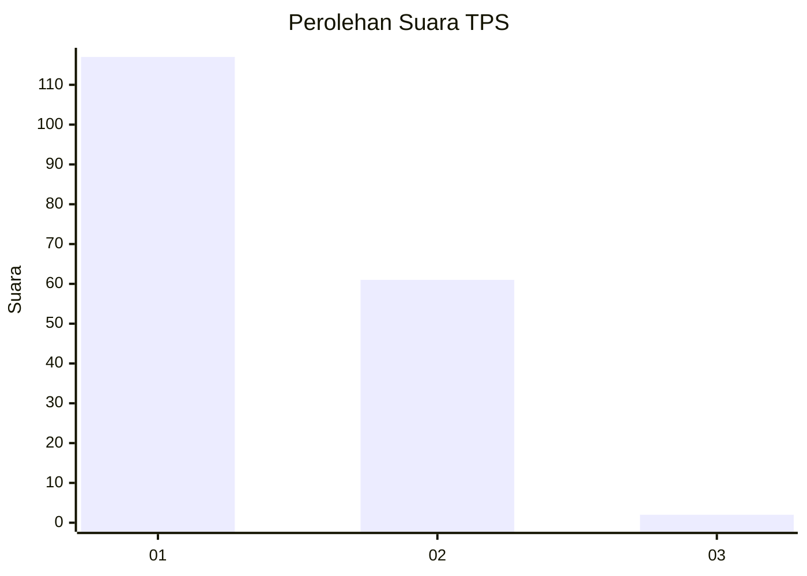
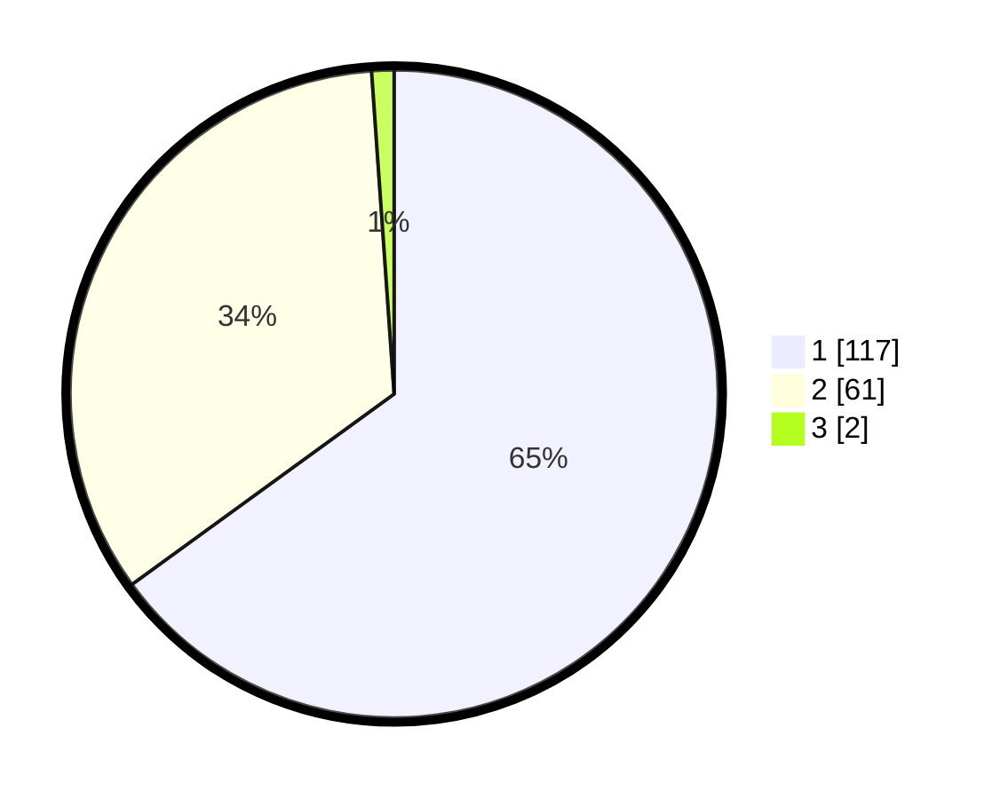

# Hasil

## Grafik

## Tabel

| No. | Nama Paslon    | Suara | Suara (raw) | Persentase |
|:--- |:-------------- | -----:| -----------:| ----------:|
| 1   | ANIES MUHAIMIN | 117   | [117][p-1]  | 65,00      |
| 2   | PRABOWO GIBRAN | 61    | [61][p-2]   | 33,89      |
| 3   | GANJAR MAHFUD  | 2     | [2][p-3]    | 1,11       |

[p-1]: https://github.com/gigit-pemilu/pemilu-2024-11-aceh/blob/main/pilpres/hitung-suara/sub/11-aceh/sub/02-aceh-tenggara/sub/03-bambel/sub/2025-lawe-kihing/sub/002-tps/sub/paslon-1.txt
[p-2]: https://github.com/gigit-pemilu/pemilu-2024-11-aceh/blob/main/pilpres/hitung-suara/sub/11-aceh/sub/02-aceh-tenggara/sub/03-bambel/sub/2025-lawe-kihing/sub/002-tps/sub/paslon-2.txt
[p-3]: https://github.com/gigit-pemilu/pemilu-2024-11-aceh/blob/main/pilpres/hitung-suara/sub/11-aceh/sub/02-aceh-tenggara/sub/03-bambel/sub/2025-lawe-kihing/sub/002-tps/sub/paslon-3.txt

## Foto C Plano

https://sirekap-obj-formc.kpu.go.id/6017/pemilu/ppwp/11/02/03/20/25/1102032025002-20240215-100706--ea2b5092-0183-42dd-8af2-47fd133dd03c.jpg

https://sirekap-obj-formc.kpu.go.id/6017/pemilu/ppwp/11/02/03/20/25/1102032025002-20240215-100732--4233d716-35eb-4c2e-99a9-3dbba22e442e.jpg

## Metadata

| Key        | Value               |
| ---------- | ------------------- |
| Time Stamp | 2024-02-24 22:31:28 |

